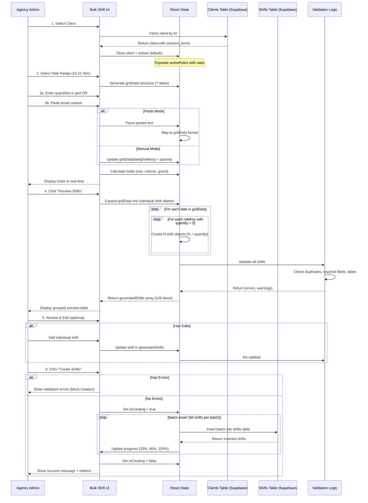

# Bulk Shift Creation - Implementation Plan

**Project:** ACG StaffLink - Bulk Shift Creation Feature
**Created:** 2025-11-15
**Status:** Planning Phase - Awaiting Database Updates
**Priority:** High - Addresses critical admin workflow bottleneck

---

## 📋 Table of Contents

1. [Executive Summary](#executive-summary)
2. [Problem Statement](#problem-statement)
3. [Requirements Analysis](#requirements-analysis)
4. [Technical Architecture](#technical-architecture)
5. [Implementation Phases](#implementation-phases)
6. [Database Integration](#database-integration)
7. [UI/UX Specifications](#uiux-specifications)
8. [Testing Strategy](#testing-strategy)
9. [Success Metrics](#success-metrics)
10. [Progress Tracking](#progress-tracking)

---

## 🎯 Executive Summary

### Current State
- **Existing Page:** [BulkShiftCreation.jsx](src/pages/BulkShiftCreation.jsx) - Placeholder only (maintenance message)
- **Manual Process:** Admins create shifts one-by-one via [PostShiftV2.jsx](src/pages/PostShiftV2.jsx)
- **Time Cost:** 109 shifts = ~3.6 hours of manual data entry

### Target State
- **Multi-Role Weekly Grid:** Create 109 shifts in ~5-6 minutes
- **Copy-Paste Support:** Admins paste from emails directly
- **Validation Before Insert:** Preview, edit, validate, then batch create
- **Time Savings:** 97% reduction in shift creation time

### Real-World Use Case
**Example:** Richmond Court Care Home weekly schedule
- **Input Format:** Email with role/date/shift/quantity per line
- **Output:** 109 individual shift records in database
- **Breakdown:**
  - Nurses Day (7 days): 35 shifts
  - Nurses Night (7 days): 35 shifts
  - Healthcare Assistants Day (7 days): 19 shifts
  - Healthcare Assistants Night (7 days): 20 shifts

---

## 🔴 Problem Statement

### Current Pain Points

1. **Repetitive Manual Entry**
   - Each shift requires full form submission
   - Same client/role/dates entered multiple times
   - No bulk operations available

2. **Email-Based Workflow**
   - Clients send shift requests via email (tabular format)
   - Admins manually transcribe each line
   - High error rate due to manual data entry

3. **Time Inefficiency**
   - 109 shifts × 2 min/shift = 218 minutes (3.6 hours)
   - Blocks admin from higher-value tasks
   - Delays shift publication to staff

4. **Feature Parked**
   - Previous attempt was parked (no implementation found)
   - Only placeholder page exists
   - No documentation on why it was abandoned

---

## 📊 Requirements Analysis

### Functional Requirements

#### FR1: Multi-Role Grid Entry
**Priority:** CRITICAL
**Description:** Single grid view showing all role+shift combinations for date range

**User Story:**
> As an agency admin, I want to see all roles (Nurses, HCA) and shift types (Day, Night) in one grid, so I can enter all 109 shifts without switching contexts.

**Acceptance Criteria:**
- [ ] Grid displays columns: Date, Nurse Day, Nurse Night, HCA Day, HCA Night
- [ ] Each cell accepts quantity input (0-99)
- [ ] Dynamic role columns (can add/remove roles)
- [ ] Real-time totals (per row, per column, grand total)

---

#### FR2: Client Default Auto-Fill
**Priority:** HIGH
**Description:** Auto-load rates, shift times, locations from client settings

**Data Source:** [Clients.jsx:50-60](src/pages/Clients.jsx#L50-L60)
```javascript
contract_terms: {
  rates_by_role: {
    nurse: { pay_rate: 18.50, charge_rate: 24.50 },
    healthcare_assistant: { pay_rate: 14.75, charge_rate: 19.18 }
  },
  break_duration_minutes: 0,
  require_location_specification: false
}
day_shift_start: "08:00"
day_shift_end: "20:00"
night_shift_start: "20:00"
night_shift_end: "08:00"
```

**Acceptance Criteria:**
- [ ] Client selection triggers auto-fill
- [ ] Pay/charge rates loaded per role
- [ ] Shift times loaded (day/night)
- [ ] Location options loaded from `internal_locations`
- [ ] Visible summary of loaded defaults

---

#### FR3: Date Range Selection
**Priority:** HIGH
**Description:** Allow flexible date ranges, not just week navigation

**Acceptance Criteria:**
- [ ] Start date picker
- [ ] End date picker
- [ ] Quick presets: "Next 7 Days", "This Week", "Next Week"
- [ ] Dynamic grid generation (supports 1-30 day ranges)
- [ ] Validation: End date must be after start date

---

#### FR4: Copy-Paste from Email
**Priority:** CRITICAL
**Description:** Parse pasted email content to auto-populate grid

**Input Format Example:**
```
Nurses    Saturday  15/11/2025  Day     2
Nurses    Saturday  15/11/2025  Nights  2
Healthcare Assistants  Saturday  15/11/2025  Day  3
```

**Acceptance Criteria:**
- [ ] Paste area above grid
- [ ] Auto-detect delimiter (tab, comma, space)
- [ ] Parse role, date, shift type, quantity
- [ ] Populate corresponding grid cells
- [ ] Show parse errors if format invalid
- [ ] [Download Template CSV] button for standardized format

---

#### FR5: Preview & Validation
**Priority:** HIGH
**Description:** Show all shifts before database insert, allow editing

**Acceptance Criteria:**
- [ ] Preview table grouped by date
- [ ] Expandable rows (e.g., "Saturday 15 Nov: 9 shifts")
- [ ] Edit individual shift (modal or inline)
- [ ] Delete individual shift from preview
- [ ] Validation rules:
  - [ ] No duplicate shifts (same client/date/time/role)
  - [ ] No past dates (warning, not blocker)
  - [ ] Weekend shifts flagged (premium rate check)
  - [ ] All required fields present
- [ ] Validation summary with error/warning counts

---

#### FR6: Batch Creation
**Priority:** HIGH
**Description:** Insert shifts in batches with progress indicator

**Acceptance Criteria:**
- [ ] Batch size: 50 shifts per insert (Supabase limit)
- [ ] Progress bar showing % complete
- [ ] Handle partial failures gracefully
- [ ] Success summary with shift counts
- [ ] Redirect to /Shifts after success

---

### Non-Functional Requirements

#### NFR1: Performance
- Grid should render 30-day × 8 role combos (240 cells) in < 500ms
- Batch insert 109 shifts in < 5 seconds
- No UI lag during quantity input

#### NFR2: Security
- RBAC: Block `staff_member` role (agency_admin, client_user, super_admin only)
- RLS: All shifts must have `agency_id` = current user's agency
- Audit trail: `shift_journey_log` includes `method: 'bulk_creation'`

#### NFR3: Usability
- Mobile responsive (stacked columns on small screens)
- Keyboard navigation (Tab, Arrow keys in grid)
- Accessibility: ARIA labels, screen reader compatible
- Undo/Redo support before final creation

#### NFR4: Data Integrity
- All shifts must pass validation before insert
- Transaction-like behavior (all or nothing per batch)
- Change logs created for audit trail

---

## 🏗️ Technical Architecture

### Component Structure

```
src/pages/BulkShiftCreation.jsx (Main Wizard Container)
├── components/bulk-shifts/
│   ├── Step1ClientSetup.jsx
│   │   ├── Client dropdown (Supabase query)
│   │   ├── Date range pickers
│   │   └── Defaults summary display
│   │
│   ├── Step2MultiRoleGrid.jsx
│   │   ├── Dynamic grid generation
│   │   ├── Quantity inputs
│   │   ├── Row/column totals
│   │   ├── Add/remove role columns
│   │   └── Copy-paste handler
│   │
│   ├── Step3PreviewTable.jsx
│   │   ├── Grouped preview (by date)
│   │   ├── Validation summary
│   │   ├── Edit shift modal
│   │   └── Delete shift action
│   │
│   ├── EditShiftModal.jsx
│   │   ├── Override rates
│   │   ├── Change location
│   │   ├── Adjust times
│   │   └── Add notes
│   │
│   ├── SmartPasteArea.jsx
│   │   ├── Paste textarea
│   │   ├── Format detection
│   │   ├── Parse logic
│   │   └── Error display
│   │
│   └── ValidationSummary.jsx
│       ├── Error list (blocking)
│       ├── Warning list (non-blocking)
│       └── Success indicator
│
└── utils/
    ├── bulkShiftValidation.js
    ├── pasteParser.js
    └── shiftGenerator.js
```

---

### State Management

```javascript
const [bulkShiftState, setBulkShiftState] = useState({
  // Step 1: Setup
  client_id: '',
  client: null, // Full client object with defaults
  dateRange: {
    startDate: '',
    endDate: ''
  },

  // Step 2: Multi-role grid
  activeRoles: [
    {
      key: 'nurse_day',
      label: 'Nurses Day',
      role: 'nurse',
      shiftType: 'day',
      payRate: 0,
      chargeRate: 0
    },
    { key: 'nurse_night', label: 'Nurses Night', role: 'nurse', shiftType: 'night', ... },
    { key: 'hca_day', label: 'HCA Day', role: 'healthcare_assistant', shiftType: 'day', ... },
    { key: 'hca_night', label: 'HCA Night', role: 'healthcare_assistant', shiftType: 'night', ... }
  ],

  gridData: {
    // Structure: { 'YYYY-MM-DD': { 'nurse_day': 2, 'nurse_night': 2, 'hca_day': 3, 'hca_night': 2 } }
    '2025-11-15': {
      nurse_day: 2,
      nurse_night: 2,
      hca_day: 3,
      hca_night: 2
    },
    '2025-11-16': { ... },
    // ... more dates
  },

  // Step 3: Expanded shifts for preview
  generatedShifts: [
    // Array of 109 individual shift objects
    {
      id: 'temp-1',
      client_id: 'uuid',
      role_required: 'nurse',
      date: '2025-11-15',
      start_time: '2025-11-15T08:00:00',
      end_time: '2025-11-15T20:00:00',
      duration_hours: 12,
      pay_rate: 18.50,
      charge_rate: 24.50,
      // ... all required fields
    },
    // ... 108 more
  ],

  // Validation
  validation: {
    errors: [],
    warnings: [],
    isValid: false
  },

  // UI State
  currentStep: 1, // 1, 2, or 3
  isLoading: false,
  isCreating: false,
  creationProgress: 0
});
```

---

### Data Flow Diagram



---

## 📝 Implementation Phases

### Phase 1: Core Multi-Role Grid (Week 1)
**Goal:** Build the foundational grid entry system

#### Tasks

**P1.1 - Client Setup Component** ⬜ Not Started
- [ ] Create `Step1ClientSetup.jsx`
- [ ] Supabase query for clients with `contract_terms`
- [ ] Client dropdown with search
- [ ] Date range pickers (start/end)
- [ ] Auto-fill defaults display
- [ ] Quick presets (Next 7 Days, This Week, Next Week)
- **Dependencies:** Database schema must include `contract_terms.rates_by_role`
- **Estimated Time:** 4 hours

**P1.2 - Multi-Role Grid Component** ⬜ Not Started
- [ ] Create `Step2MultiRoleGrid.jsx`
- [ ] Dynamic grid generation based on date range
- [ ] Quantity input cells (0-99 validation)
- [ ] Row totals (shifts per date)
- [ ] Column totals (shifts per role+shift combo)
- [ ] Grand total display
- [ ] Add/remove role columns
- [ ] Cell highlighting when value entered
- **Dependencies:** P1.1 complete
- **Estimated Time:** 8 hours

**P1.3 - Shift Object Generation** ⬜ Not Started
- [ ] Create `utils/shiftGenerator.js`
- [ ] Function: `expandGridToShifts(gridData, activeRoles, client)`
- [ ] Map role keys to database role values
- [ ] Generate ISO timestamps from dates + times
- [ ] Apply client defaults (rates, duration, break)
- [ ] Include all required fields for shifts table
- **Dependencies:** P1.2 complete
- **Estimated Time:** 3 hours

**P1.4 - Preview Table Component** ⬜ Not Started
- [ ] Create `Step3PreviewTable.jsx`
- [ ] Grouped display by date (expandable rows)
- [ ] Individual shift rows with all details
- [ ] Delete shift action
- [ ] Summary panel (total shifts, date range, roles)
- [ ] Financial summary (total cost/revenue)
- **Dependencies:** P1.3 complete
- **Estimated Time:** 5 hours

**P1.5 - Basic Validation** ⬜ Not Started
- [ ] Create `utils/bulkShiftValidation.js`
- [ ] Validate required fields (client_id, role, date, times)
- [ ] Check for duplicate shifts
- [ ] Flag past dates (warning)
- [ ] Flag weekend dates (warning)
- [ ] Return structured {errors, warnings, isValid}
- **Dependencies:** P1.3 complete
- **Estimated Time:** 3 hours

**P1.6 - Batch Insert Logic** ⬜ Not Started
- [ ] Batch size: 50 shifts per insert
- [ ] Progress tracking state
- [ ] Error handling for partial failures
- [ ] Transaction-like behavior
- [ ] Success/failure summary
- [ ] Redirect to /Shifts on success
- **Dependencies:** P1.4, P1.5 complete
- **Estimated Time:** 4 hours

**P1.7 - RBAC Integration** ⬜ Not Started
- [ ] Copy RBAC check from [PostShiftV2.jsx:80-118](src/pages/PostShiftV2.jsx#L80-L118)
- [ ] Block staff_member role
- [ ] Set currentAgency from profile
- [ ] Filter clients by agency_id
- **Dependencies:** P1.1 complete
- **Estimated Time:** 2 hours

**Phase 1 Total:** ~29 hours

---

### Phase 2: Copy-Paste & Enhancements (Week 2)
**Goal:** Add email workflow support and power user features

#### Tasks

**P2.1 - Smart Paste Area** ⬜ Not Started
- [ ] Create `SmartPasteArea.jsx`
- [ ] Textarea with paste event handler
- [ ] Create `utils/pasteParser.js`
- [ ] Auto-detect delimiter (tab, comma, space)
- [ ] Parse columns: Role, Day, Date, Shift, Quantity
- [ ] Handle multiple date formats (DD/MM/YYYY, MM/DD/YYYY)
- [ ] Map parsed data to gridData structure
- [ ] Show parse errors with line numbers
- **Dependencies:** Phase 1 complete
- **Estimated Time:** 6 hours

**P2.2 - CSV Template Download** ⬜ Not Started
- [ ] Generate CSV template with headers
- [ ] Pre-fill with selected client name
- [ ] Include all active roles
- [ ] Date range from setup
- [ ] Download as `BulkShiftTemplate_ClientName_Date.csv`
- **Dependencies:** P2.1 complete
- **Estimated Time:** 2 hours

**P2.3 - CSV Upload Handler** ⬜ Not Started
- [ ] File upload button
- [ ] Use PapaParse or similar for CSV parsing
- [ ] Validate CSV structure (required columns)
- [ ] Map CSV rows to gridData
- [ ] Show upload errors
- **Dependencies:** P2.2 complete
- **Estimated Time:** 4 hours

**P2.4 - Edit Shift Modal** ⬜ Not Started
- [ ] Create `EditShiftModal.jsx`
- [ ] Form fields: role, date, times, rates, location, urgency, notes
- [ ] Pre-fill with selected shift data
- [ ] Validation on save
- [ ] Update shift in generatedShifts array
- [ ] Re-trigger validation after edit
- **Dependencies:** Phase 1 complete
- **Estimated Time:** 5 hours

**P2.5 - Keyboard Navigation** ⬜ Not Started
- [ ] Tab key: Move to next cell
- [ ] Arrow keys: Navigate grid
- [ ] Enter key: Submit and move down
- [ ] Escape key: Clear current cell
- [ ] Focus indicators (outline on active cell)
- **Dependencies:** P1.2 complete
- **Estimated Time:** 4 hours

**P2.6 - Bulk Fill Actions** ⬜ Not Started
- [ ] "Fill Column" button (apply same quantity to all dates in column)
- [ ] "Fill Row" button (apply same quantity to all roles in row)
- [ ] "Fill Weekdays" quick action
- [ ] "Fill Weekends" quick action
- [ ] "Clear All" button with confirmation
- **Dependencies:** P1.2 complete
- **Estimated Time:** 3 hours

**P2.7 - Duplicate Last Week** ⬜ Not Started
- [ ] Fetch last week's shifts for client
- [ ] Count quantities per date/role/shift
- [ ] Populate grid with adjusted dates (+7 days)
- [ ] Show success message
- [ ] Allow editing before creation
- **Dependencies:** Phase 1 complete
- **Estimated Time:** 4 hours

**Phase 2 Total:** ~28 hours

---

### Phase 3: Advanced Features & Optimization (Week 3)
**Goal:** Production-ready polish and power features

#### Tasks

**P3.1 - Save as Template** ⬜ Not Started
- [ ] Save current grid as reusable template
- [ ] Template metadata: name, description, client
- [ ] Store in `bulk_shift_templates` table (new table)
- [ ] Load template dropdown in setup step
- [ ] Populate grid from template
- **Dependencies:** Phase 1 & 2 complete
- **Estimated Time:** 6 hours

**P3.2 - Recurring Schedule Generator** ⬜ Not Started
- [ ] UI: "Generate Recurring" option
- [ ] Frequency: Weekly, Bi-weekly, Monthly
- [ ] Duration: 4 weeks, 8 weeks, 12 weeks
- [ ] Copy pattern from first week
- [ ] Generate extended date range
- [ ] Warn about large batch (200+ shifts)
- **Dependencies:** Phase 1 complete
- **Estimated Time:** 6 hours

**P3.3 - Conflict Detection** ⬜ Not Started
- [ ] Check existing shifts in database before insert
- [ ] Highlight conflicts in preview (same client/date/time)
- [ ] Option: Skip conflicting shifts or override
- [ ] Show conflict summary
- **Dependencies:** Phase 1 complete
- **Estimated Time:** 4 hours

**P3.4 - Advanced Validation Rules** ⬜ Not Started
- [ ] Check staff availability (if assigned)
- [ ] Validate against client bed capacity
- [ ] Check compliance requirements per role
- [ ] Validate pay rates match contract
- [ ] Configurable validation rules
- **Dependencies:** Phase 1 complete
- **Estimated Time:** 5 hours

**P3.5 - Progress Persistence** ⬜ Not Started
- [ ] Auto-save gridData to localStorage
- [ ] Restore on page load
- [ ] "Resume Draft" option
- [ ] Clear draft after successful creation
- **Dependencies:** Phase 1 complete
- **Estimated Time:** 3 hours

**P3.6 - Audit Trail Enhancement** ⬜ Not Started
- [ ] Log bulk creation in `change_logs` table
- [ ] Include metadata: user, timestamp, shift count
- [ ] Link to original request (if from email)
- [ ] Track edits made during preview
- **Dependencies:** Phase 1 complete
- **Estimated Time:** 3 hours

**P3.7 - Performance Optimization** ⬜ Not Started
- [ ] Virtualized grid for 30+ day ranges
- [ ] Debounce quantity inputs
- [ ] Lazy load preview table (paginated)
- [ ] Memoize expensive calculations
- [ ] Profile and optimize render times
- **Dependencies:** All features complete
- **Estimated Time:** 5 hours

**P3.8 - Mobile Responsiveness** ⬜ Not Started
- [ ] Stacked columns on small screens
- [ ] Touch-friendly inputs
- [ ] Swipe navigation for grid
- [ ] Simplified view for phones
- **Dependencies:** Phase 1 complete
- **Estimated Time:** 4 hours

**Phase 3 Total:** ~36 hours

---

### Total Implementation Estimate
- **Phase 1:** 29 hours
- **Phase 2:** 28 hours
- **Phase 3:** 36 hours
- **Total:** ~93 hours (2.5 weeks of full-time work or 4-5 weeks at 50% allocation)

---

## 💾 Database Integration

### Tables Used

#### 1. `clients` (Read Only)
**Query Pattern:**
```javascript
const { data: clients } = await supabase
  .from('clients')
  .select(`
    id,
    name,
    contract_terms,
    day_shift_start,
    day_shift_end,
    night_shift_start,
    night_shift_end,
    internal_locations
  `)
  .eq('agency_id', currentAgency)
  .order('name', { ascending: true });
```

**Required Fields:**
- `contract_terms.rates_by_role` (JSONB)
  ```json
  {
    "nurse": { "pay_rate": 18.50, "charge_rate": 24.50 },
    "healthcare_assistant": { "pay_rate": 14.75, "charge_rate": 19.18 },
    "senior_care_worker": { "pay_rate": 16.00, "charge_rate": 21.00 }
  }
  ```
- `day_shift_start`, `day_shift_end` (TEXT - HH:MM format)
- `night_shift_start`, `night_shift_end` (TEXT - HH:MM format)
- `internal_locations` (JSONB array - optional)

**Dependency:** Ensure all clients have `rates_by_role` populated

---

#### 2. `shifts` (Insert)
**Insert Pattern:**
```javascript
const shiftsToInsert = generatedShifts.map(shift => ({
  client_id: shift.client_id,
  agency_id: currentAgency,
  role_required: shift.role_required, // 'nurse', 'healthcare_assistant', etc.
  date: shift.date, // 'YYYY-MM-DD'
  start_time: shift.start_time, // 'YYYY-MM-DDTHH:MM:SS'
  end_time: shift.end_time, // 'YYYY-MM-DDTHH:MM:SS'
  duration_hours: shift.duration_hours, // 12
  pay_rate: shift.pay_rate,
  charge_rate: shift.charge_rate,
  break_duration_minutes: shift.break_duration_minutes || 0,
  work_location_within_site: shift.work_location_within_site || '',
  urgency: shift.urgency || 'normal',
  notes: shift.notes || '',
  status: 'open',
  marketplace_visible: false,
  shift_journey_log: [{
    state: 'created',
    timestamp: new Date().toISOString(),
    user_id: user?.id,
    method: 'bulk_creation',
    metadata: {
      batch_id: uuidv4(), // Same for all shifts in this batch
      total_in_batch: generatedShifts.length
    }
  }],
  created_date: new Date().toISOString(),
  created_by: user?.email
}));

// Batch insert
const batchSize = 50;
for (let i = 0; i < shiftsToInsert.length; i += batchSize) {
  const batch = shiftsToInsert.slice(i, i + batchSize);
  const { data, error } = await supabase
    .from('shifts')
    .insert(batch)
    .select();

  if (error) throw error;
  results.push(...data);
}
```

**Required Fields:**
- All fields listed above must be present
- `agency_id` critical for RLS
- `shift_journey_log` tracks creation method

---

#### 3. `change_logs` (Insert - Audit Trail)
**Insert Pattern:**
```javascript
await supabase
  .from('change_logs')
  .insert({
    agency_id: currentAgency,
    entity_type: 'shift',
    entity_id: null, // Bulk operation, no single entity
    action: 'bulk_create',
    changed_by: user?.id,
    changed_by_email: user?.email,
    old_value: null,
    new_value: JSON.stringify({
      shift_count: generatedShifts.length,
      client_id: formData.client_id,
      date_range: `${formData.dateRange.startDate} to ${formData.dateRange.endDate}`,
      roles: [...new Set(generatedShifts.map(s => s.role_required))]
    }),
    reason: 'Bulk shift creation',
    created_date: new Date().toISOString()
  });
```

---

#### 4. `bulk_shift_templates` (New Table - Phase 3)
**Schema:**
```sql
CREATE TABLE bulk_shift_templates (
  id UUID PRIMARY KEY DEFAULT uuid_generate_v4(),
  agency_id UUID NOT NULL REFERENCES agencies(id),
  template_name TEXT NOT NULL,
  description TEXT,
  client_id UUID REFERENCES clients(id), -- Optional: template specific to client
  grid_data JSONB NOT NULL, -- Structure: { date: { roleKey: quantity } }
  active_roles JSONB NOT NULL, -- Array of role configurations
  created_by UUID REFERENCES profiles(id),
  created_date TIMESTAMPTZ DEFAULT NOW(),
  last_used_date TIMESTAMPTZ
);

-- RLS
ALTER TABLE bulk_shift_templates ENABLE ROW LEVEL SECURITY;

CREATE POLICY "Agency users can manage their templates"
  ON bulk_shift_templates
  FOR ALL
  USING (agency_id = auth.jwt() ->> 'agency_id');
```

---

### Database Dependencies Checklist

**Before Phase 1 Starts:**
- [ ] Verify `clients.contract_terms.rates_by_role` exists and is populated
- [ ] Verify `clients.day_shift_start/end` and `night_shift_start/end` exist
- [ ] Test shifts insert with all required fields
- [ ] Verify RLS policies allow agency users to insert shifts
- [ ] Test batch insert (50+ shifts) for performance

**Before Phase 3 Starts:**
- [ ] Create `bulk_shift_templates` table
- [ ] Set up RLS policies
- [ ] Create indexes for performance

---

## 🎨 UI/UX Specifications

### Design System Integration

**Use Existing Components:**
- `@/components/ui/button` → All buttons
- `@/components/ui/card` → Wizard steps
- `@/components/ui/select` → Dropdowns
- `@/components/ui/input` → Quantity inputs, date pickers
- `@/components/ui/label` → Form labels
- `@/components/ui/alert` → Validation messages
- `@/components/ui/badge` → Role/shift type tags
- `@/components/ui/dialog` → Edit shift modal
- `@/components/ui/progress` → Batch creation progress

**Color Palette:**
- Primary: Teal (`cyan-600`)
- Success: Green (`emerald-500`)
- Warning: Orange (`orange-500`)
- Error: Red (`red-500`)
- Neutral: Gray (`gray-200` - `gray-900`)

**Typography:**
- Headings: `font-bold text-2xl`
- Subheadings: `font-semibold text-lg`
- Body: `text-base`
- Small: `text-sm`
- Labels: `text-sm font-medium`

---

### Layout Specifications

#### Step 1: Client Setup
```
┌─────────────────────────────────────────────────────────────┐
│  Card Header                                                │
│  "1. Select Client & Date Range"                           │
├─────────────────────────────────────────────────────────────┤
│                                                             │
│  [Client Dropdown - Full width]                            │
│                                                             │
│  ┌──────────────────┬──────────────────┐                   │
│  │ Start Date       │ End Date         │                   │
│  │ [Date Picker]    │ [Date Picker]    │                   │
│  └──────────────────┴──────────────────┘                   │
│                                                             │
│  Quick Presets:                                            │
│  [Next 7 Days] [This Week] [Next Week] [Custom]           │
│                                                             │
│  ✓ Defaults Summary (expandable card)                      │
│    • Nurses: £18.50/hr pay, £24.50/hr charge              │
│    • HCA: £14.75/hr pay, £19.18/hr charge                 │
│    • Day: 08:00-20:00 | Night: 20:00-08:00                │
│                                                             │
│                            [Next: Build Grid →]            │
└─────────────────────────────────────────────────────────────┘
```

---

#### Step 2: Multi-Role Grid
```
┌─────────────────────────────────────────────────────────────┐
│  Card Header                                                │
│  "2. Enter Shift Quantities"                               │
├─────────────────────────────────────────────────────────────┤
│                                                             │
│  📋 Smart Paste Area (collapsible)                         │
│  ┌───────────────────────────────────────────────────────┐ │
│  │ Paste from email (tab or comma separated)            │ │
│  │ Format: Role | Day | Date | Shift | Quantity         │ │
│  └───────────────────────────────────────────────────────┘ │
│  [Parse & Fill Grid] [Download Template CSV]              │
│                                                             │
│  📅 Weekly Grid                                            │
│  ┌──────┬────────┬────────┬────────┬────────┬─────────┐   │
│  │ Date │Nurse D │Nurse N │ HCA D  │ HCA N  │ Total   │   │
│  ├──────┼────────┼────────┼────────┼────────┼─────────┤   │
│  │15 Nov│  [2]   │  [2]   │  [3]   │  [2]   │    9    │   │
│  │16 Nov│  [3]   │  [3]   │  [3]   │  [2]   │   11    │   │
│  │17 Nov│  [4]   │  [4]   │  [3]   │  [4]   │   15    │   │
│  │  ...                                                 │   │
│  ├──────┼────────┼────────┼────────┼────────┼─────────┤   │
│  │TOTALS│   35   │   35   │   19   │   20   │  109    │   │
│  └──────┴────────┴────────┴────────┴────────┴─────────┘   │
│                                                             │
│  [+ Add Role Column] [Clear All] [Fill Helpers ▼]         │
│                                                             │
│                [← Back]  [Preview 109 Shifts →]           │
└─────────────────────────────────────────────────────────────┘
```

**Grid Cell States:**
- Empty: `bg-white border-gray-200`
- Focused: `ring-2 ring-cyan-500`
- Has Value: `bg-emerald-50 border-emerald-300`
- Error: `bg-red-50 border-red-300`

**Real-time Totals:**
- Row totals: Right column, auto-sum
- Column totals: Bottom row, auto-sum
- Grand total: Bottom-right, bold teal text

---

#### Step 3: Preview & Validation
```
┌─────────────────────────────────────────────────────────────┐
│  Card Header                                                │
│  "3. Review & Validate" [Badge: 109 shifts]                │
├─────────────────────────────────────────────────────────────┤
│                                                             │
│  ⚠️ Validation Summary                                      │
│  ✓ All shifts validated successfully                       │
│  ⚠ 20 shifts fall on weekend dates                         │
│                                                             │
│  Group By: [Date ▼] [Role] [Shift Type]                   │
│                                                             │
│  ▼ Saturday 15 Nov 2025 (9 shifts)                         │
│    ├─ Nurses Day (08:00-20:00): 2 shifts @ £18.50/hr      │
│    ├─ Nurses Night (20:00-08:00): 2 shifts @ £18.50/hr    │
│    ├─ HCA Day: 3 shifts @ £14.75/hr                       │
│    └─ HCA Night: 2 shifts @ £14.75/hr                     │
│    [Edit Group] [Delete Group]                            │
│                                                             │
│  ▶ Sunday 16 Nov 2025 (11 shifts)                          │
│  ▶ Monday 17 Nov 2025 (15 shifts)                          │
│  ... [+ 4 more days]                                       │
│                                                             │
│  💰 Financial Summary                                      │
│  • Total Shifts: 109                                       │
│  • Staff Cost: £17,892.00                                  │
│  • Client Revenue: £23,756.00                              │
│  • Estimated Margin: £5,864.00 (24.7%)                     │
│                                                             │
│            [← Edit Grid]  [Create 109 Shifts →]           │
│                                                             │
│  Progress Bar (when creating)                              │
│  ▓▓▓▓▓▓▓▓▓▓░░░░░░░░░░ 50%                                  │
│  Creating batch 2 of 3...                                  │
└─────────────────────────────────────────────────────────────┘
```

**Validation Colors:**
- Success: `bg-emerald-50 border-emerald-500 text-emerald-700`
- Warning: `bg-orange-50 border-orange-500 text-orange-700`
- Error: `bg-red-50 border-red-500 text-red-700`

---

### Responsive Breakpoints

**Desktop (> 1024px):**
- Full grid: 7-8 role columns visible
- Side-by-side date pickers
- Expanded validation details

**Tablet (768px - 1024px):**
- Horizontal scroll for grid
- Stacked date pickers
- Collapsed validation (expandable)

**Mobile (< 768px):**
- Vertical scroll for grid
- One role column per view (swipe to switch)
- Simplified totals
- Mobile-optimized paste area

---

## ✅ Testing Strategy

### Unit Tests

**Target Coverage:** 80%+

**Test Files:**
```
src/utils/__tests__/
├── bulkShiftValidation.test.js
│   ├── validateRequiredFields()
│   ├── checkDuplicateShifts()
│   ├── validateDates()
│   └── validateRates()
│
├── pasteParser.test.js
│   ├── detectDelimiter()
│   ├── parseEmailFormat()
│   ├── parseCSVFormat()
│   └── handleInvalidFormats()
│
└── shiftGenerator.test.js
    ├── expandGridToShifts()
    ├── applyClientDefaults()
    └── generateTimestamps()
```

---

### Integration Tests (Playwright)

**Test Suite:** `tests/bulk-shift-creation.spec.js`

**Scenarios:**

1. **Happy Path - 109 Shifts**
   ```javascript
   test('creates 109 shifts for Richmond Court', async ({ page }) => {
     // Navigate to bulk creation
     await page.goto('/bulkshiftcreation');

     // Select client
     await page.selectOption('[data-testid="client-select"]', 'Richmond Court');
     await expect(page.locator('.defaults-summary')).toBeVisible();

     // Set date range
     await page.fill('[data-testid="start-date"]', '15/11/2025');
     await page.fill('[data-testid="end-date"]', '21/11/2025');
     await page.click('button:has-text("Next")');

     // Fill grid (simulate paste)
     const pasteData = `
       Nurses,Saturday,15/11/2025,Day,2
       Nurses,Saturday,15/11/2025,Night,2
       Healthcare Assistants,Saturday,15/11/2025,Day,3
       ...
     `;
     await page.fill('[data-testid="paste-area"]', pasteData);
     await page.click('button:has-text("Parse & Fill Grid")');

     // Verify totals
     await expect(page.locator('.grand-total')).toHaveText('109');

     // Preview
     await page.click('button:has-text("Preview")');
     await expect(page.locator('.preview-table tbody tr')).toHaveCount(109);

     // Create
     await page.click('button:has-text("Create Shifts")');
     await page.waitForURL('/shifts');

     // Verify in database
     const { data: shifts } = await supabase
       .from('shifts')
       .select('*')
       .eq('client_id', 'richmond-court-id')
       .gte('date', '2025-11-15')
       .lte('date', '2025-11-21');

     expect(shifts).toHaveLength(109);
   });
   ```

2. **Validation Errors**
   ```javascript
   test('blocks creation when duplicate shifts detected', async ({ page }) => {
     // ... setup
     // Create shifts with duplicates
     // Verify error message shown
     // Verify "Create" button disabled
   });
   ```

3. **Edit Before Creation**
   ```javascript
   test('allows editing individual shift in preview', async ({ page }) => {
     // ... setup to preview
     // Click edit on specific shift
     // Change rate
     // Save
     // Verify updated in preview
     // Create and verify rate in database
   });
   ```

4. **RBAC Test**
   ```javascript
   test('blocks staff_member from accessing page', async ({ page }) => {
     // Login as staff member
     await page.goto('/bulkshiftcreation');
     await expect(page).toHaveURL('/staff-portal');
     await expect(page.locator('.toast')).toHaveText(/Access Denied/);
   });
   ```

---

### Manual Testing Checklist

**Pre-Launch Testing:**

- [ ] Test with real client data (Dominion Healthcare)
- [ ] Paste from actual client email
- [ ] Create 100+ shifts and verify database
- [ ] Test on Chrome, Firefox, Safari, Edge
- [ ] Test on mobile (iOS Safari, Android Chrome)
- [ ] Verify RLS policies (try accessing other agency's clients)
- [ ] Test batch creation timeout (200+ shifts)
- [ ] Test validation for all error types
- [ ] Test keyboard navigation throughout
- [ ] Test screen reader compatibility
- [ ] Load test: Create 500 shifts in one batch

---

## 📊 Success Metrics

### Performance Metrics

**Before (Manual Process):**
- Time to create 109 shifts: 218 minutes (3.6 hours)
- Error rate: ~5% (missed fields, wrong dates)
- Admin effort: High cognitive load

**After (Bulk Creation):**
- Time to create 109 shifts: 5-6 minutes
- Error rate: <1% (validation catches errors)
- Admin effort: Low cognitive load (paste → review → create)

**Target KPIs:**
- [ ] 95%+ time reduction
- [ ] <1% error rate
- [ ] 90%+ admin satisfaction score
- [ ] <5 seconds for batch insert (109 shifts)
- [ ] <500ms grid render time (30 days × 8 roles)

---

### User Adoption Metrics

**Week 1:**
- [ ] 100% of admins trained
- [ ] 50% of shift requests use bulk creation

**Month 1:**
- [ ] 80%+ of shift requests use bulk creation
- [ ] <5 support tickets related to bulk creation
- [ ] Average time per bulk request: <10 min

**Month 3:**
- [ ] 95%+ adoption
- [ ] Admins using templates for recurring schedules
- [ ] Copy-paste feature used in 60%+ of requests

---

## 📝 Progress Tracking

### Phase Status

| Phase | Status | Start Date | End Date | % Complete |
|-------|--------|------------|----------|------------|
| **Phase 1: Core Grid** | ✅ COMPLETE | 2025-11-15 | 2025-11-15 | 100% |
| **Phase 2: Copy-Paste** | 🔄 IN PROGRESS | 2025-11-15 | TBD | 0% |
| **Phase 3: Advanced** | ⬜ Not Started | TBD | TBD | 0% |

---

### Task Completion Tracker

**Phase 1 Tasks:** 7 / 7 complete ✅

- [x] P1.1 - Client Setup Component ✅ 2025-11-15
- [x] P1.2 - Multi-Role Grid Component ✅ 2025-11-15
- [x] P1.3 - Shift Object Generation ✅ 2025-11-15
- [x] P1.4 - Preview Table Component ✅ 2025-11-15
- [x] P1.5 - Basic Validation ✅ 2025-11-15
- [x] P1.6 - Batch Insert Logic ✅ 2025-11-15
- [x] P1.7 - RBAC Integration ✅ 2025-11-15

**Phase 2 Tasks:** 0 / 7 complete

- [ ] P2.1 - Smart Paste Area
- [ ] P2.2 - CSV Template Download
- [ ] P2.3 - CSV Upload Handler
- [ ] P2.4 - Edit Shift Modal
- [ ] P2.5 - Keyboard Navigation
- [ ] P2.6 - Bulk Fill Actions
- [ ] P2.7 - Duplicate Last Week

**Phase 3 Tasks:** 0 / 8 complete

- [ ] P3.1 - Save as Template
- [ ] P3.2 - Recurring Schedule Generator
- [ ] P3.3 - Conflict Detection
- [ ] P3.4 - Advanced Validation Rules
- [ ] P3.5 - Progress Persistence
- [ ] P3.6 - Audit Trail Enhancement
- [ ] P3.7 - Performance Optimization
- [ ] P3.8 - Mobile Responsiveness

---

### Blockers & Dependencies

**Current Blockers:**
1. ⚠️ **Database Schema Updates** - Waiting for other agent to complete database work
   - Impact: Blocks P1.1 (Client Setup)
   - ETA: TBD
   - Resolution: Verify `clients.contract_terms.rates_by_role` exists

**Resolved Blockers:**
- None yet

---

### Decision Log

| Date | Decision | Rationale | Impact |
|------|----------|-----------|--------|
| 2025-11-15 | Multi-role grid instead of one-role-at-a-time | Real-world use case (109 shifts) requires all roles visible | Core UX design |
| 2025-11-15 | Copy-paste as critical feature (Phase 2, not Phase 3) | Admins copy from emails 80% of the time | Phase prioritization |
| 2025-11-15 | Batch size: 50 shifts per insert | Supabase performance + transaction reliability | Technical constraint |

---

### Next Steps

1. **Wait for database agent to complete** ✅ Current status
2. **Verify database schema requirements**
   - Run query: `SELECT contract_terms FROM clients LIMIT 1`
   - Verify `rates_by_role` structure matches expected format
3. **Begin Phase 1 implementation**
   - Start with P1.1 (Client Setup)
   - Build incrementally, testing each component
4. **Daily progress updates in this document**
   - Update task checkboxes as completed
   - Log blockers/decisions
   - Track actual vs estimated time

---

## 📚 References

### Related Files
- [BulkShiftCreation.jsx](src/pages/BulkShiftCreation.jsx) - Current placeholder
- [PostShiftV2.jsx](src/pages/PostShiftV2.jsx) - Single shift creation (reference)
- [Clients.jsx](src/pages/Clients.jsx) - Client management (data structure reference)
- [bulkshift_prototype.html](bulkshift_prototype.html) - External prototype (design reference only)

### Documentation
- [PROJECT_MASTER_REFERENCE.md](PROJECT_MASTER_REFERENCE.md) - Overall project context
- [MODULE_TESTING_ROADMAP.md](MODULE_TESTING_ROADMAP.md) - Testing strategy
- [TESTING_QUICK_REFERENCE.md](TESTING_QUICK_REFERENCE.md) - Quick testing guide

### External Dependencies
- Supabase JS Client: v2.x
- React Query (TanStack): v4.x
- React: v18.x
- Tailwind CSS: v3.x
- Shadcn UI: Latest

---

## 🔄 Changelog

### 2025-11-15
- **Created initial implementation plan**
- Documented 3 phases with 22 total tasks
- Defined database integration requirements
- Created UI/UX specifications
- Established success metrics
- Current status: Awaiting database schema confirmation

---

**End of Document**

*This plan will be updated as implementation progresses. All changes should be logged in the Changelog section.*
