# 🔔 COMPLETE NOTIFICATION SYSTEM AUDIT

**Date**: 2025-11-19  
**Purpose**: Comprehensive audit of ALL notifications before Twilio → n8n/Meta WhatsApp migration  
**Scope**: Email, SMS, WhatsApp across entire shift lifecycle

---

## 📊 EXECUTIVE SUMMARY

### **Current State:**
- **Email**: ✅ Working (Resend API, batched via notification_queue)
- **SMS**: ❌ Failing (Twilio not funded)
- **WhatsApp**: ✅ Working (Twilio WhatsApp Business API)

### **Migration Goal:**
- **Phase 1**: Convert all SMS/WhatsApp to Email with portal links (buttons for urgent shifts, confirmations, reminders)
- **Phase 2**: Convert Email notifications to n8n/Meta WhatsApp templates

### **Total Notification Triggers Identified**: 23 unique triggers across shift lifecycle

---

## 🎯 NOTIFICATION CHANNELS

### **1. Email (Resend API)**
- **Status**: ✅ Working
- **Batching**: 5-minute queue via `notification-digest-engine`
- **Edge Function**: `send-email`
- **Templates**: `EmailTemplates.jsx` (professional, dark-mode compatible)

### **2. SMS (Twilio)**
- **Status**: ❌ Not funded
- **Edge Function**: `send-sms`
- **Usage**: Instant notifications (shift assignments, reminders, urgent broadcasts)

### **3. WhatsApp (Twilio)**
- **Status**: ✅ Working
- **Edge Function**: `send-whatsapp`
- **Usage**: Instant notifications (parallel with SMS)

### **4. WhatsApp (Meta/n8n) - PLANNED**
- **Status**: 🟡 Templates created, not connected
- **Templates**: 8 approved templates in Meta Business Manager
- **n8n Workflows**: Created but not deployed

---

## 📋 NOTIFICATION QUEUE SYSTEM

### **Database Table**: `notification_queue`
**Purpose**: Batch multiple notifications into single email (reduce spam, save costs ~90%)

**Fields**:
- `recipient_email`, `recipient_type` (staff/client/admin)
- `notification_type` (shift_assignment, shift_confirmation, etc.)
- `pending_items` (JSONB array of shifts/items)
- `status` (pending/sent/failed)
- `scheduled_send_at` (timestamp for batching)

**Processing**: `notification-digest-engine` runs every 5 minutes (cron job)

---

## 🔄 SHIFT LIFECYCLE NOTIFICATION TIMELINE

### **PHASE 1: SHIFT CREATION**
```
Shift Created (status: open)
├─ No notifications sent
└─ Shift visible in marketplace (if marketplace_visible = true)
```

### **PHASE 2: SHIFT ASSIGNMENT**
```
Admin Assigns Staff (status: open → assigned/confirmed)
├─ CONFIRM MODE (checkbox unchecked):
│   ├─ TO STAFF:
│   │   ├─ ✅ Email: "Shift Confirmed" (instant)
│   │   ├─ ❌ SMS: "SHIFT CONFIRMED! Arrive 10 mins early" (Twilio not funded)
│   │   └─ ✅ WhatsApp: "SHIFT CONFIRMED! Arrive 10 mins early" (instant)
│   └─ TO CLIENT:
│       └─ ✅ Email: "Shift Confirmed - Staff assigned" (batched, 5-min delay)
│
└─ ASSIGN MODE (checkbox checked):
    ├─ TO STAFF:
    │   ├─ ✅ Email: "New Shift Assignment - please confirm" (batched, 5-min delay)
    │   ├─ ❌ SMS: "NEW SHIFT - Reply to confirm" (Twilio not funded)
    │   └─ ✅ WhatsApp: "NEW SHIFT - Reply to confirm" (instant)
    └─ TO CLIENT:
        └─ ✅ Email: "Staff Member Assigned - awaiting confirmation" (instant)
```

**Code References**:
- `src/components/shifts/ShiftAssignmentModal.jsx:260-365`
- `src/components/notifications/NotificationService.jsx:170-300` (notifyShiftAssignment)
- `src/components/notifications/NotificationService.jsx:429-508` (notifyShiftConfirmedToStaff)
- `src/components/notifications/NotificationService.jsx:595-678` (notifyShiftConfirmedToClient)
- `supabase/functions/shift-verification-chain/index.ts:244-302` (staff_assigned trigger)

---

### **PHASE 3: STAFF CONFIRMATION (Assign Mode Only)**
```
Staff Confirms via Portal (status: assigned → confirmed)
├─ TO STAFF:
│   └─ ✅ Toast: "Shift Confirmed! See you there!"
├─ TO CLIENT:
│   └─ ✅ Email: "Staff Confirmed - [Name] will arrive at scheduled time" (instant)
└─ TO ADMIN:
    └─ ✅ Email: "Staff confirmed shift" (instant)
```

**Code References**:
- `src/pages/StaffPortal.jsx:335-513` (confirmShiftMutation)
- `supabase/functions/shift-verification-chain/index.ts:145-167` (staff_confirmed_shift trigger)

---

### **PHASE 4: PRE-SHIFT REMINDERS**
```
24 Hours Before Shift (cron: hourly)
├─ TO STAFF:
│   ├─ ✅ Email: "Shift Reminder - Tomorrow at [Client]" (instant)
│   ├─ ❌ SMS: "REMINDER: You have a shift TOMORROW" (Twilio not funded)
│   └─ ✅ WhatsApp: "REMINDER: You have a shift TOMORROW" (instant)
└─ Database: Sets reminder_24h_sent = true

2 Hours Before Shift (cron: hourly)
├─ TO STAFF:
│   ├─ ❌ SMS: "REMINDER: Shift starts in 2 hours" (Twilio not funded)
│   └─ ✅ WhatsApp: "REMINDER: Shift starts in 2 hours" (instant)
└─ Database: Sets reminder_2h_sent = true
```

**Code References**:
- `supabase/functions/shift-reminder-engine/index.ts:68-148` (24h reminder)
- `supabase/functions/shift-reminder-engine/index.ts:150-200` (2h reminder)
- `src/components/notifications/NotificationService.jsx:514-589` (notifyShiftReminder24h)

**Cron Job**: `shift-reminder-engine-hourly` (runs every hour)

---

### **PHASE 5: SHIFT START**
```
Shift Start Time Reached (cron: every 5 min)
├─ Status: confirmed → in_progress
├─ Database: Sets shift_started_at timestamp
└─ No notifications sent
```

**Code References**:
- `supabase/functions/shift-status-automation/index.ts:152-175`

---

### **PHASE 6: SHIFT END**
```
Shift End Time Reached (cron: every 5 min)
├─ Status: in_progress → awaiting_admin_closure
├─ Database: Sets shift_ended_at timestamp
└─ No notifications sent (timesheet reminder sent separately)
```

**Code References**:
- `supabase/functions/shift-status-automation/index.ts` (automation logic)

---

### **PHASE 7: POST-SHIFT TIMESHEET REMINDER**
```
Immediately After Shift Ends (cron: hourly)
├─ TO STAFF:
│   ├─ ✅ Email: "Please submit your timesheet" (instant)
│   ├─ ✅ WhatsApp: "📋 TIMESHEET REMINDER - Upload now" (instant)
│   └─ Database: Sets timesheet_reminder_sent = true
└─ Includes portal link for timesheet upload
```

**Code References**:
- `supabase/functions/post-shift-timesheet-reminder/index.ts:1-350`

**Cron Job**: `post-shift-timesheet-reminder-hourly` (runs every hour)

---

### **PHASE 8: TIMESHEET SUBMISSION**
```
Staff Uploads Timesheet via Portal/WhatsApp
├─ OCR Processing: extract-timesheet-data edge function
├─ Validation: intelligent-timesheet-validator edge function
├─ Auto-Approval (if confidence > 95%):
│   ├─ Status: awaiting_admin_closure → completed
│   ├─ TO STAFF:
│   │   └─ ✅ Email: "Timesheet Approved - Payment processing" (instant)
│   └─ TO ADMIN:
│       └─ ✅ Email: "Timesheet auto-approved for [Staff]" (instant)
└─ Manual Review (if confidence < 95%):
    └─ TO ADMIN:
        └─ ✅ Email: "Timesheet requires review" (instant)
```

**Code References**:
- `supabase/functions/auto-timesheet-approval-engine/index.ts`
- `supabase/functions/intelligent-timesheet-validator/index.ts`

---

### **PHASE 9: SHIFT COMPLETION**
```
Admin Verifies Shift (status: awaiting_admin_closure → completed)
├─ TO STAFF:
│   └─ ✅ Email: "Shift Verified - Payment approved" (instant)
└─ Database: Sets verified_at timestamp, ready for payroll
```

---

## 🚨 URGENT SHIFT NOTIFICATIONS

### **Urgent Shift Broadcast**
```
Admin Creates Urgent Shift
├─ TO ALL ELIGIBLE STAFF:
│   ├─ ❌ SMS: "URGENT SHIFT AVAILABLE - Reply YES to accept" (Twilio not funded)
│   └─ ✅ WhatsApp: "URGENT SHIFT AVAILABLE - Reply YES to accept" (instant)
└─ NO EMAIL (too slow for urgent needs)
```

**Code References**:
- `src/components/notifications/NotificationService.jsx:306-336` (notifyUrgentShift)
- `supabase/functions/urgent-shift-escalation/index.ts`

**Note**: Email intentionally excluded - urgent shifts need instant response

---

## 📧 CLIENT (CARE HOME) NOTIFICATIONS

### **Current Client Touchpoints**:

1. **Staff Assigned to Shift**
   - **Trigger**: Admin assigns staff (confirm mode)
   - **Channel**: ✅ Email (batched, 5-min delay)
   - **Template**: "Shift Confirmed - [Staff Name] assigned"
   - **Code**: `NotificationService.jsx:595-678`

2. **Staff Confirmed Shift**
   - **Trigger**: Staff confirms via portal (assign mode)
   - **Channel**: ✅ Email (instant)
   - **Template**: "Staff Confirmed - [Name] will arrive on time"
   - **Code**: `shift-verification-chain/index.ts:145-167`

3. **Staff Clocked In**
   - **Trigger**: Staff clocks in via GPS
   - **Channel**: ✅ Email (instant)
   - **Template**: "Staff Clocked In - [Name] arrived at [Time]"
   - **Code**: `shift-verification-chain/index.ts:169-242`

4. **Geofence Mismatch Alert**
   - **Trigger**: Staff clocks in outside geofence radius
   - **Channel**: ✅ Email to ADMIN (instant)
   - **Template**: "⚠️ ALERT: Staff clocked in outside location"
   - **Code**: `shift-verification-chain/index.ts:200-220`

### **Missing Client Touchpoints (GAPS IDENTIFIED):**

❌ **Shift Created** - Client not notified when shift is scheduled
❌ **Shift Cancelled** - Client not notified if shift is cancelled
❌ **Staff Running Late** - No proactive notification if staff hasn't clocked in 15 min after start
❌ **Shift Completed** - Client not notified when shift ends and timesheet submitted
❌ **Weekly Summary** - No weekly digest of completed shifts for client review

---

## 🔔 COMPLIANCE & ADMIN NOTIFICATIONS

### **1. Compliance Document Expiry**
```
Daily Scan at 8am (cron: daily)
├─ 30 Days Before Expiry:
│   ├─ TO STAFF:
│   │   ├─ ✅ Email: "Document expires in 30 days - please renew"
│   │   └─ ❌ SMS: "REMINDER: [Document] expires soon" (Twilio not funded)
│   └─ Database: Sets reminder_30d_sent = true
│
├─ 14 Days Before Expiry:
│   ├─ TO STAFF:
│   │   ├─ ✅ Email: "⚠️ URGENT: Document expires in 14 days"
│   │   └─ ❌ SMS: "URGENT: [Document] expires in 14 days" (Twilio not funded)
│   └─ Database: Sets reminder_14d_sent = true
│
├─ 7 Days Before Expiry:
│   ├─ TO STAFF:
│   │   ├─ ✅ Email: "🚨 CRITICAL: Document expires in 7 DAYS"
│   │   ├─ ❌ SMS: "FINAL WARNING: [Document] expires in 7 days" (Twilio not funded)
│   │   └─ Database: Sets reminder_7d_sent = true
│   └─ TO ADMIN:
│       └─ ✅ Email: "Staff [Name] has critical document expiring in 7 days"
│
└─ Document Expired:
    ├─ Auto-suspend staff (if critical document: DBS, Right to Work, Professional Registration)
    ├─ TO STAFF:
    │   └─ ✅ Email: "⛔ ACCOUNT SUSPENDED - Expired document"
    └─ TO ADMIN:
        └─ ✅ Email: "Staff [Name] auto-suspended - expired [Document]"
```

**Code References**:
- `supabase/functions/compliance-monitor/index.ts:68-350`
- `src/components/notifications/NotificationService.jsx:342-423` (notifyComplianceExpiry)

**Cron Job**: `compliance-monitor-daily` (runs daily at 8am)

---

### **2. Staff Daily Digest**
```
Every Morning at 8am (cron: daily)
├─ TO STAFF (with shifts today):
│   ├─ ✅ Email: "Good Morning! You have [X] shifts today"
│   ├─ ❌ SMS: "Good morning! [X] shifts today" (Twilio not funded)
│   └─ Includes: Shift times, client names, locations
└─ Database: Queries shifts where date = today AND status IN (confirmed, in_progress)
```

**Code References**:
- `supabase/functions/staff-daily-digest-engine/index.ts`
- `supabase/functions/email-automation-engine/index.ts:38-120`

**Cron Job**: Runs daily at 8am

---

### **3. Admin Weekly Summary**
```
Every Monday at 8am (cron: weekly)
├─ TO ADMIN:
│   └─ ✅ Email: "Weekly Summary - [X] shifts completed, [Y] pending"
└─ Includes: Completed shifts, pending verifications, compliance alerts
```

**Code References**:
- `supabase/functions/email-automation-engine/index.ts:122-200`

---

### **4. Payment Reminders**
```
Daily Scan for Overdue Invoices (cron: daily)
├─ TO CLIENT (invoice overdue):
│   └─ ✅ Email: "Payment Reminder - Invoice [#] overdue"
└─ Escalation: 7 days, 14 days, 30 days
```

**Code References**:
- `supabase/functions/payment-reminder-engine/index.ts`

---

### **5. Incomplete Profile Reminder**
```
Daily Scan for Incomplete Staff Profiles (cron: daily)
├─ TO STAFF (profile < 100% complete):
│   └─ ✅ Email: "Complete your profile to access shifts"
└─ Includes: Missing fields, compliance documents needed
```

**Code References**:
- `supabase/functions/incomplete-profile-reminder/index.ts`

---

### **6. No-Show Detection**
```
Shift Start Time + 30 Minutes (cron: hourly)
├─ IF staff hasn't clocked in:
│   ├─ TO ADMIN:
│   │   └─ ✅ Email: "⚠️ ALERT: Staff [Name] no-show for shift at [Client]"
│   └─ TO CLIENT:
│       └─ ✅ Email: "We're investigating staff delay - will update shortly"
└─ Database: Sets no_show_detected = true
```

**Code References**:
- `supabase/functions/no-show-detection-engine/index.ts`

---

### **7. Daily Shift Closure Engine**
```
Daily Scan for Overdue Shift Closures (cron: daily)
├─ TO ADMIN (shifts in awaiting_admin_closure > 48h):
│   └─ ✅ Email: "⚠️ [X] shifts pending verification for >48 hours"
└─ Includes: List of shifts, staff names, clients
```

**Code References**:
- `supabase/functions/daily-shift-closure-engine/index.ts`

---

## 📊 MERMAID TIMELINE: SHIFT LIFECYCLE NOTIFICATIONS

```mermaid
graph TD
    A[Shift Created<br/>status: open] --> B{Admin Assigns Staff}

    B -->|Confirm Mode<br/>checkbox unchecked| C[Status: confirmed<br/>✅ Email to Staff: Shift Confirmed<br/>❌ SMS to Staff: Confirmed<br/>✅ WhatsApp to Staff: Confirmed<br/>✅ Email to Client: Staff Assigned batched]

    B -->|Assign Mode<br/>checkbox checked| D[Status: assigned<br/>✅ Email to Staff: Please Confirm batched<br/>❌ SMS to Staff: Reply to confirm<br/>✅ WhatsApp to Staff: Reply to confirm<br/>✅ Email to Client: Awaiting Confirmation instant]

    D --> E{Staff Confirms<br/>via Portal}
    E --> F[Status: confirmed<br/>✅ Email to Client: Staff Confirmed<br/>✅ Email to Admin: Confirmed]

    C --> G[24h Before Shift<br/>cron: hourly]
    F --> G

    G --> H[✅ Email to Staff: Reminder<br/>❌ SMS to Staff: Reminder<br/>✅ WhatsApp to Staff: Reminder<br/>Sets reminder_24h_sent = true]

    H --> I[2h Before Shift<br/>cron: hourly]
    I --> J[❌ SMS to Staff: 2h Reminder<br/>✅ WhatsApp to Staff: 2h Reminder<br/>Sets reminder_2h_sent = true]

    J --> K[Shift Start Time<br/>cron: every 5 min]
    K --> L[Status: in_progress<br/>Sets shift_started_at<br/>No notifications]

    L --> M[Shift End Time<br/>cron: every 5 min]
    M --> N[Status: awaiting_admin_closure<br/>Sets shift_ended_at<br/>No notifications]

    N --> O[Post-Shift Reminder<br/>cron: hourly]
    O --> P[✅ Email to Staff: Submit Timesheet<br/>✅ WhatsApp to Staff: Upload Now<br/>Sets timesheet_reminder_sent = true]

    P --> Q{Staff Uploads<br/>Timesheet}

    Q -->|OCR Confidence > 95%| R[Auto-Approval<br/>Status: completed<br/>✅ Email to Staff: Approved<br/>✅ Email to Admin: Auto-approved]

    Q -->|OCR Confidence < 95%| S[Manual Review<br/>✅ Email to Admin: Review Required]

    S --> T[Admin Verifies]
    T --> U[Status: completed<br/>✅ Email to Staff: Verified<br/>Sets verified_at]

    R --> V[Ready for Payroll]
    U --> V

    style C fill:#10b981,color:#fff
    style F fill:#10b981,color:#fff
    style R fill:#10b981,color:#fff
    style U fill:#10b981,color:#fff
    style D fill:#f59e0b,color:#fff
    style N fill:#f59e0b,color:#fff
    style S fill:#ef4444,color:#fff
```



---

## 🔍 DUPLICATE NOTIFICATIONS IDENTIFIED

### **1. Shift Assignment (Confirm Mode)**
**Issue**: Both `NotificationService.notifyShiftConfirmedToStaff()` AND `shift-verification-chain` send client emails

**Current Behavior**:
- `NotificationService` sends batched email to client (5-min delay)
- `shift-verification-chain` sends instant email to client

**Recommendation**: ✅ Keep both - different purposes:
- Batched email = digest of multiple assignments
- Instant email = real-time confirmation for urgent shifts

---

### **2. Timesheet Reminders**
**Issue**: Multiple reminder systems exist

**Current Systems**:
- `post-shift-timesheet-reminder` edge function (hourly cron)
- `NotificationService.notifyTimesheetReminder()` (called from frontend)
- n8n workflow `timesheetreminder` template (not deployed)

**Recommendation**: ❌ Consolidate to single system:
- Use `post-shift-timesheet-reminder` edge function only
- Remove frontend calls to `NotificationService.notifyTimesheetReminder()`
- Deploy n8n workflow in Phase 2 (replace edge function)

---

### **3. Daily Digests**
**Issue**: Two engines send morning digests

**Current Systems**:
- `staff-daily-digest-engine` (dedicated engine)
- `email-automation-engine` (also sends daily digests at 8am)

**Recommendation**: ❌ Consolidate to `staff-daily-digest-engine` only

---

## 🚨 GAPS & MISSING NOTIFICATIONS

### **Client (Care Home) Gaps:**

1. **❌ Shift Created Notification**
   - **When**: Admin creates shift for client
   - **Why Missing**: No trigger exists
   - **Recommendation**: Add email when shift created (batched)
   - **Amazon-Style**: "Your shift request has been received - we're finding the best staff for you"

2. **❌ Shift Cancelled Notification**
   - **When**: Admin cancels shift
   - **Why Missing**: No trigger exists
   - **Recommendation**: Add instant email to client
   - **Amazon-Style**: "Shift cancelled - no charge applied"

3. **❌ Staff Running Late Alert**
   - **When**: Staff hasn't clocked in 15 min after shift start
   - **Why Missing**: No-show detection exists but doesn't notify client
   - **Recommendation**: Add proactive email to client
   - **Amazon-Style**: "We're checking on your staff member - will update shortly"

4. **❌ Shift Completed Notification**
   - **When**: Shift verified and timesheet approved
   - **Why Missing**: No trigger exists
   - **Recommendation**: Add email to client
   - **Amazon-Style**: "Shift completed successfully - invoice attached"

5. **❌ Weekly Summary for Clients**
   - **When**: Every Monday morning
   - **Why Missing**: Only admin gets weekly summary
   - **Recommendation**: Add client weekly digest
   - **Amazon-Style**: "Last week: [X] shifts completed, [Y] hours, [Z] staff members"

---

### **Staff Gaps:**

1. **❌ Shift Cancelled Notification**
   - **When**: Admin cancels assigned shift
   - **Why Missing**: No trigger exists
   - **Recommendation**: Add instant multi-channel notification
   - **Impact**: Staff may show up to cancelled shift

2. **❌ Shift Modified Notification**
   - **When**: Admin changes shift time/location
   - **Why Missing**: No trigger exists
   - **Recommendation**: Add instant multi-channel notification
   - **Impact**: Staff may arrive at wrong time/location

3. **❌ Payment Processed Notification**
   - **When**: Staff payment approved and sent
   - **Why Missing**: No trigger exists
   - **Recommendation**: Add email notification
   - **Amazon-Style**: "Payment of £[X] processed - arriving in 2-3 days"

---

### **Admin Gaps:**

1. **❌ Marketplace Shift Expiring Alert**
   - **When**: Shift on marketplace for >48h with no applicants
   - **Why Missing**: No trigger exists
   - **Recommendation**: Add email alert to admin
   - **Impact**: Shifts may go unfilled

2. **❌ Staff Availability Changed**
   - **When**: Staff updates availability in portal
   - **Why Missing**: No trigger exists
   - **Recommendation**: Add email notification to admin
   - **Impact**: Admin may assign shifts to unavailable staff

---

## 🔧 AUTOMATION ENGINES (CRON JOBS)

### **Active Cron Jobs:**

| Engine | Schedule | Purpose | Status |
|--------|----------|---------|--------|
| `notification-digest-engine` | Every 5 min | Process batched email queue | ✅ Active |
| `shift-status-automation` | Every 5 min | Auto-transition shift states | ✅ Active |
| `shift-reminder-engine` | Every hour | 24h and 2h pre-shift reminders | ✅ Active |
| `post-shift-timesheet-reminder` | Every hour | Timesheet upload reminders | ✅ Active |
| `compliance-monitor` | Daily 8am | Document expiry reminders | ✅ Active |
| `staff-daily-digest-engine` | Daily 8am | Morning shift summary | ✅ Active |
| `email-automation-engine` | Daily 8am | Daily/weekly digests | ⚠️ Duplicate |
| `payment-reminder-engine` | Daily | Overdue invoice reminders | ✅ Active |
| `incomplete-profile-reminder` | Daily | Profile completion reminders | ✅ Active |
| `no-show-detection-engine` | Every hour | Detect staff no-shows | ✅ Active |
| `daily-shift-closure-engine` | Daily | Overdue shift closure alerts | ✅ Active |

---

## 📱 WHATSAPP TEMPLATES (Meta Business Manager)

### **Approved Templates (n8n-ready):**

1. **`shiftassignment`** - New shift assigned to staff
2. **`timesheetreminder`** - Upload timesheet after shift
3. **`shiftconfirmation`** - Shift confirmed by staff
4. **`urgentshift`** - Urgent shift broadcast
5. **`complianceexpiry`** - Document expiring soon
6. **`shiftreminder`** - 24h pre-shift reminder
7. **`paymentprocessed`** - Payment sent to staff
8. **`shiftcancelled`** - Shift cancelled notification

**Status**: ✅ Templates approved, ❌ Not connected to system

**n8n Workflows Created**:
- `n8n-workflows/shift-assignment-notification.json`
- `n8n-workflows/PRIORITY-WORKFLOWS-DEPLOYMENT.md`

---

## 🚀 PHASE 1 MIGRATION PLAN: SMS/WhatsApp → Email with Portal Links

### **Goal**: Convert all instant SMS/WhatsApp notifications to Email with actionable buttons

### **Phase 1 Changes:**

#### **1. Urgent Shift Broadcast**
**Current**:
- ❌ SMS: "URGENT SHIFT - Reply YES to accept"
- ✅ WhatsApp: "URGENT SHIFT - Reply YES to accept"

**Phase 1**:
- ✅ Email: "🚨 URGENT SHIFT AVAILABLE"
- Button: "View & Accept Shift" → Links to portal `/marketplace`
- Includes: Shift details, client name, pay rate, start time

**Code Changes**:
- `NotificationService.jsx:306-336` - Add email template with button
- Remove SMS/WhatsApp calls
- Add portal link: `${PORTAL_URL}/marketplace?shift_id=${shiftId}`

---

#### **2. Shift Assignment (Assign Mode)**
**Current**:
- ✅ Email: "New Shift Assignment - please confirm" (batched)
- ❌ SMS: "NEW SHIFT - Reply to confirm"
- ✅ WhatsApp: "NEW SHIFT - Reply to confirm"

**Phase 1**:
- ✅ Email: "📅 New Shift Assignment" (instant, not batched)
- Button: "Confirm Shift" → Links to portal `/staff-portal?action=confirm&shift_id=${shiftId}`
- Includes: Shift details, client name, location, times

**Code Changes**:
- `NotificationService.jsx:170-300` - Modify email template
- Add confirmation button with deep link
- Remove SMS/WhatsApp calls
- Change `useBatching: true` → `useBatching: false` (instant delivery)

---

#### **3. Shift Reminders (24h & 2h)**
**Current**:
- ✅ Email: "Shift Reminder - Tomorrow at [Client]"
- ❌ SMS: "REMINDER: Shift TOMORROW"
- ✅ WhatsApp: "REMINDER: Shift TOMORROW"

**Phase 1**:
- ✅ Email: "🔔 Shift Reminder - Tomorrow at [Client]"
- Button: "View Shift Details" → Links to portal `/staff-portal`
- Button: "Get Directions" → Links to Google Maps with client address
- Includes: Shift details, client contact, parking instructions

**Code Changes**:
- `shift-reminder-engine/index.ts:112-148` - Modify to send email only
- Add buttons for portal link and directions
- Remove SMS/WhatsApp calls

---

#### **4. Timesheet Reminder**
**Current**:
- ✅ Email: "Please submit your timesheet"
- ✅ WhatsApp: "📋 TIMESHEET REMINDER - Upload now"

**Phase 1**:
- ✅ Email: "📋 Timesheet Reminder - Upload Required"
- Button: "Upload Timesheet" → Links to portal `/timesheet?shift_id=${shiftId}`
- Includes: Shift details, hours worked, upload instructions

**Code Changes**:
- `post-shift-timesheet-reminder/index.ts` - Modify to send email only
- Add upload button with deep link
- Remove WhatsApp calls

---

#### **5. Compliance Expiry Reminders**
**Current**:
- ✅ Email: "Document expires in [X] days"
- ❌ SMS: "REMINDER: [Document] expires soon"

**Phase 1**:
- ✅ Email: "⚠️ Document Expiring - Action Required"
- Button: "Upload New Document" → Links to portal `/compliance?doc_id=${docId}`
- Includes: Document name, expiry date, upload instructions

**Code Changes**:
- `compliance-monitor/index.ts:273-350` - Modify email template
- Add upload button with deep link
- Remove SMS calls

---

### **Phase 1 Email Template Standards:**

**All emails must include**:
1. **Clear subject line** with emoji for visual scanning
2. **Primary CTA button** (blue, prominent) linking to portal
3. **Secondary info** (shift details, client name, times)
4. **Footer** with agency branding and contact info
5. **Mobile-responsive** design (80% of staff use mobile)

**Button Design**:
```html
<a href="${PORTAL_URL}/action" style="
    display: inline-block;
    padding: 12px 24px;
    background: #0284c7;
    color: white;
    text-decoration: none;
    border-radius: 6px;
    font-weight: bold;
">
    Button Text
</a>
```

---

### **Phase 1 Deep Linking Strategy:**

**Portal Routes**:
- `/marketplace?shift_id=${shiftId}` - View urgent shift
- `/staff-portal?action=confirm&shift_id=${shiftId}` - Confirm assigned shift
- `/staff-portal` - View all shifts
- `/timesheet?shift_id=${shiftId}` - Upload timesheet
- `/compliance?doc_id=${docId}` - Upload compliance document

**Authentication**:
- All links require login
- Use magic link authentication for one-click access
- Store `redirect_url` in session for post-login redirect

---

## 🚀 PHASE 2 MIGRATION PLAN: Email → n8n/Meta WhatsApp

### **Goal**: Convert email notifications to WhatsApp using approved Meta templates and n8n workflows

### **Prerequisites**:
1. ✅ Meta WhatsApp Business Account approved
2. ✅ 8 WhatsApp templates approved
3. ✅ n8n workflows created
4. ❌ n8n workflows not deployed
5. ❌ Webhook endpoints not configured

---

### **Phase 2 Architecture:**

```
Frontend/Edge Function
    ↓
Invoke n8n Webhook
    ↓
n8n Workflow
    ├─ Validate data
    ├─ Format template parameters
    └─ Call Meta WhatsApp API
        ↓
Meta WhatsApp Business API
    ↓
Staff receives WhatsApp message
```

**Benefits over Twilio**:
- ✅ Lower cost (Meta charges per conversation, not per message)
- ✅ Rich media support (images, documents, buttons)
- ✅ Interactive buttons (staff can reply with button clicks)
- ✅ Read receipts and delivery status
- ✅ Template approval ensures compliance

---

### **Phase 2 Changes:**

#### **1. Shift Assignment (Assign Mode)**
**Phase 1**: Email with "Confirm Shift" button
**Phase 2**: WhatsApp with interactive buttons

**WhatsApp Template**: `shiftassignment`

**Parameters**:
- `{{1}}` - Staff first name
- `{{2}}` - Client name
- `{{3}}` - Shift date (formatted: "Monday, 20 Nov 2025")
- `{{4}}` - Shift time (formatted: "08:00 - 20:00")
- `{{5}}` - Location/ward

**Interactive Buttons**:
- "✅ Confirm Shift" → Triggers webhook to confirm shift
- "❌ Cannot Attend" → Triggers webhook to decline shift
- "📞 Call Office" → Opens phone dialer

**n8n Workflow**: `shift-assignment-notification.json`

**Code Changes**:
- `NotificationService.jsx:170-300` - Replace email call with n8n webhook
- Add webhook URL: `${N8N_URL}/webhook/shift-assignment`
- Pass shift data as JSON payload

---

#### **2. Shift Reminder (24h)**
**Phase 1**: Email with "View Shift Details" button
**Phase 2**: WhatsApp with interactive buttons

**WhatsApp Template**: `shiftreminder`

**Parameters**:
- `{{1}}` - Staff first name
- `{{2}}` - Client name
- `{{3}}` - Shift time tomorrow
- `{{4}}` - Location/ward

**Interactive Buttons**:
- "✅ I'll Be There" → Confirms attendance
- "📍 Get Directions" → Opens Google Maps
- "📞 Call Client" → Opens phone dialer with client number

**n8n Workflow**: `shift-reminder-notification.json`

**Code Changes**:
- `shift-reminder-engine/index.ts:112-148` - Replace email/SMS with n8n webhook
- Add webhook URL: `${N8N_URL}/webhook/shift-reminder`

---

#### **3. Timesheet Reminder**
**Phase 1**: Email with "Upload Timesheet" button
**Phase 2**: WhatsApp with camera upload

**WhatsApp Template**: `timesheetreminder`

**Parameters**:
- `{{1}}` - Staff first name
- `{{2}}` - Client name
- `{{3}}` - Shift date
- `{{4}}` - Hours worked (estimated)

**Interactive Buttons**:
- "📸 Upload Photo" → Opens camera for timesheet photo
- "📄 Upload Document" → Opens file picker
- "⏰ Remind Me Later" → Snoozes reminder for 2 hours

**n8n Workflow**: `timesheet-reminder-notification.json`

**Code Changes**:
- `post-shift-timesheet-reminder/index.ts` - Replace email with n8n webhook
- Add webhook URL: `${N8N_URL}/webhook/timesheet-reminder`
- Connect to `whatsapp-timesheet-upload-handler` for photo processing

---

#### **4. Urgent Shift Broadcast**
**Phase 1**: Email with "View & Accept Shift" button
**Phase 2**: WhatsApp with instant accept

**WhatsApp Template**: `urgentshift`

**Parameters**:
- `{{1}}` - Client name
- `{{2}}` - Shift date (formatted: "TODAY" or "TOMORROW")
- `{{3}}` - Shift time
- `{{4}}` - Pay rate (formatted: "£15.50/hour")
- `{{5}}` - Location

**Interactive Buttons**:
- "✅ I'LL TAKE IT" → Instant assignment (first to click wins)
- "❌ Not Available" → Removes from broadcast list
- "ℹ️ More Info" → Opens shift details in portal

**n8n Workflow**: `urgent-shift-broadcast.json`

**Code Changes**:
- `NotificationService.jsx:306-336` - Replace email with n8n webhook
- Add webhook URL: `${N8N_URL}/webhook/urgent-shift`
- Add race condition handling (first staff to accept wins)

---

#### **5. Compliance Expiry**
**Phase 1**: Email with "Upload New Document" button
**Phase 2**: WhatsApp with document upload

**WhatsApp Template**: `complianceexpiry`

**Parameters**:
- `{{1}}` - Staff first name
- `{{2}}` - Document name (e.g., "DBS Check")
- `{{3}}` - Days until expiry
- `{{4}}` - Expiry date (formatted: "20 Dec 2025")

**Interactive Buttons**:
- "📄 Upload Now" → Opens document picker
- "📅 Set Reminder" → Schedules follow-up reminder
- "❓ Need Help" → Opens support chat

**n8n Workflow**: `compliance-expiry-notification.json`

**Code Changes**:
- `compliance-monitor/index.ts:273-350` - Replace email with n8n webhook
- Add webhook URL: `${N8N_URL}/webhook/compliance-expiry`

---

### **Phase 2 n8n Webhook Configuration:**

**Webhook URLs**:
- `https://n8n.acgstafflink.com/webhook/shift-assignment`
- `https://n8n.acgstafflink.com/webhook/shift-reminder`
- `https://n8n.acgstafflink.com/webhook/timesheet-reminder`
- `https://n8n.acgstafflink.com/webhook/urgent-shift`
- `https://n8n.acgstafflink.com/webhook/compliance-expiry`

**Authentication**:
- Use API key in header: `X-API-Key: ${N8N_API_KEY}`
- Store in Supabase secrets

**Payload Format**:
```json
{
  "staff_id": "uuid",
  "shift_id": "uuid",
  "template_name": "shiftassignment",
  "parameters": {
    "staff_name": "John",
    "client_name": "Sunrise Care Home",
    "shift_date": "Monday, 20 Nov 2025",
    "shift_time": "08:00 - 20:00",
    "location": "Ward A"
  },
  "phone_number": "+447123456789"
}
```

---

### **Phase 2 Interactive Button Handling:**

**When staff clicks WhatsApp button**:
1. Meta sends webhook to n8n
2. n8n validates button click
3. n8n calls Supabase edge function
4. Edge function updates database
5. Edge function sends confirmation WhatsApp

**Example: Staff confirms shift**:
```
Staff clicks "✅ Confirm Shift"
    ↓
Meta webhook → n8n
    ↓
n8n calls: POST /functions/v1/confirm-shift-via-whatsapp
    ↓
Edge function:
    - Updates shift status to 'confirmed'
    - Notifies client via email
    - Sends confirmation WhatsApp to staff
```

**Code Changes Needed**:
- Create new edge function: `confirm-shift-via-whatsapp`
- Create new edge function: `decline-shift-via-whatsapp`
- Create new edge function: `accept-urgent-shift-via-whatsapp`

---

### **Phase 2 Fallback Strategy:**

**If WhatsApp fails** (user blocked bot, phone number invalid, etc.):
1. n8n detects failure
2. n8n calls fallback webhook
3. System sends Email instead
4. Admin notified of WhatsApp failure

**Code**:
```javascript
// In n8n workflow
if (whatsappResult.status === 'failed') {
  // Call email fallback
  await fetch('${SUPABASE_URL}/functions/v1/send-email', {
    method: 'POST',
    body: JSON.stringify({
      to: staff.email,
      subject: emailSubject,
      html: emailTemplate
    })
  });

  // Notify admin
  await logWhatsAppFailure(staff.id, 'whatsapp_blocked');
}
```

---

## 📊 COST COMPARISON: Twilio vs Meta WhatsApp

### **Twilio Costs (Current - Not Funded)**:
- SMS: £0.04 per message
- WhatsApp: £0.005 per message (first 1,000 free/month)
- **Estimated Monthly Cost** (1,000 staff, 4 shifts/month each):
  - 4,000 shift assignments × £0.005 = £20
  - 4,000 reminders × £0.005 = £20
  - 4,000 timesheet reminders × £0.005 = £20
  - **Total: ~£60/month**

### **Meta WhatsApp Costs (Phase 2)**:
- **Conversation-based pricing** (not per-message)
- First 1,000 conversations/month: FREE
- After 1,000: £0.03 per conversation
- Conversation = 24-hour window (unlimited messages)
- **Estimated Monthly Cost** (1,000 staff, 4 shifts/month each):
  - 4,000 conversations (shift assignment + reminder + timesheet in same 24h window)
  - First 1,000 free
  - 3,000 × £0.03 = £90
  - **Total: ~£90/month**

**BUT**: Meta allows multiple messages in 24h window, so:
- Shift assignment + 24h reminder + timesheet reminder = 1 conversation
- **Actual cost: ~£30/month** (3x cheaper than Twilio)

---

## 🎯 AMAZON-STYLE CSAT IMPROVEMENTS

### **Proactive Client Notifications (Missing):**

#### **1. Shift Created Confirmation**
**When**: Admin creates shift for client
**Channel**: Email (batched)
**Template**: "Your shift request has been received"

**Content**:
- Shift details (date, time, role)
- Expected assignment timeline ("We'll assign staff within 24 hours")
- Contact info if changes needed

**Amazon Parallel**: "Your order has been received"

---

#### **2. Staff Assignment Notification**
**When**: Staff assigned to shift (confirm mode)
**Channel**: Email (instant)
**Template**: "Staff assigned to your shift"

**Content**:
- Staff name, photo, qualifications
- Arrival time
- Contact info
- "Track your staff" link (GPS clock-in status)

**Amazon Parallel**: "Your order has shipped - track your package"

---

#### **3. Staff Confirmed Notification**
**When**: Staff confirms shift (assign mode)
**Channel**: Email (instant)
**Template**: "Staff confirmed - arriving on time"

**Content**:
- Confirmation message
- Staff contact info
- Parking/access instructions reminder

**Amazon Parallel**: "Out for delivery - arriving today"

---

#### **4. Staff Clocked In Notification**
**When**: Staff clocks in via GPS
**Channel**: Email (instant)
**Template**: "Staff has arrived"

**Content**:
- Clock-in time
- Location confirmation
- "Rate your experience" link (post-shift)

**Amazon Parallel**: "Your package has been delivered"

---

#### **5. Shift Completed Notification**
**When**: Shift verified and timesheet approved
**Channel**: Email (instant)
**Template**: "Shift completed successfully"

**Content**:
- Hours worked
- Invoice attached (PDF)
- "Rate your staff" link (CSAT survey)
- "Book again" button (repeat shift)

**Amazon Parallel**: "How was your delivery? Rate your experience"

---

#### **6. Weekly Summary for Clients**
**When**: Every Monday 9am
**Channel**: Email
**Template**: "Last week's summary"

**Content**:
- Total shifts completed
- Total hours
- Staff members used
- Average rating
- Invoice summary
- "Book next week" button

**Amazon Parallel**: "Your weekly order summary"

---

### **CSAT Survey Integration:**

**Post-Shift Survey** (sent 2 hours after shift ends):
1. "How was [Staff Name]?" (1-5 stars)
2. "Would you book them again?" (Yes/No)
3. "Any feedback?" (Optional text)

**Incentive**: Clients who complete 10 surveys get £50 credit

**Database**: Store in `shift_ratings` table:
- `shift_id`, `client_id`, `staff_id`
- `rating` (1-5), `would_book_again` (boolean)
- `feedback` (text), `created_at`

**Impact**:
- Staff with avg rating > 4.5 get "Top Rated" badge
- Staff with avg rating < 3.0 get flagged for review
- Clients see staff ratings before confirming

---

## 📋 IMPLEMENTATION CHECKLIST

### **Phase 1: Email Migration (4-6 weeks)**

**Week 1-2: Email Template Development**
- [ ] Create email templates with buttons for all 5 notification types
- [ ] Add deep linking to portal routes
- [ ] Test mobile responsiveness
- [ ] Add magic link authentication for one-click access

**Week 3-4: Code Changes**
- [ ] Modify `NotificationService.jsx` to remove SMS/WhatsApp calls
- [ ] Update `shift-reminder-engine` to send email only
- [ ] Update `post-shift-timesheet-reminder` to send email only
- [ ] Update `compliance-monitor` to send email only
- [ ] Add portal deep linking to all emails

**Week 5-6: Testing & Deployment**
- [ ] Test all email templates on mobile devices
- [ ] Test deep linking and authentication flow
- [ ] Deploy to production
- [ ] Monitor email delivery rates
- [ ] Gather user feedback

---

### **Phase 2: WhatsApp Migration (6-8 weeks)**

**Week 1-2: n8n Setup**
- [ ] Deploy n8n instance (self-hosted or cloud)
- [ ] Configure Meta WhatsApp Business API credentials
- [ ] Create webhook endpoints for all 5 notification types
- [ ] Test webhook authentication

**Week 3-4: Workflow Development**
- [ ] Deploy `shift-assignment-notification.json` workflow
- [ ] Deploy `shift-reminder-notification.json` workflow
- [ ] Deploy `timesheet-reminder-notification.json` workflow
- [ ] Deploy `urgent-shift-broadcast.json` workflow
- [ ] Deploy `compliance-expiry-notification.json` workflow

**Week 5-6: Interactive Button Handling**
- [ ] Create `confirm-shift-via-whatsapp` edge function
- [ ] Create `decline-shift-via-whatsapp` edge function
- [ ] Create `accept-urgent-shift-via-whatsapp` edge function
- [ ] Test button click → database update flow
- [ ] Add confirmation messages

**Week 7-8: Testing & Deployment**
- [ ] Test all WhatsApp templates with real phone numbers
- [ ] Test interactive buttons
- [ ] Test fallback to email if WhatsApp fails
- [ ] Deploy to production
- [ ] Monitor delivery rates and user engagement

---

### **Client Notification Improvements (2-3 weeks)**

**Week 1: New Notification Development**
- [ ] Create "Shift Created" email template
- [ ] Create "Staff Assigned" email template (enhanced)
- [ ] Create "Shift Completed" email template
- [ ] Create "Weekly Summary" email template
- [ ] Add CSAT survey links

**Week 2: Database & Edge Functions**
- [ ] Create `shift_ratings` table
- [ ] Create `notify-client-shift-created` edge function
- [ ] Create `notify-client-shift-completed` edge function
- [ ] Create `client-weekly-digest-engine` edge function
- [ ] Add cron job for weekly digest (Monday 9am)

**Week 3: Testing & Deployment**
- [ ] Test all client notifications
- [ ] Test CSAT survey flow
- [ ] Deploy to production
- [ ] Monitor client engagement

---

## 🚨 ROLLBACK PLAN

### **If Phase 1 Fails** (Email adoption low):
1. Re-enable SMS/WhatsApp via Twilio (fund account)
2. Keep email as secondary channel
3. Analyze why staff prefer SMS/WhatsApp
4. Iterate on email templates

### **If Phase 2 Fails** (WhatsApp delivery issues):
1. Fallback to Phase 1 (Email with buttons)
2. Keep n8n workflows for future retry
3. Investigate Meta API issues
4. Consider hybrid approach (Email + WhatsApp)

---

## 📊 SUCCESS METRICS

### **Phase 1 Success Criteria:**
- ✅ 80%+ email open rate (industry avg: 20-30%)
- ✅ 50%+ click-through rate on buttons
- ✅ <5% bounce rate
- ✅ Staff confirm shifts within 2 hours (vs 6 hours with SMS)

### **Phase 2 Success Criteria:**
- ✅ 95%+ WhatsApp delivery rate
- ✅ 70%+ read rate within 1 hour
- ✅ 40%+ button click rate
- ✅ <10% fallback to email
- ✅ 30% cost reduction vs Twilio

### **Client Notification Success Criteria:**
- ✅ 60%+ CSAT survey completion rate
- ✅ 4.0+ average staff rating
- ✅ 20% increase in repeat bookings
- ✅ 50% reduction in "where is my staff?" calls

---

## 🎯 FINAL RECOMMENDATIONS

### **Immediate Actions (This Week):**
1. ✅ Fund Twilio account temporarily (£50) to restore SMS/WhatsApp
2. ✅ Start Phase 1 email template development
3. ✅ Create `shift_ratings` table for CSAT
4. ✅ Add "Shift Created" notification for clients

### **Short-Term (Next 4 Weeks):**
1. ✅ Complete Phase 1 migration (Email with buttons)
2. ✅ Deploy client notification improvements
3. ✅ Launch CSAT survey system
4. ✅ Consolidate duplicate notification engines

### **Long-Term (Next 8 Weeks):**
1. ✅ Complete Phase 2 migration (n8n/Meta WhatsApp)
2. ✅ Deploy interactive button handling
3. ✅ Monitor cost savings vs Twilio
4. ✅ Iterate based on user feedback

---

## 📝 NOTES FOR NEXT THREAD

**Key Decisions Needed**:
1. Should we fund Twilio temporarily or go straight to Phase 1?
2. Which notification type to migrate first? (Recommend: Shift reminders - lowest risk)
3. Should we keep email as fallback after Phase 2? (Recommend: Yes)
4. Timeline for client CSAT system? (Recommend: Parallel with Phase 1)

**Technical Debt to Address**:
1. Consolidate `staff-daily-digest-engine` and `email-automation-engine`
2. Remove duplicate timesheet reminder systems
3. Add missing notifications (shift cancelled, shift modified, payment processed)
4. Implement geofence alerts for clients (staff running late)

**Open Questions**:
1. How to handle staff who don't have smartphones? (Keep email as option)
2. Should urgent shifts use WhatsApp or Email in Phase 1? (Recommend: Both)
3. How to migrate existing Twilio WhatsApp conversations to Meta? (Not possible - fresh start)

---

**END OF AUDIT** ✅


