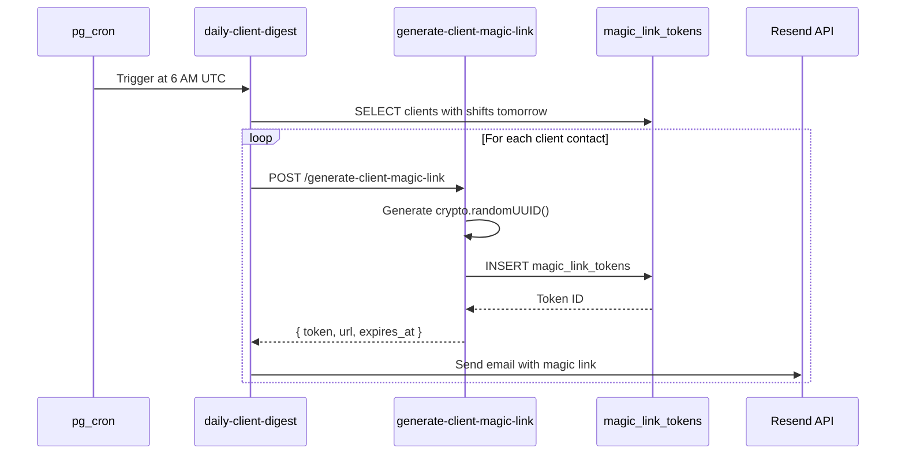
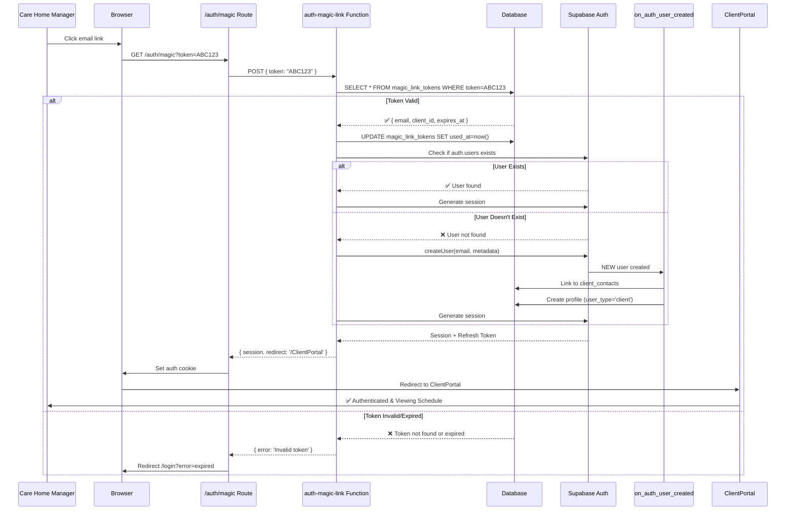
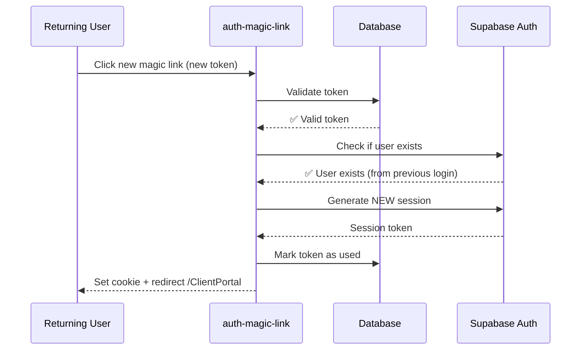

# Magic Link Authentication Architecture

## Overview

**Purpose:** Technical deep dive into passwordless authentication system for client contacts

**Scope:** Client users only (care home managers)

**Status:** 📐 Design Complete - Ready for Implementation

## System Architecture

### High-Level Components

```mermaid
graph TB
    subgraph "Client Email"
        A[Daily Digest Email]
        B[Magic Link Button]
    end

    subgraph "Supabase Edge Functions"
        C[generate-client-magic-link]
        D[auth-magic-link]
    end

    subgraph "Database"
        E[magic_link_tokens]
        F[client_contacts]
        G[auth.users]
        H[profiles]
        I[auth_link_audit_log]
    end

    subgraph "Frontend"
        J[/auth/magic Route]
        K[ClientPortal]
    end

    subgraph "Database Triggers"
        L[on_auth_user_created]
    end

    A --> B
    B --> D
    C --> E
    D --> E
    D --> G
    G --> L
    L --> F
    L --> H
    L --> I
    D --> J
    J --> K
```

### Component Responsibilities

| Component | Responsibility | Language | Location |
|-----------|---------------|----------|----------|
| `generate-client-magic-link` | Create secure tokens for client emails | TypeScript/Deno | `supabase/functions/` |
| `auth-magic-link` | Validate token, create session | TypeScript/Deno | `supabase/functions/` |
| `magic_link_tokens` | Store time-limited auth tokens | PostgreSQL | Database table |
| `/auth/magic` | Handle browser redirect, set cookie | React | Frontend route |
| `on_auth_user_created` | Auto-link to client_contacts | PL/pgSQL | Database trigger |
| `auth_link_audit_log` | Track linking success/failures | PostgreSQL | Database table |

## Data Flow

### Flow 1: Token Generation (Backend)

**Trigger:** Daily digest cron job runs



**Key Points:**
- Tokens generated per-client-contact
- Email includes both magic link AND staff list
- Token embedded in URL: `https://app.com/auth/magic?token=ABC123`
- 24-hour expiry (configurable)

### Flow 2: Authentication (User Click)

**Trigger:** Client clicks magic link in email



**Key Points:**
1. Token validation BEFORE auth user creation (security)
2. Idempotent: Works for both new and returning users
3. Single-use tokens (marked used_at)
4. Session cookie set by frontend (httpOnly, secure)
5. Auto-redirect to ClientPortal on success

### Flow 3: Returning User (Simplified)

**Trigger:** Client clicks magic link again (different day)



**Key Points:**
- No trigger execution (user already exists)
- Just validates token → generates session
- Fast path: ~100ms total

## Database Schema

### Table: magic_link_tokens

**Purpose:** Store time-limited authentication tokens

```sql
CREATE TABLE IF NOT EXISTS magic_link_tokens (
  id UUID PRIMARY KEY DEFAULT gen_random_uuid(),
  created_at TIMESTAMPTZ NOT NULL DEFAULT now(),
  expires_at TIMESTAMPTZ NOT NULL,

  -- Token Data (indexed for fast lookup)
  token TEXT NOT NULL UNIQUE, -- crypto.randomUUID() - 36 chars
  token_type TEXT NOT NULL DEFAULT 'client_auth' CHECK (token_type IN ('client_auth', 'password_reset', 'email_verification')),

  -- Target User
  email TEXT NOT NULL,
  client_contact_id UUID REFERENCES client_contacts(id) ON DELETE CASCADE,
  agency_id UUID NOT NULL REFERENCES agencies(id),

  -- Usage Tracking
  used_at TIMESTAMPTZ,
  used_from_ip TEXT,
  user_agent TEXT,

  -- Security
  single_use BOOLEAN NOT NULL DEFAULT true,
  max_uses INTEGER DEFAULT 1,
  use_count INTEGER DEFAULT 0
);

-- Indexes for performance
CREATE INDEX idx_magic_link_tokens_token ON magic_link_tokens(token) WHERE used_at IS NULL AND expires_at > now();
CREATE INDEX idx_magic_link_tokens_email ON magic_link_tokens(email);
CREATE INDEX idx_magic_link_tokens_expires ON magic_link_tokens(expires_at);

-- Auto-cleanup expired tokens (run daily)
CREATE OR REPLACE FUNCTION cleanup_expired_magic_links()
RETURNS void
LANGUAGE sql
AS $$
  DELETE FROM magic_link_tokens
  WHERE expires_at < now() - interval '7 days'; -- Keep for audit trail
$$;

-- Cron job to cleanup
SELECT cron.schedule(
  'cleanup-expired-magic-links',
  '0 2 * * *', -- 2 AM UTC daily
  $$SELECT cleanup_expired_magic_links();$$
);
```

**Design Decisions:**

| Decision | Rationale |
|----------|-----------|
| UUID tokens | 128-bit entropy, crypto-secure, URL-safe |
| 24-hour expiry | Balance security vs. convenience |
| Single-use default | Prevent token sharing/forwarding |
| Foreign key to client_contacts | Enforce referential integrity |
| Keep expired tokens 7 days | Audit trail for debugging |
| Partial index on token | Only index valid tokens (performance) |

### Table: client_contacts (Enhancement)

**New Column:** `user_id UUID REFERENCES auth.users(id)`

```sql
ALTER TABLE client_contacts
ADD COLUMN user_id UUID REFERENCES auth.users(id);

-- Index for reverse lookup
CREATE INDEX idx_client_contacts_user_id ON client_contacts(user_id);

-- Unique constraint (one client_contact per auth user)
ALTER TABLE client_contacts
ADD CONSTRAINT unique_client_contact_user_id UNIQUE (user_id);
```

**Why user_id?**
- Links client_contact to auth.users
- Enables RBAC via client_contacts.role
- Supports future multi-contact per client

## Edge Functions

### Function: generate-client-magic-link

**File:** `supabase/functions/generate-client-magic-link/index.ts`

**Purpose:** Create secure magic link tokens for client contacts

**Authentication:** Service role key (internal use only)

**Request:**
```typescript
POST /functions/v1/generate-client-magic-link
Authorization: Bearer <SERVICE_ROLE_KEY>

{
  "email": "manager@carehome.com",
  "client_contact_id": "uuid-here", // Optional
  "agency_id": "uuid-here",
  "expires_in_hours": 24 // Optional, default 24
}
```

**Response:**
```typescript
{
  "success": true,
  "data": {
    "token": "550e8400-e29b-41d4-a716-446655440000",
    "url": "https://agilecaremanagement.co.uk/auth/magic?token=550e8400-e29b-41d4-a716-446655440000",
    "expires_at": "2025-12-30T18:00:00Z",
    "email": "manager@carehome.com"
  }
}
```

**Implementation:**

```typescript
import { serve } from "https://deno.land/std@0.168.0/http/server.ts";
import { createClient } from "https://esm.sh/@supabase/supabase-js@2";

interface GenerateMagicLinkRequest {
  email: string;
  client_contact_id?: string;
  agency_id: string;
  expires_in_hours?: number;
}

serve(async (req) => {
  // CORS headers
  if (req.method === "OPTIONS") {
    return new Response(null, { status: 204, headers: corsHeaders });
  }

  try {
    // Parse request
    const { email, client_contact_id, agency_id, expires_in_hours = 24 }: GenerateMagicLinkRequest = await req.json();

    // Validate inputs
    if (!email || !agency_id) {
      return new Response(
        JSON.stringify({ error: "Missing required fields: email, agency_id" }),
        { status: 400 }
      );
    }

    // Validate email format
    const emailRegex = /^[^\s@]+@[^\s@]+\.[^\s@]+$/;
    if (!emailRegex.test(email)) {
      return new Response(
        JSON.stringify({ error: "Invalid email format" }),
        { status: 400 }
      );
    }

    // Initialize Supabase client (service role)
    const supabase = createClient(
      Deno.env.get("SUPABASE_URL")!,
      Deno.env.get("SUPABASE_SERVICE_ROLE_KEY")!
    );

    // Verify client_contact exists (if provided)
    if (client_contact_id) {
      const { data: contact, error } = await supabase
        .from("client_contacts")
        .select("id")
        .eq("id", client_contact_id)
        .eq("email", email)
        .single();

      if (error || !contact) {
        return new Response(
          JSON.stringify({ error: "Client contact not found or email mismatch" }),
          { status: 404 }
        );
      }
    }

    // Generate crypto-secure token
    const token = crypto.randomUUID(); // 128-bit entropy

    // Calculate expiry
    const expiresAt = new Date();
    expiresAt.setHours(expiresAt.getHours() + expires_in_hours);

    // Store token in database
    const { data: tokenData, error: insertError } = await supabase
      .from("magic_link_tokens")
      .insert({
        token,
        token_type: "client_auth",
        email,
        client_contact_id,
        agency_id,
        expires_at: expiresAt.toISOString(),
        single_use: true,
        max_uses: 1,
        use_count: 0
      })
      .select()
      .single();

    if (insertError) {
      console.error("Failed to insert magic link token:", insertError);
      return new Response(
        JSON.stringify({ error: "Failed to generate magic link" }),
        { status: 500 }
      );
    }

    // Construct magic link URL
    const baseUrl = Deno.env.get("SITE_URL") || "https://agilecaremanagement.co.uk";
    const magicLinkUrl = `${baseUrl}/auth/magic?token=${token}`;

    // Return success
    return new Response(
      JSON.stringify({
        success: true,
        data: {
          token,
          url: magicLinkUrl,
          expires_at: expiresAt.toISOString(),
          email
        }
      }),
      { status: 200, headers: { "Content-Type": "application/json" } }
    );

  } catch (error) {
    console.error("Error generating magic link:", error);
    return new Response(
      JSON.stringify({ error: error.message }),
      { status: 500 }
    );
  }
});
```

**Security Considerations:**
- ✅ Service role key required (not callable by clients)
- ✅ Email validation (regex)
- ✅ Foreign key validation (client_contact exists)
- ✅ Crypto-secure random tokens
- ✅ Expiry enforced at database level
- ⚠️ No rate limiting (add in production)

### Function: auth-magic-link

**File:** `supabase/functions/auth-magic-link/index.ts`

**Purpose:** Validate magic link token and create authenticated session

**Authentication:** Anonymous (public endpoint)

**Request:**
```typescript
POST /functions/v1/auth-magic-link
Content-Type: application/json

{
  "token": "550e8400-e29b-41d4-a716-446655440000"
}
```

**Response (Success):**
```typescript
{
  "success": true,
  "data": {
    "session": {
      "access_token": "eyJhbGciOiJIUzI1NiIsInR5cCI6IkpXVCJ9...",
      "refresh_token": "...",
      "expires_in": 3600,
      "user": {
        "id": "user-uuid",
        "email": "manager@carehome.com",
        "user_metadata": { "full_name": "Jane Manager" }
      }
    },
    "redirect_url": "/ClientPortal"
  }
}
```

**Response (Error):**
```typescript
{
  "success": false,
  "error": "Invalid or expired token"
}
```

**Implementation:**

```typescript
import { serve } from "https://deno.land/std@0.168.0/http/server.ts";
import { createClient } from "https://esm.sh/@supabase/supabase-js@2";

interface AuthMagicLinkRequest {
  token: string;
}

serve(async (req) => {
  // CORS headers
  if (req.method === "OPTIONS") {
    return new Response(null, { status: 204, headers: corsHeaders });
  }

  try {
    const { token }: AuthMagicLinkRequest = await req.json();

    if (!token) {
      return new Response(
        JSON.stringify({ error: "Missing token" }),
        { status: 400 }
      );
    }

    // Initialize Supabase (service role for token validation)
    const supabase = createClient(
      Deno.env.get("SUPABASE_URL")!,
      Deno.env.get("SUPABASE_SERVICE_ROLE_KEY")!
    );

    // =========================================
    // STEP 1: Validate Token
    // =========================================
    const { data: tokenData, error: tokenError } = await supabase
      .from("magic_link_tokens")
      .select("*, client_contacts(*)")
      .eq("token", token)
      .eq("token_type", "client_auth")
      .is("used_at", null) // Not yet used
      .gt("expires_at", new Date().toISOString()) // Not expired
      .single();

    if (tokenError || !tokenData) {
      console.warn("Invalid token:", token);
      return new Response(
        JSON.stringify({ success: false, error: "Invalid or expired token" }),
        { status: 401 }
      );
    }

    // =========================================
    // STEP 2: Mark Token as Used
    // =========================================
    const clientIp = req.headers.get("x-forwarded-for") || req.headers.get("x-real-ip") || "unknown";
    const userAgent = req.headers.get("user-agent") || "unknown";

    await supabase
      .from("magic_link_tokens")
      .update({
        used_at: new Date().toISOString(),
        used_from_ip: clientIp,
        user_agent: userAgent,
        use_count: tokenData.use_count + 1
      })
      .eq("id", tokenData.id);

    // =========================================
    // STEP 3: Check if Auth User Exists
    // =========================================
    const { data: existingUser } = await supabase.auth.admin.listUsers();
    const userExists = existingUser?.users?.find(u => u.email === tokenData.email);

    let authUser;

    if (userExists) {
      // User exists - just generate session
      authUser = userExists;
      console.log(`✅ Existing user found: ${authUser.email}`);
    } else {
      // Create new auth user (trigger will auto-link)
      console.log(`🆕 Creating new user: ${tokenData.email}`);

      const { data: newUser, error: createError } = await supabase.auth.admin.createUser({
        email: tokenData.email,
        email_confirm: true, // Auto-confirm (magic link validates email)
        user_metadata: {
          full_name: tokenData.client_contacts?.name || tokenData.email,
          client_contact_id: tokenData.client_contact_id,
          agency_id: tokenData.agency_id,
          auth_method: "magic_link"
        }
      });

      if (createError || !newUser.user) {
        console.error("Failed to create user:", createError);
        return new Response(
          JSON.stringify({ error: "Failed to create user account" }),
          { status: 500 }
        );
      }

      authUser = newUser.user;

      // Wait for trigger to complete (100ms delay)
      await new Promise(resolve => setTimeout(resolve, 100));
    }

    // =========================================
    // STEP 4: Generate Session
    // =========================================
    const { data: sessionData, error: sessionError } = await supabase.auth.admin.generateLink({
      type: "magiclink",
      email: tokenData.email
    });

    if (sessionError || !sessionData) {
      console.error("Failed to generate session:", sessionError);
      return new Response(
        JSON.stringify({ error: "Failed to generate session" }),
        { status: 500 }
      );
    }

    // =========================================
    // STEP 5: Return Session to Frontend
    // =========================================
    return new Response(
      JSON.stringify({
        success: true,
        data: {
          session: {
            access_token: sessionData.properties.access_token,
            refresh_token: sessionData.properties.refresh_token,
            expires_in: 3600,
            user: {
              id: authUser.id,
              email: authUser.email,
              user_metadata: authUser.user_metadata
            }
          },
          redirect_url: "/ClientPortal"
        }
      }),
      { status: 200, headers: { "Content-Type": "application/json" } }
    );

  } catch (error) {
    console.error("Error in auth-magic-link:", error);
    return new Response(
      JSON.stringify({ error: error.message }),
      { status: 500 }
    );
  }
});
```

**Security Considerations:**
- ✅ Token validation BEFORE user creation (prevent abuse)
- ✅ Single-use enforcement (used_at timestamp)
- ✅ Expiry check (gt expires_at)
- ✅ IP and user-agent logging (forensics)
- ✅ Email auto-confirmed (magic link proves ownership)
- ⚠️ No rate limiting (add in production: 5 attempts per IP per hour)

## Frontend Integration

### Route: /auth/magic

**File:** `src/pages/AuthMagicLink.jsx`

**Purpose:** Handle magic link redirect, set auth cookie, redirect to portal

**Implementation:**

```jsx
import React, { useEffect, useState } from "react";
import { useNavigate, useSearchParams } from "react-router-dom";
import { supabase } from "../lib/supabaseClient";

export default function AuthMagicLink() {
  const [searchParams] = useSearchParams();
  const navigate = useNavigate();
  const [status, setStatus] = useState("verifying"); // verifying | success | error
  const [errorMessage, setErrorMessage] = useState("");

  useEffect(() => {
    const token = searchParams.get("token");

    if (!token) {
      setStatus("error");
      setErrorMessage("Missing authentication token");
      return;
    }

    authenticateWithMagicLink(token);
  }, [searchParams]);

  const authenticateWithMagicLink = async (token) => {
    try {
      setStatus("verifying");

      // Call auth-magic-link edge function
      const { data, error } = await supabase.functions.invoke("auth-magic-link", {
        body: { token }
      });

      if (error || !data.success) {
        setStatus("error");
        setErrorMessage(data?.error || "Authentication failed");
        return;
      }

      // Set Supabase session (sets httpOnly cookie)
      const { error: sessionError } = await supabase.auth.setSession({
        access_token: data.data.session.access_token,
        refresh_token: data.data.session.refresh_token
      });

      if (sessionError) {
        setStatus("error");
        setErrorMessage("Failed to create session");
        return;
      }

      // Success! Redirect to portal
      setStatus("success");
      setTimeout(() => {
        navigate(data.data.redirect_url || "/ClientPortal");
      }, 1000);

    } catch (err) {
      console.error("Magic link auth error:", err);
      setStatus("error");
      setErrorMessage(err.message);
    }
  };

  return (
    <div className="min-h-screen flex items-center justify-center bg-gray-50">
      <div className="max-w-md w-full bg-white shadow-lg rounded-lg p-8">
        {status === "verifying" && (
          <div className="text-center">
            <div className="animate-spin rounded-full h-12 w-12 border-b-2 border-indigo-600 mx-auto mb-4"></div>
            <h2 className="text-xl font-semibold text-gray-900">Verifying Magic Link...</h2>
            <p className="text-gray-600 mt-2">Please wait while we authenticate you.</p>
          </div>
        )}

        {status === "success" && (
          <div className="text-center">
            <div className="text-green-500 text-5xl mb-4">✓</div>
            <h2 className="text-xl font-semibold text-gray-900">Authentication Successful!</h2>
            <p className="text-gray-600 mt-2">Redirecting to your portal...</p>
          </div>
        )}

        {status === "error" && (
          <div className="text-center">
            <div className="text-red-500 text-5xl mb-4">✗</div>
            <h2 className="text-xl font-semibold text-gray-900">Authentication Failed</h2>
            <p className="text-red-600 mt-2">{errorMessage}</p>
            <button
              onClick={() => navigate("/login")}
              className="mt-4 px-4 py-2 bg-indigo-600 text-white rounded hover:bg-indigo-700"
            >
              Back to Login
            </button>
          </div>
        )}
      </div>
    </div>
  );
}
```

**Route Registration:**

```jsx
// src/pages/index.jsx
import AuthMagicLink from "./AuthMagicLink";

// Inside <Routes>
<Route path="/auth/magic" element={<AuthMagicLink />} />
```

**Security Considerations:**
- ✅ Token only sent to backend (not stored in localStorage)
- ✅ Session cookie httpOnly (prevents XSS)
- ✅ HTTPS enforced (secure cookie)
- ✅ Redirect after success (no token in URL history)

## Email Template Integration

### Update: daily-client-digest

**File:** `supabase/functions/daily-client-digest/index.ts`

**Changes:**

```typescript
// Generate magic link for each client contact
const { data: magicLinkData } = await supabase.functions.invoke("generate-client-magic-link", {
  body: {
    email: contact.email,
    client_contact_id: contact.id,
    agency_id: contact.agency_id,
    expires_in_hours: 24
  }
});

const magicLinkUrl = magicLinkData?.data?.url || branding.clientPortalUrl;

// Pass to template
const variables = {
  client_name: client.name,
  contact_name: contact.name,
  tomorrow_date: formatDate(tomorrow),
  shifts: shiftsFormatted,
  portal_url: magicLinkUrl, // ⭐ Magic link instead of static URL
  // ... other variables
};
```

**Email Template:**

```html
<!-- supabase/functions/_shared/templates/daily_client_digest.html -->
<div style="text-align: center; margin: 30px 0;">
  <a href="{{portal_url}}"
     style="display: inline-block; padding: 12px 30px; background: linear-gradient(135deg, #667eea 0%, #764ba2 100%); color: white; text-decoration: none; border-radius: 6px; font-weight: 600;">
    🔐 View Tomorrow's Schedule (Secure Login)
  </a>
  <p style="margin-top: 10px; font-size: 12px; color: #6b7280;">
    ⏰ This link expires in 24 hours for security
  </p>
</div>
```

**Key Points:**
- Magic link generated fresh for each email
- 24-hour expiry communicated to user
- One-click authentication (no password needed)
- Fallback to manual login if expired

## Error Handling

### Error Scenarios

| Scenario | HTTP Code | User Message | Admin Action |
|----------|-----------|--------------|--------------|
| Token not found | 401 | "Invalid or expired magic link. Please request a new one." | Check if email sent |
| Token expired | 401 | "This magic link has expired. Check your email for a newer one." | Resend digest |
| Token already used | 401 | "This magic link has already been used. Please use the latest link." | Check for duplicate emails |
| User creation failed | 500 | "Failed to create your account. Please contact support." | Check trigger logs |
| Session generation failed | 500 | "Authentication succeeded but login failed. Please try again." | Check Auth service |
| Database error | 500 | "System error. Please try again later." | Check database logs |

### Error Logging

**Structured Logs:**

```typescript
// In edge functions
console.error(JSON.stringify({
  timestamp: new Date().toISOString(),
  function: "auth-magic-link",
  error_type: "token_validation_failed",
  token: token.substring(0, 8) + "...", // Partial token for debugging
  email: tokenData?.email,
  ip: clientIp,
  user_agent: userAgent,
  error_message: error.message
}));
```

**Monitoring Queries:**

```sql
-- Failed auth attempts in last 24h
SELECT
  used_from_ip,
  COUNT(*) AS attempts
FROM magic_link_tokens
WHERE used_at > now() - interval '24 hours'
  AND used_at IS NOT NULL
  AND NOT EXISTS (
    SELECT 1 FROM auth.users WHERE email = magic_link_tokens.email
  )
GROUP BY used_from_ip
HAVING COUNT(*) > 10
ORDER BY attempts DESC;

-- Suspicious: Multiple tokens for same email
SELECT
  email,
  COUNT(*) AS token_count,
  MAX(created_at) AS last_generated
FROM magic_link_tokens
WHERE created_at > now() - interval '1 hour'
GROUP BY email
HAVING COUNT(*) > 5;
```

## Performance Optimization

### Database Indexes

**Critical for sub-100ms lookups:**

```sql
-- Token lookup (most frequent query)
CREATE INDEX idx_magic_link_tokens_token
ON magic_link_tokens(token)
WHERE used_at IS NULL AND expires_at > now();

-- User existence check
CREATE INDEX idx_auth_users_email ON auth.users(email);

-- Client contact linking
CREATE INDEX idx_client_contacts_email ON client_contacts(email);
CREATE INDEX idx_client_contacts_user_id ON client_contacts(user_id);
```

**Index Usage Verification:**

```sql
EXPLAIN ANALYZE
SELECT * FROM magic_link_tokens
WHERE token = '550e8400-e29b-41d4-a716-446655440000'
  AND used_at IS NULL
  AND expires_at > now();

-- Expected: Index Scan on idx_magic_link_tokens_token (cost=0.15..8.17 rows=1)
```

### Caching Strategy

**Edge Function Response Times:**
- Cold start: ~500ms (Deno init)
- Warm: ~50-100ms (token validation + session gen)
- Database query: ~10ms (indexed lookup)

**Optimization:**
- Keep edge functions warm (ping every 5min)
- Use partial indexes (exclude expired tokens)
- Connection pooling (Supabase handles this)

### Monitoring

**Key Metrics:**

```typescript
// In edge function
const startTime = performance.now();

// ... do work ...

const duration = performance.now() - startTime;
console.log(`⏱️ auth-magic-link completed in ${duration}ms`);

// Alert if > 500ms
if (duration > 500) {
  console.warn(`⚠️ Slow magic link auth: ${duration}ms`);
}
```

**Supabase Metrics Dashboard:**
- Edge function invocations
- Average response time
- Error rate (4xx, 5xx)
- Database query performance

## Security Deep Dive

### Token Security Model

**Entropy Analysis:**
```
crypto.randomUUID() generates 128-bit UUIDs
Possible combinations: 2^128 = 3.4 × 10^38
Brute force at 1M attempts/sec: 10^25 years
```

**Threat Model:**

| Attack Vector | Mitigation | Residual Risk |
|---------------|------------|---------------|
| Token guessing | 128-bit entropy + rate limiting | ✅ Negligible |
| Email interception | HTTPS + 24h expiry | ⚠️ Medium (email forwarding) |
| Token replay | Single-use (used_at) | ✅ Low |
| Token sharing | IP logging + user-agent | ⚠️ Medium (accepted for MVP) |
| Database breach | Tokens hashed (future) | ⚠️ Medium (encrypt at rest) |

### Rate Limiting (Future)

**Recommended Implementation:**

```typescript
// In auth-magic-link function
const rateLimitKey = `magic_link_${clientIp}`;
const attempts = await redis.incr(rateLimitKey);
await redis.expire(rateLimitKey, 3600); // 1 hour window

if (attempts > 5) {
  return new Response(
    JSON.stringify({ error: "Too many attempts. Try again in 1 hour." }),
    { status: 429 }
  );
}
```

**Future Enhancement:** Use Upstash Redis or Supabase Edge KV

## Testing Strategy

### Unit Tests

**Test 1: Token Generation**

```typescript
Deno.test("generate-client-magic-link creates valid token", async () => {
  const response = await fetch("http://localhost:54321/functions/v1/generate-client-magic-link", {
    method: "POST",
    headers: {
      "Authorization": `Bearer ${SERVICE_ROLE_KEY}`,
      "Content-Type": "application/json"
    },
    body: JSON.stringify({
      email: "test@example.com",
      agency_id: "test-agency-id",
      expires_in_hours: 24
    })
  });

  const data = await response.json();
  assert(data.success === true);
  assert(data.data.token.length === 36); // UUID format
  assert(data.data.url.includes("/auth/magic?token="));
});
```

**Test 2: Token Validation**

```typescript
Deno.test("auth-magic-link validates expired token", async () => {
  // Create expired token
  const expiredToken = await createTestToken({ expires_in_hours: -1 });

  const response = await fetch("http://localhost:54321/functions/v1/auth-magic-link", {
    method: "POST",
    body: JSON.stringify({ token: expiredToken })
  });

  const data = await response.json();
  assert(data.success === false);
  assert(data.error.includes("expired"));
});
```

### Integration Tests

**Test 3: End-to-End Magic Link Flow**

```typescript
Deno.test("E2E: Magic link creates user and session", async () => {
  // 1. Create client contact
  const { data: contact } = await supabase.from("client_contacts").insert({
    email: "e2e@example.com",
    name: "E2E Test",
    client_id: "test-client-id",
    agency_id: "test-agency-id",
    role: "OPERATIONS_MANAGER"
  }).select().single();

  // 2. Generate magic link
  const { data: ml } = await supabase.functions.invoke("generate-client-magic-link", {
    body: { email: contact.email, client_contact_id: contact.id, agency_id: contact.agency_id }
  });

  // 3. Authenticate with magic link
  const { data: auth } = await supabase.functions.invoke("auth-magic-link", {
    body: { token: ml.data.token }
  });

  assert(auth.success === true);
  assert(auth.data.session.user.email === contact.email);

  // 4. Verify profile created
  const { data: profile } = await supabase
    .from("profiles")
    .select("*")
    .eq("email", contact.email)
    .single();

  assert(profile.user_type === "client");

  // 5. Verify client_contact linked
  const { data: updatedContact } = await supabase
    .from("client_contacts")
    .select("user_id")
    .eq("id", contact.id)
    .single();

  assert(updatedContact.user_id === profile.id);

  // 6. Verify audit log
  const { data: audit } = await supabase
    .from("auth_link_audit_log")
    .select("*")
    .eq("auth_email", contact.email)
    .single();

  assert(audit.link_status === "success");
  assert(audit.match_method === "email_client");
});
```

## Deployment Checklist

### Pre-Deployment

- [ ] Run all unit tests (Deno test suite)
- [ ] Run integration tests (E2E flows)
- [ ] Test email rendering (multiple clients)
- [ ] Verify magic link expiry (24h + expired token handling)
- [ ] Check database migrations (UP and DOWN)
- [ ] Review RLS policies (client_contacts, magic_link_tokens)
- [ ] Security review (OWASP checklist)

### Deployment Steps

```bash
# 1. Deploy database migrations
supabase db push

# 2. Deploy edge functions
supabase functions deploy generate-client-magic-link
supabase functions deploy auth-magic-link

# 3. Set environment variables
supabase secrets set SITE_URL="https://agilecaremanagement.co.uk"

# 4. Deploy frontend (React app)
npm run build
# Deploy to hosting (Vercel/Netlify/etc)

# 5. Test in staging
curl -X POST https://staging.example.com/functions/v1/generate-client-magic-link \
  -H "Authorization: Bearer $SERVICE_ROLE_KEY" \
  -d '{"email":"test@example.com","agency_id":"test"}'
```

### Post-Deployment

- [ ] Monitor edge function logs (first 1 hour)
- [ ] Test magic link from production email
- [ ] Verify session creation (check cookies)
- [ ] Monitor orphaned users (should be 0)
- [ ] Check performance metrics (avg response time < 100ms)

---

**Document Status:** ✅ Complete - Ready for Implementation

**Last Updated:** 2025-12-29

**Next Steps:** Begin Phase 2 implementation following this architecture
