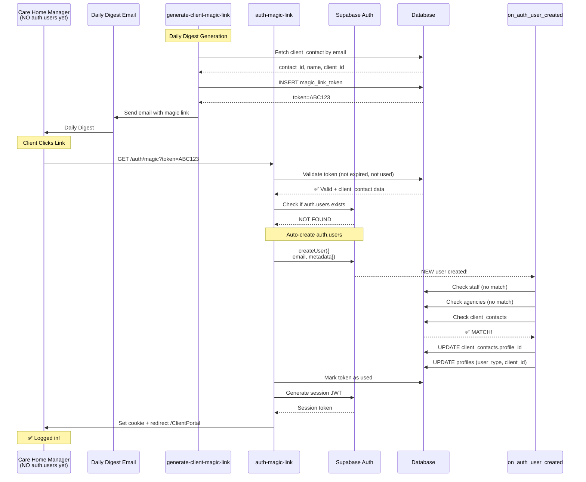

# PHASE 2: Magic Link Authentication for Clients

## Objective
Implement passwordless authentication for client contacts using secure, time-limited magic links.

## Duration
10-14 hours

## Priority
**HIGH** - Solves critical client onboarding friction

## User Decision

**Approved Approach:**
- ✅ Magic link ONLY for **CLIENTS** (no password required)
- ✅ Optional password creation (from settings, not forced)
- ✅ MVP: All clients get OPERATIONS_MANAGER access
- ✅ Future: Support multiple contacts per client with RBAC

**Out of Scope:**
- ❌ Staff magic links - PARKED for future consideration
- Staff continue using password-only authentication (secure accounts for payroll/compliance)

## Problem Statement

### Current Client Onboarding Flow
```
1. Admin creates client_contact record
2. Admin sends invitation email
3. Client clicks invite link
4. Client signs up with password (FRICTION!)
5. Database trigger creates pending profile
6. ProfileSetup calls RPC to link client_contact
7. Finally redirects to ClientPortal
```

**Issues:**
- Existing care home managers won't create password accounts
- 7-step process with multiple failure points
- Poor UX for clients who just want to check tomorrow's schedule

### Desired Flow
```
1. Client receives daily digest email
2. Client clicks "View Today's Schedule"
3. Magic link auto-authenticates
4. Client lands directly on ClientPortal ✅
```

## Architecture

### Magic Link Flow - Complete



## Database Changes

### 1. Extend `magic_link_tokens` Table

**File:** `supabase/migrations/20251228000000_extend_magic_link_tokens.sql`

```sql
-- Add columns for authentication use case
ALTER TABLE magic_link_tokens
  ADD COLUMN IF NOT EXISTS auth_type TEXT DEFAULT 'download'
    CHECK (auth_type IN ('download', 'client_authentication')),
  ADD COLUMN IF NOT EXISTS profile_id UUID REFERENCES profiles(id),
  ADD COLUMN IF NOT EXISTS session_duration_hours INTEGER DEFAULT 720;

-- Create index for auth lookups
CREATE INDEX IF NOT EXISTS idx_magic_link_tokens_auth
  ON magic_link_tokens(token, auth_type)
  WHERE auth_type = 'client_authentication' AND used_at IS NULL;

-- Update RLS policies for auth tokens
CREATE POLICY "Auth tokens readable by auth function"
  ON magic_link_tokens FOR SELECT
  TO service_role
  USING (auth_type = 'client_authentication');
```

### 2. Update Database Trigger

**File:** `supabase/migrations/20251228000001_enhance_auth_trigger.sql`

**Add client_contacts check to existing trigger:**

```sql
CREATE OR REPLACE FUNCTION link_user_on_signup()
RETURNS TRIGGER AS $$
DECLARE
  v_staff staff%ROWTYPE;
  v_agency agencies%ROWTYPE;
  v_contact client_contacts%ROWTYPE;  -- NEW
BEGIN
  -- Check 1: Staff member (EXISTING)
  SELECT * INTO v_staff
  FROM staff
  WHERE email = NEW.email
    AND user_id IS NULL
    AND status = 'onboarding'
  LIMIT 1;

  IF FOUND THEN
    -- [EXISTING staff linking logic]
    RETURN NEW;
  END IF;

  -- Check 2: Agency admin (EXISTING)
  SELECT * INTO v_agency
  FROM agencies
  WHERE contact_email = NEW.email
  LIMIT 1;

  IF FOUND THEN
    -- [EXISTING agency linking logic]
    RETURN NEW;
  END IF;

  -- Check 3: Client contact (NEW!)
  SELECT * INTO v_contact
  FROM client_contacts
  WHERE email = NEW.email
    AND profile_id IS NULL
    AND is_active = true
  LIMIT 1;

  IF FOUND THEN
    -- Link client_contact to profile
    UPDATE client_contacts
    SET profile_id = NEW.id,
        updated_at = NOW()
    WHERE id = v_contact.id;

    -- Get client's agency_id
    DECLARE
      v_client_agency_id UUID;
    BEGIN
      SELECT agency_id INTO v_client_agency_id
      FROM clients
      WHERE id = v_contact.client_id;

      -- Create/update profile
      INSERT INTO profiles (
        id,
        email,
        user_type,
        client_id,
        agency_id,
        full_name,
        phone,
        created_at,
        updated_at
      )
      VALUES (
        NEW.id,
        NEW.email,
        'client_user',
        v_contact.client_id,
        v_client_agency_id,
        COALESCE(
          NEW.raw_user_meta_data->>'full_name',
          v_contact.first_name || ' ' || v_contact.last_name
        ),
        v_contact.phone_number,
        NOW(),
        NOW()
      )
      ON CONFLICT (id) DO UPDATE SET
        user_type = 'client_user',
        client_id = EXCLUDED.client_id,
        agency_id = EXCLUDED.agency_id,
        full_name = COALESCE(profiles.full_name, EXCLUDED.full_name),
        updated_at = NOW();

      RETURN NEW;
    END;
  END IF;

  -- Check 4: No match → pending (EXISTING)
  -- [EXISTING pending logic]
  RETURN NEW;
END;
$$ LANGUAGE plpgsql SECURITY DEFINER;
```

## Edge Functions

### 1. generate-client-magic-link

**File:** `supabase/functions/generate-client-magic-link/index.ts`

**Purpose:** Create magic link token for a client contact

**Input:**
```typescript
{
  client_contact_id: "uuid",
  email: "manager@carehome.com"
}
```

**Output:**
```typescript
{
  magic_link: "https://agilecaremanagement.co.uk/auth/magic?token=ABC123",
  expires_at: "2025-12-29T10:00:00Z"
}
```

**Implementation:**
```typescript
import { serve } from "https://deno.land/std@0.168.0/http/server.ts";
import { createClient } from "https://esm.sh/@supabase/supabase-js@2";

serve(async (req) => {
  try {
    const supabase = createClient(
      Deno.env.get("SUPABASE_URL") ?? "",
      Deno.env.get("SUPABASE_SERVICE_ROLE_KEY") ?? ""
    );

    const { client_contact_id, email } = await req.json();

    // Validate client_contact exists and is active
    const { data: contact, error: contactError } = await supabase
      .from("client_contacts")
      .select("*, clients!inner(agency_id)")
      .eq("id", client_contact_id)
      .eq("email", email)
      .eq("is_active", true)
      .single();

    if (contactError || !contact) {
      throw new Error("Client contact not found or inactive");
    }

    // Generate secure token
    const token = crypto.randomUUID();
    const expiresAt = new Date(Date.now() + 24 * 60 * 60 * 1000); // 24 hours

    // Insert token
    const { error: tokenError } = await supabase
      .from("magic_link_tokens")
      .insert({
        token,
        auth_type: "client_authentication",
        client_id: contact.client_id,
        agency_id: contact.clients.agency_id,
        expires_at: expiresAt.toISOString(),
        metadata: {
          client_contact_id: contact.id,
          email: contact.email,
          first_name: contact.first_name,
          last_name: contact.last_name
        }
      });

    if (tokenError) throw tokenError;

    // Build magic link URL
    const SITE_URL = Deno.env.get("SITE_URL") || "https://agilecaremanagement.co.uk";
    const magicLink = `${SITE_URL}/auth/magic?token=${token}`;

    return new Response(
      JSON.stringify({
        success: true,
        magic_link: magicLink,
        expires_at: expiresAt.toISOString()
      }),
      { headers: { "Content-Type": "application/json" } }
    );

  } catch (error) {
    return new Response(
      JSON.stringify({ success: false, error: error.message }),
      { status: 400, headers: { "Content-Type": "application/json" } }
    );
  }
});
```

### 2. auth-magic-link

**File:** `supabase/functions/auth-magic-link/index.ts`

**Purpose:** Validate token and create session

**Input:** Query param `?token=ABC123`

**Output:** Redirect to `/ClientPortal` with session cookie

**Implementation:**
```typescript
import { serve } from "https://deno.land/std@0.168.0/http/server.ts";
import { createClient } from "https://esm.sh/@supabase/supabase-js@2";

serve(async (req) => {
  try {
    const url = new URL(req.url);
    const token = url.searchParams.get("token");

    if (!token) {
      throw new Error("Token missing");
    }

    const supabase = createClient(
      Deno.env.get("SUPABASE_URL") ?? "",
      Deno.env.get("SUPABASE_SERVICE_ROLE_KEY") ?? ""
    );

    // Validate token
    const { data: tokenData, error: tokenError } = await supabase
      .from("magic_link_tokens")
      .select("*")
      .eq("token", token)
      .eq("auth_type", "client_authentication")
      .is("used_at", null)
      .gt("expires_at", new Date().toISOString())
      .single();

    if (tokenError || !tokenData) {
      throw new Error("Invalid or expired token");
    }

    const metadata = tokenData.metadata as any;
    const email = metadata.email;

    // Check if user already exists
    const { data: existingUser } = await supabase.auth.admin.getUserByEmail(email);

    let userId;

    if (!existingUser?.user) {
      // Create auth.users account
      const { data: newUser, error: createError } = await supabase.auth.admin.createUser({
        email,
        email_confirm: true, // Skip email verification
        user_metadata: {
          full_name: `${metadata.first_name} ${metadata.last_name}`,
          source: "magic_link_client",
          client_contact_id: metadata.client_contact_id
        }
      });

      if (createError) throw createError;
      userId = newUser.user.id;

      // Wait for trigger to complete (poll profiles table)
      let attempts = 0;
      while (attempts < 10) {
        const { data: profile } = await supabase
          .from("profiles")
          .select("user_type")
          .eq("id", userId)
          .single();

        if (profile?.user_type === "client_user") break;
        await new Promise(resolve => setTimeout(resolve, 500));
        attempts++;
      }
    } else {
      userId = existingUser.user.id;
    }

    // Mark token as used
    await supabase
      .from("magic_link_tokens")
      .update({ used_at: new Date().toISOString() })
      .eq("token", token);

    // Generate session link
    const { data: sessionData, error: sessionError } = await supabase.auth.admin.generateLink({
      type: "magiclink",
      email
    });

    if (sessionError) throw sessionError;

    // Redirect with session
    const redirectUrl = `${Deno.env.get("SITE_URL") || "https://agilecaremanagement.co.uk"}/ClientPortal`;

    return new Response(null, {
      status: 302,
      headers: {
        "Location": redirectUrl,
        "Set-Cookie": `sb-access-token=${sessionData.properties.hashed_token}; Path=/; HttpOnly; Secure; SameSite=Lax`
      }
    });

  } catch (error) {
    // Redirect to error page
    const errorUrl = `${Deno.env.get("SITE_URL")}/login?error=${encodeURIComponent(error.message)}`;
    return new Response(null, {
      status: 302,
      headers: { "Location": errorUrl }
    });
  }
});
```

### 3. Update daily-client-digest

**File:** `supabase/functions/daily-client-digest/index.ts`

**Add magic link generation before sending email:**

```typescript
// After fetching client contact info
const clientContactEmail = client.contact_person.email;

// Generate magic link
const { data: magicLinkData } = await supabase.functions.invoke('generate-client-magic-link', {
  body: {
    client_contact_id: clientContact.id, // You'll need to fetch this
    email: clientContactEmail
  }
});

const magicLink = magicLinkData?.magic_link || branding.clientPortalUrl;

// Pass to template
const templateVars = {
  // ... existing vars
  portal_url: magicLink, // Now a magic link instead of static URL
};
```

## Frontend Changes

### Create /auth/magic Route

**File:** `src/pages/AuthMagicLink.jsx`

```jsx
import React, { useEffect, useState } from 'react';
import { useNavigate, useSearchParams } from 'react-router-dom';
import { supabase } from '@/api/supabase';

export default function AuthMagicLink() {
  const [searchParams] = useSearchParams();
  const [status, setStatus] = useState('validating');
  const [error, setError] = useState(null);
  const navigate = useNavigate();

  useEffect(() => {
    const token = searchParams.get('token');

    if (!token) {
      setError('No authentication token provided');
      setStatus('error');
      return;
    }

    // Call edge function to validate and authenticate
    fetch(`${import.meta.env.VITE_SUPABASE_URL}/functions/v1/auth-magic-link?token=${token}`, {
      method: 'GET',
      credentials: 'include'
    })
      .then(res => {
        if (res.redirected) {
          // Edge function handled redirect
          window.location.href = res.url;
        } else if (res.ok) {
          navigate('/ClientPortal');
        } else {
          throw new Error('Authentication failed');
        }
      })
      .catch(err => {
        setError(err.message);
        setStatus('error');
      });
  }, [searchParams, navigate]);

  if (status === 'validating') {
    return (
      <div className="min-h-screen flex items-center justify-center bg-gray-50">
        <div className="text-center">
          <div className="animate-spin rounded-full h-12 w-12 border-b-2 border-blue-600 mx-auto"></div>
          <p className="mt-4 text-gray-600">Signing you in...</p>
        </div>
      </div>
    );
  }

  if (status === 'error') {
    return (
      <div className="min-h-screen flex items-center justify-center bg-gray-50">
        <div className="max-w-md w-full bg-white shadow-lg rounded-lg p-6">
          <h2 className="text-2xl font-bold text-red-600 mb-4">Authentication Failed</h2>
          <p className="text-gray-600 mb-4">{error}</p>
          <p className="text-sm text-gray-500 mb-4">
            Your login link may have expired or already been used.
          </p>
          <button
            onClick={() => navigate('/login')}
            className="w-full bg-blue-600 text-white py-2 px-4 rounded hover:bg-blue-700"
          >
            Back to Login
          </button>
        </div>
      </div>
    );
  }

  return null;
}
```

**Add route in `src/pages/index.jsx`:**
```jsx
import AuthMagicLink from "./AuthMagicLink";

// In routes
<Route path="/auth/magic" element={<AuthMagicLink />} />
```

## Security Considerations

### Token Security
- ✅ Crypto-secure UUIDs (128-bit entropy)
- ✅ 24-hour expiration
- ✅ Single-use (marked used_at)
- ✅ HTTPS only in production

### Email Forwarding Risk
- ⚠️ **Risk:** User forwards email, recipient uses magic link
- **Mitigation (MVP):** Accept risk - client data is low-sensitivity
- **Future:** Add IP binding or device fingerprinting

### Session Security
- ✅ HttpOnly cookies
- ✅ Secure flag in production
- ✅ SameSite=Lax
- ✅ 30-day session duration (configurable)

## Testing

### Unit Tests
- [ ] Token generation creates valid UUID
- [ ] Token expires after 24h
- [ ] Used tokens cannot be reused
- [ ] Invalid tokens return error
- [ ] Expired tokens return error

### Integration Tests
- [ ] Full flow: Generate → Click → Authenticate → Land on ClientPortal
- [ ] User without auth.users gets created
- [ ] User with existing auth.users gets session
- [ ] Trigger links profile correctly
- [ ] RBAC respected (OPERATIONS_MANAGER access)

### Manual Testing
- [ ] Send magic link email to test client
- [ ] Click link on desktop browser
- [ ] Click link on mobile browser
- [ ] Click same link twice (should fail second time)
- [ ] Wait 25 hours, click link (should fail)
- [ ] Verify user can set password later from settings

## Deployment

### Step 1: Database Migrations
```bash
supabase migration up 20251228000000_extend_magic_link_tokens.sql
supabase migration up 20251228000001_enhance_auth_trigger.sql
```

### Step 2: Deploy Edge Functions
```bash
supabase functions deploy generate-client-magic-link
supabase functions deploy auth-magic-link
supabase functions deploy daily-client-digest
```

### Step 3: Deploy Frontend
```bash
npm run build
# Deploy to hosting
```

### Step 4: Test in Staging
- Send test magic link email
- Verify full authentication flow
- Check error logging

### Step 5: Production Rollout
- Deploy to production
- Enable for single agency first
- Monitor for 48 hours
- Gradual rollout to all agencies

## Success Metrics

- ✅ 90%+ of clients use magic links (vs password signup)
- ✅ Average login time < 5 seconds
- ✅ Zero orphaned users created
- ✅ < 1% token validation failures
- ✅ ClientPortal page views increase 50%+

## Future Enhancements

### Phase 2.1: Multiple Contacts per Client
- UI to add multiple client_contacts
- Each contact gets their own magic link
- RBAC roles enforced (OPERATIONS_MANAGER, FINANCE_MANAGER, etc.)

### Phase 2.2: Optional Password
- Add "Set Password" button in ClientPortal settings
- Only shown if user has no password (magic link user)
- Uses Supabase updateUser() method

### Phase 2.3: IP Binding
- Store IP address when generating token
- Validate IP matches when redeeming
- Send verification email if IP differs

---

**Ready for implementation after Phase 1 complete!**
