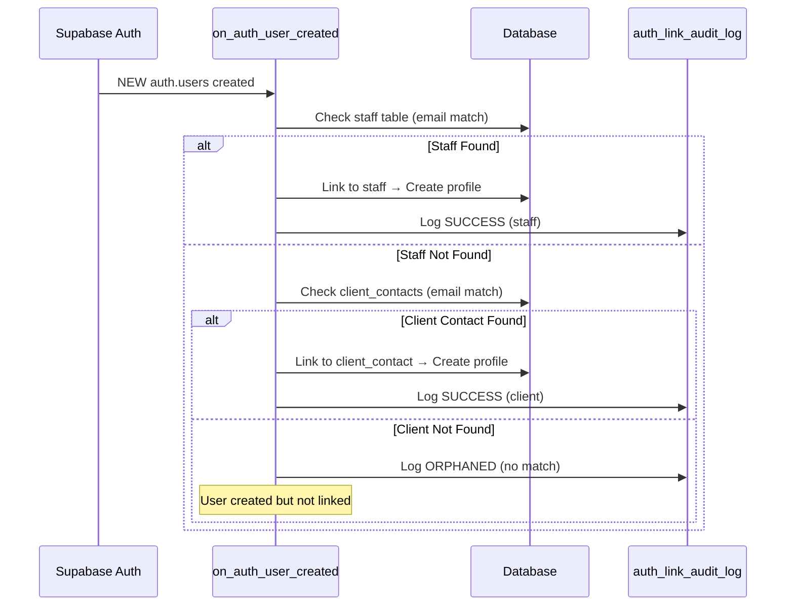

# PHASE 4: Database Trigger Enhancements

## Overview

**Objective:** Enhance the `on_auth_user_created` trigger to support client magic link authentication, add comprehensive audit logging, and prevent orphaned users.

**Duration:** 2-3 hours

**Priority:** P1 - High (foundational for Phase 2)

**Status:** 🔜 PENDING

## Problem Statement

### Current Trigger Limitations

The existing `on_auth_user_created` trigger has several gaps:

1. **Staff-Only Design**
   - Only links to `staff` table via email matching
   - No support for `client_contacts` table
   - Client magic link auth would create orphaned users

2. **No Audit Trail**
   - Can't track when users were auto-linked
   - Can't debug failed linkages
   - No forensic evidence for security reviews

3. **Limited Metadata Usage**
   - Doesn't use `user_metadata.full_name` for linking
   - Missing opportunity to prevent orphaned users
   - No validation of linking success

4. **Single User Type Support**
   - Assumes all signups are staff
   - Client contacts not handled
   - Agency admins manually linked

### Why This Matters

**Risk Without Fix:**
```
Magic Link Email → Click Link → auth.users created → ❌ NO PROFILE LINK → Orphaned User
```

**Impact:**
- User authenticated but can't access any features
- No RBAC data (undefined user_type)
- Database integrity compromised
- Manual cleanup required

## Technical Architecture

### Enhanced Trigger Flow



### Audit Log Schema

**Purpose:** Track every auto-linking attempt for debugging and security

```sql
CREATE TABLE IF NOT EXISTS auth_link_audit_log (
  id UUID PRIMARY KEY DEFAULT gen_random_uuid(),
  created_at TIMESTAMPTZ NOT NULL DEFAULT now(),

  -- Auth User Details
  auth_user_id UUID NOT NULL REFERENCES auth.users(id) ON DELETE CASCADE,
  auth_email TEXT NOT NULL,
  auth_metadata JSONB, -- Full user_metadata for forensics

  -- Linking Outcome
  link_status TEXT NOT NULL CHECK (link_status IN ('success', 'orphaned', 'error')),
  linked_to_table TEXT, -- 'staff', 'client_contacts', or NULL
  linked_to_id UUID, -- Foreign key to linked record
  user_type TEXT, -- 'staff', 'client', 'admin', or NULL

  -- Debugging
  match_method TEXT, -- 'email_staff', 'email_client', 'metadata_fullname', etc.
  error_message TEXT, -- If link_status = 'error'

  -- Performance
  execution_time_ms INTEGER -- Trigger execution duration
);

-- Indexes for querying
CREATE INDEX idx_auth_link_audit_auth_user ON auth_link_audit_log(auth_user_id);
CREATE INDEX idx_auth_link_audit_status ON auth_link_audit_log(link_status);
CREATE INDEX idx_auth_link_audit_created ON auth_link_audit_log(created_at DESC);
```

### Enhanced Trigger Logic

**New Capabilities:**
1. ✅ Match against `staff` table (existing)
2. ✅ Match against `client_contacts` table (NEW)
3. ✅ Use `user_metadata.full_name` as secondary match (future-proofing)
4. ✅ Log every attempt to audit table
5. ✅ Track execution time for performance monitoring

**Matching Priority:**
```
1. staff.email = auth.users.email → user_type = 'staff'
2. client_contacts.email = auth.users.email → user_type = 'client'
3. No match → ORPHANED (logged, not blocked)
```

**Key Decision:** We DO NOT block orphaned users (graceful degradation). Instead:
- User can authenticate successfully
- Audit log captures the event
- Admin dashboard shows orphaned users for manual review
- Future module can add invite-only system

## Implementation Tasks

### Task 1: Create Audit Log Table

**File:** `supabase/migrations/[TIMESTAMP]_create_auth_link_audit_log.sql`

**Migration:**

```sql
-- UP Migration
CREATE TABLE IF NOT EXISTS auth_link_audit_log (
  id UUID PRIMARY KEY DEFAULT gen_random_uuid(),
  created_at TIMESTAMPTZ NOT NULL DEFAULT now(),

  -- Auth User Details
  auth_user_id UUID NOT NULL REFERENCES auth.users(id) ON DELETE CASCADE,
  auth_email TEXT NOT NULL,
  auth_metadata JSONB,

  -- Linking Outcome
  link_status TEXT NOT NULL CHECK (link_status IN ('success', 'orphaned', 'error')),
  linked_to_table TEXT,
  linked_to_id UUID,
  user_type TEXT,

  -- Debugging
  match_method TEXT,
  error_message TEXT,

  -- Performance
  execution_time_ms INTEGER
);

-- Indexes
CREATE INDEX idx_auth_link_audit_auth_user ON auth_link_audit_log(auth_user_id);
CREATE INDEX idx_auth_link_audit_status ON auth_link_audit_log(link_status);
CREATE INDEX idx_auth_link_audit_created ON auth_link_audit_log(created_at DESC);

-- RLS Policies (admin-only access)
ALTER TABLE auth_link_audit_log ENABLE ROW LEVEL SECURITY;

CREATE POLICY "Admin can view audit logs"
  ON auth_link_audit_log
  FOR SELECT
  USING (
    EXISTS (
      SELECT 1 FROM profiles
      WHERE profiles.id = auth.uid()
      AND profiles.user_type = 'admin'
    )
  );

-- DOWN Migration
DROP TABLE IF EXISTS auth_link_audit_log CASCADE;
```

**Testing:**
```sql
-- Verify table created
SELECT * FROM auth_link_audit_log LIMIT 1;

-- Verify RLS enabled
SELECT tablename, rowsecurity FROM pg_tables WHERE tablename = 'auth_link_audit_log';

-- Verify policies
SELECT * FROM pg_policies WHERE tablename = 'auth_link_audit_log';
```

### Task 2: Enhance on_auth_user_created Trigger

**File:** `supabase/migrations/[TIMESTAMP]_enhance_auth_user_trigger.sql`

**Current Trigger Location:** Check existing migrations for `fix_staff_signup_linking.sql` or similar

**Enhanced Trigger Function:**

```sql
-- UP Migration
CREATE OR REPLACE FUNCTION handle_new_user()
RETURNS TRIGGER
LANGUAGE plpgsql
SECURITY DEFINER
SET search_path = public
AS $$
DECLARE
  start_time TIMESTAMPTZ;
  end_time TIMESTAMPTZ;
  execution_ms INTEGER;

  staff_match RECORD;
  client_match RECORD;
  profile_id UUID;

  v_link_status TEXT;
  v_linked_to_table TEXT;
  v_linked_to_id UUID;
  v_user_type TEXT;
  v_match_method TEXT;
  v_error TEXT;
BEGIN
  start_time := clock_timestamp();

  -- Default to orphaned (will update if match found)
  v_link_status := 'orphaned';
  v_linked_to_table := NULL;
  v_linked_to_id := NULL;
  v_user_type := NULL;
  v_match_method := NULL;
  v_error := NULL;

  BEGIN
    -- PRIORITY 1: Check staff table
    SELECT id, first_name, last_name, agency_id
    INTO staff_match
    FROM staff
    WHERE email = NEW.email
    LIMIT 1;

    IF FOUND THEN
      -- Create profile linked to staff
      INSERT INTO profiles (id, email, user_type, full_name, agency_id)
      VALUES (
        NEW.id,
        NEW.email,
        'staff',
        COALESCE(
          NEW.raw_user_meta_data->>'full_name',
          staff_match.first_name || ' ' || staff_match.last_name
        ),
        staff_match.agency_id
      )
      RETURNING id INTO profile_id;

      -- Update staff record
      UPDATE staff
      SET user_id = NEW.id
      WHERE id = staff_match.id;

      -- Log success
      v_link_status := 'success';
      v_linked_to_table := 'staff';
      v_linked_to_id := staff_match.id;
      v_user_type := 'staff';
      v_match_method := 'email_staff';

    ELSE
      -- PRIORITY 2: Check client_contacts table
      SELECT id, name, client_id, agency_id, role
      INTO client_match
      FROM client_contacts
      WHERE email = NEW.email
      LIMIT 1;

      IF FOUND THEN
        -- Create profile linked to client contact
        INSERT INTO profiles (id, email, user_type, full_name, agency_id)
        VALUES (
          NEW.id,
          NEW.email,
          'client',
          COALESCE(
            NEW.raw_user_meta_data->>'full_name',
            client_match.name
          ),
          client_match.agency_id
        )
        RETURNING id INTO profile_id;

        -- Update client_contacts record
        UPDATE client_contacts
        SET user_id = NEW.id
        WHERE id = client_match.id;

        -- Log success
        v_link_status := 'success';
        v_linked_to_table := 'client_contacts';
        v_linked_to_id := client_match.id;
        v_user_type := 'client';
        v_match_method := 'email_client';

      ELSE
        -- No match found - orphaned user
        v_link_status := 'orphaned';
        v_error := 'No matching staff or client_contact found for email: ' || NEW.email;
      END IF;
    END IF;

  EXCEPTION WHEN OTHERS THEN
    -- Log error but don't block user creation
    v_link_status := 'error';
    v_error := SQLERRM;
  END;

  -- Calculate execution time
  end_time := clock_timestamp();
  execution_ms := EXTRACT(EPOCH FROM (end_time - start_time)) * 1000;

  -- Always log to audit table
  INSERT INTO auth_link_audit_log (
    auth_user_id,
    auth_email,
    auth_metadata,
    link_status,
    linked_to_table,
    linked_to_id,
    user_type,
    match_method,
    error_message,
    execution_time_ms
  )
  VALUES (
    NEW.id,
    NEW.email,
    NEW.raw_user_meta_data,
    v_link_status,
    v_linked_to_table,
    v_linked_to_id,
    v_user_type,
    v_match_method,
    v_error,
    execution_ms
  );

  RETURN NEW;
END;
$$;

-- Ensure trigger exists
DROP TRIGGER IF EXISTS on_auth_user_created ON auth.users;

CREATE TRIGGER on_auth_user_created
  AFTER INSERT ON auth.users
  FOR EACH ROW
  EXECUTE FUNCTION handle_new_user();

-- DOWN Migration
-- Revert to previous trigger version (staff-only)
-- (Include previous trigger code here for rollback)
```

**Key Changes:**
1. ✅ Added `client_contacts` matching (lines 45-72)
2. ✅ Priority order: staff → client_contacts → orphaned
3. ✅ Comprehensive audit logging (lines 80-95)
4. ✅ Performance tracking (execution_time_ms)
5. ✅ Graceful error handling (doesn't block user creation)
6. ✅ Uses `raw_user_meta_data->>'full_name'` for profile.full_name

### Task 3: Create Orphaned User Detection View

**Purpose:** Admin dashboard to identify orphaned users requiring manual linking

**File:** `supabase/migrations/[TIMESTAMP]_create_orphaned_users_view.sql`

```sql
-- UP Migration
CREATE OR REPLACE VIEW orphaned_users AS
SELECT
  au.id AS auth_user_id,
  au.email,
  au.created_at,
  au.raw_user_meta_data->>'full_name' AS metadata_name,
  aal.match_method,
  aal.error_message,
  aal.execution_time_ms,
  -- Check if profile exists (should be NULL for true orphans)
  p.id AS profile_id,
  p.user_type
FROM auth.users au
LEFT JOIN auth_link_audit_log aal ON au.id = aal.auth_user_id
LEFT JOIN profiles p ON au.id = p.id
WHERE aal.link_status = 'orphaned' OR p.id IS NULL
ORDER BY au.created_at DESC;

-- Grant access to admins
GRANT SELECT ON orphaned_users TO authenticated;

-- RLS Policy
ALTER VIEW orphaned_users SET (security_invoker = on);

-- DOWN Migration
DROP VIEW IF EXISTS orphaned_users;
```

**Usage:**
```sql
-- Admin dashboard query
SELECT * FROM orphaned_users;

-- Count orphaned users
SELECT COUNT(*) FROM orphaned_users;

-- Orphaned users by date
SELECT DATE(created_at), COUNT(*)
FROM orphaned_users
GROUP BY DATE(created_at)
ORDER BY DATE(created_at) DESC;
```

### Task 4: Add Admin Notification for Orphaned Users

**Optional Enhancement:** Email admins when orphaned users detected

**File:** `supabase/functions/orphaned-user-notifier/index.ts`

**Trigger:** Daily cron job or real-time on audit log insert

```typescript
import { serve } from "https://deno.land/std@0.168.0/http/server.ts";
import { createClient } from "https://esm.sh/@supabase/supabase-js@2";

serve(async (req) => {
  const supabase = createClient(
    Deno.env.get("SUPABASE_URL")!,
    Deno.env.get("SUPABASE_SERVICE_ROLE_KEY")!
  );

  // Get orphaned users from last 24 hours
  const { data: orphaned, error } = await supabase
    .from("auth_link_audit_log")
    .select("*")
    .eq("link_status", "orphaned")
    .gte("created_at", new Date(Date.now() - 24 * 60 * 60 * 1000).toISOString());

  if (error || !orphaned || orphaned.length === 0) {
    return new Response(JSON.stringify({ orphaned: 0 }), { status: 200 });
  }

  // Send notification to admins
  await supabase.functions.invoke("send-email", {
    body: {
      to: "admin@agilecaremanagement.co.uk",
      subject: `⚠️ ${orphaned.length} Orphaned Users Detected`,
      html: `
        <h2>Orphaned User Alert</h2>
        <p>${orphaned.length} user(s) created in last 24h without profile linkage.</p>
        <ul>
          ${orphaned.map(u => `<li>${u.auth_email} - ${u.error_message}</li>`).join("")}
        </ul>
        <p><a href="https://agilecaremanagement.co.uk/Dashboard?view=orphaned-users">Review Orphaned Users</a></p>
      `
    }
  });

  return new Response(JSON.stringify({ notified: true, count: orphaned.length }), { status: 200 });
});
```

**Cron Schedule:**
```sql
-- Run daily at 9 AM UTC
SELECT cron.schedule(
  'notify-orphaned-users',
  '0 9 * * *',
  $$
  SELECT net.http_post(
    url := 'https://rzzxxkppkiasuouuglaf.supabase.co/functions/v1/orphaned-user-notifier',
    headers := '{"Authorization": "Bearer ' || current_setting('app.settings.service_role_key') || '"}'::jsonb
  );
  $$
);
```

## Testing Strategy

### Unit Tests (SQL)

**Test 1: Staff User Auto-Link**

```sql
-- Create test staff
INSERT INTO staff (email, first_name, last_name, agency_id)
VALUES ('test.staff@example.com', 'Test', 'Staff', 'agency-uuid');

-- Simulate auth user creation
INSERT INTO auth.users (email, raw_user_meta_data)
VALUES ('test.staff@example.com', '{"full_name": "Test Staff"}'::jsonb);

-- Verify auto-link
SELECT
  au.id AS auth_id,
  p.id AS profile_id,
  p.user_type,
  s.user_id AS staff_user_id,
  aal.link_status,
  aal.match_method
FROM auth.users au
JOIN profiles p ON au.id = p.id
JOIN staff s ON p.id = s.user_id
JOIN auth_link_audit_log aal ON au.id = aal.auth_user_id
WHERE au.email = 'test.staff@example.com';

-- Expected:
-- ✅ profile exists with user_type='staff'
-- ✅ staff.user_id matches auth.users.id
-- ✅ audit log shows link_status='success', match_method='email_staff'
```

**Test 2: Client Contact Auto-Link**

```sql
-- Create test client contact
INSERT INTO client_contacts (email, name, client_id, agency_id, role)
VALUES ('manager@carehome.com', 'Jane Manager', 'client-uuid', 'agency-uuid', 'OPERATIONS_MANAGER');

-- Simulate magic link auth (user creation)
INSERT INTO auth.users (email, raw_user_meta_data)
VALUES ('manager@carehome.com', '{"full_name": "Jane Manager"}'::jsonb);

-- Verify auto-link
SELECT
  au.id AS auth_id,
  p.id AS profile_id,
  p.user_type,
  cc.user_id AS client_contact_user_id,
  aal.link_status,
  aal.match_method
FROM auth.users au
JOIN profiles p ON au.id = p.id
JOIN client_contacts cc ON p.id = cc.user_id
JOIN auth_link_audit_log aal ON au.id = aal.auth_user_id
WHERE au.email = 'manager@carehome.com';

-- Expected:
-- ✅ profile exists with user_type='client'
-- ✅ client_contacts.user_id matches auth.users.id
-- ✅ audit log shows link_status='success', match_method='email_client'
```

**Test 3: Orphaned User (No Match)**

```sql
-- Simulate random signup (no staff or client_contact exists)
INSERT INTO auth.users (email, raw_user_meta_data)
VALUES ('random.user@gmail.com', '{"full_name": "Random User"}'::jsonb);

-- Verify orphaned
SELECT
  au.id AS auth_id,
  p.id AS profile_id,  -- Should be NULL
  aal.link_status,     -- Should be 'orphaned'
  aal.error_message
FROM auth.users au
LEFT JOIN profiles p ON au.id = p.id
JOIN auth_link_audit_log aal ON au.id = aal.auth_user_id
WHERE au.email = 'random.user@gmail.com';

-- Expected:
-- ✅ auth.users record exists
-- ❌ NO profile record (profile_id IS NULL)
-- ✅ audit log shows link_status='orphaned'
-- ✅ error_message explains why
```

**Test 4: Performance Monitoring**

```sql
-- Check average execution time
SELECT
  AVG(execution_time_ms) AS avg_ms,
  MAX(execution_time_ms) AS max_ms,
  MIN(execution_time_ms) AS min_ms,
  COUNT(*) AS total_triggers
FROM auth_link_audit_log
WHERE created_at > now() - interval '7 days';

-- Expected:
-- ✅ avg_ms < 50ms (fast trigger)
-- ✅ max_ms < 200ms (no outliers)
```

### Integration Tests

**Test 5: Magic Link Flow (End-to-End)**

```typescript
// 1. Admin creates client contact
await supabase.from("client_contacts").insert({
  email: "newclient@example.com",
  name: "New Client",
  client_id: "client-uuid",
  agency_id: "agency-uuid",
  role: "OPERATIONS_MANAGER"
});

// 2. Generate magic link
const { data: magicLink } = await supabase.functions.invoke("generate-client-magic-link", {
  body: { email: "newclient@example.com" }
});

// 3. Simulate click (creates auth user)
const { data: session } = await supabase.functions.invoke("auth-magic-link", {
  body: { token: magicLink.token }
});

// 4. Verify auto-link happened
const { data: profile } = await supabase
  .from("profiles")
  .select("*, client_contacts(*)")
  .eq("email", "newclient@example.com")
  .single();

// Assertions
assert(profile.user_type === "client");
assert(profile.client_contacts.user_id === profile.id);

// 5. Verify audit log
const { data: audit } = await supabase
  .from("auth_link_audit_log")
  .select("*")
  .eq("auth_email", "newclient@example.com")
  .single();

assert(audit.link_status === "success");
assert(audit.match_method === "email_client");
```

### Rollback Tests

**Test 6: Migration Rollback**

```bash
# Apply migrations
supabase migration up

# Verify trigger works
psql -c "SELECT handle_new_user();"

# Rollback migration
supabase migration down

# Verify old trigger restored
psql -c "SELECT handle_new_user();"  # Should use old staff-only logic
```

## Rollback Plan

### Scenario 1: Trigger Breaks Production

**Symptoms:**
- User signups failing
- 500 errors on registration
- Audit log shows 'error' status

**Rollback:**
```sql
-- Revert to previous trigger version
CREATE OR REPLACE FUNCTION handle_new_user()
RETURNS TRIGGER
LANGUAGE plpgsql
AS $$
BEGIN
  -- [Previous staff-only trigger code]
  RETURN NEW;
END;
$$;
```

**Impact:**
- Client contacts won't auto-link (orphaned)
- Staff continues working
- Manual linking required for clients

### Scenario 2: Audit Log Performance Issues

**Symptoms:**
- Slow user signups (>500ms)
- Database CPU spike
- execution_time_ms > 200ms

**Rollback:**
```sql
-- Disable audit logging temporarily
CREATE OR REPLACE FUNCTION handle_new_user()
RETURNS TRIGGER
AS $$
BEGIN
  -- [Same logic but comment out audit INSERT]
  -- INSERT INTO auth_link_audit_log ... -- DISABLED
  RETURN NEW;
END;
$$;
```

**Impact:**
- No forensic trail (acceptable for short-term)
- Performance restored

### Scenario 3: Complete Revert

**Nuclear Option:**
```bash
# Rollback both migrations
supabase db push --dry-run  # Preview changes
supabase migration down      # Revert trigger enhancement
supabase migration down      # Revert audit log table

# Verify rollback
psql -c "SELECT * FROM auth_link_audit_log;"  # Should error (table gone)
```

**Impact:**
- No client auto-linking
- No audit trail
- System reverts to staff-only signup

## Success Criteria

### Functional Requirements

- ✅ Staff users auto-link to `staff` table
- ✅ Client users auto-link to `client_contacts` table
- ✅ Orphaned users logged (not blocked)
- ✅ All attempts tracked in audit log
- ✅ Execution time < 100ms average
- ✅ Zero regression in staff signup flow

### Data Integrity

- ✅ No duplicate profiles created
- ✅ Foreign keys maintain referential integrity
- ✅ Orphaned users identifiable via view
- ✅ Admin notifications sent for orphaned users

### Performance

- ✅ Trigger execution < 100ms (p95)
- ✅ No N+1 queries
- ✅ Indexes support fast lookups
- ✅ Audit log doesn't slow down signups

### Security

- ✅ RLS policies prevent unauthorized access to audit logs
- ✅ Admin-only access to orphaned user view
- ✅ No PII leaked in error messages
- ✅ Service role key used securely

## Deployment Checklist

### Pre-Deployment

- [ ] Run all unit tests (SQL scripts)
- [ ] Test rollback migrations (up → down → up)
- [ ] Performance test trigger (100 concurrent signups)
- [ ] Review audit log RLS policies
- [ ] Backup production database

### Deployment Steps

```bash
# 1. Apply migrations (staging first)
supabase db push --db-url $STAGING_DB_URL

# 2. Verify trigger works
psql $STAGING_DB_URL -c "
  INSERT INTO auth.users (email, raw_user_meta_data)
  VALUES ('test@example.com', '{\"full_name\": \"Test\"}'::jsonb);
"

# 3. Check audit log
psql $STAGING_DB_URL -c "SELECT * FROM auth_link_audit_log ORDER BY created_at DESC LIMIT 5;"

# 4. Test client signup flow
curl -X POST $STAGING_URL/functions/v1/auth-magic-link \
  -H "Authorization: Bearer $ANON_KEY" \
  -d '{"token": "test-token"}'

# 5. Verify no orphaned users
psql $STAGING_DB_URL -c "SELECT * FROM orphaned_users;"

# 6. Deploy to production (if staging passed)
supabase db push --db-url $PRODUCTION_DB_URL
```

### Post-Deployment

- [ ] Monitor audit log for errors (first 24h)
- [ ] Check orphaned user count (should be 0 for magic links)
- [ ] Verify execution_time_ms < 100ms
- [ ] Test both staff and client signups
- [ ] Review error logs in Supabase dashboard

### Monitoring

```sql
-- Daily health check query
SELECT
  link_status,
  COUNT(*) AS count,
  AVG(execution_time_ms) AS avg_time_ms
FROM auth_link_audit_log
WHERE created_at > now() - interval '24 hours'
GROUP BY link_status;

-- Expected output:
-- | link_status | count | avg_time_ms |
-- |-------------|-------|-------------|
-- | success     |   45  |     32      |
-- | orphaned    |    0  |     28      |
-- | error       |    0  |      -      |
```

## Future Enhancements

### Phase 5: Invite-Only System

**Goal:** Prevent orphaned users entirely

**Approach:**
1. Create `invitations` table
2. Magic links require valid invitation
3. Contact form for uninvited users
4. Admin approval workflow

**Migration Path:**
```sql
-- Invitation table
CREATE TABLE invitations (
  id UUID PRIMARY KEY DEFAULT gen_random_uuid(),
  email TEXT NOT NULL UNIQUE,
  invited_by UUID REFERENCES profiles(id),
  invited_at TIMESTAMPTZ DEFAULT now(),
  expires_at TIMESTAMPTZ,
  accepted BOOLEAN DEFAULT false
);

-- Update trigger to check invitations
-- Reject signups without invitation
```

### Phase 6: Multi-Contact Client Support

**Goal:** Support multiple contacts per client with different roles

**Current Limitation:** One email per client in `client_contacts`

**Future State:**
```sql
-- Allow multiple contacts per client
ALTER TABLE client_contacts DROP CONSTRAINT client_contacts_email_key;

-- Add unique constraint on (client_id, email)
ALTER TABLE client_contacts ADD CONSTRAINT unique_client_email UNIQUE (client_id, email);
```

**Trigger Update:**
- Link user to PRIMARY contact first
- Allow admins to reassign contacts later

## Documentation

### Admin Guide: Managing Orphaned Users

**Location:** `/docs/admin/orphaned-users.md`

**Contents:**
1. What are orphaned users?
2. How to identify them (orphaned_users view)
3. How to manually link them (SQL examples)
4. Prevention strategies

### Developer Guide: Audit Log Usage

**Location:** `/docs/dev/auth-audit-log.md`

**Contents:**
1. Schema reference
2. Query examples
3. Performance considerations
4. RLS policies

---

**Phase 4 Status:** 🔜 Ready for Implementation

**Dependencies:**
- ✅ Phase 1 Complete (email links fixed)
- 🔜 Phase 2 In Progress (magic link auth)

**Blocks:**
- Phase 2 cannot complete without this trigger enhancement

**Estimated Completion:** 2-3 hours (including testing)

**Reviewer:** George Basera

**Last Updated:** 2025-12-29
