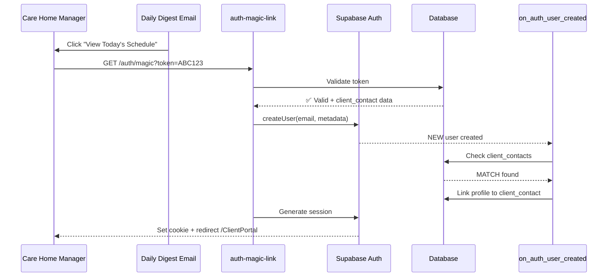
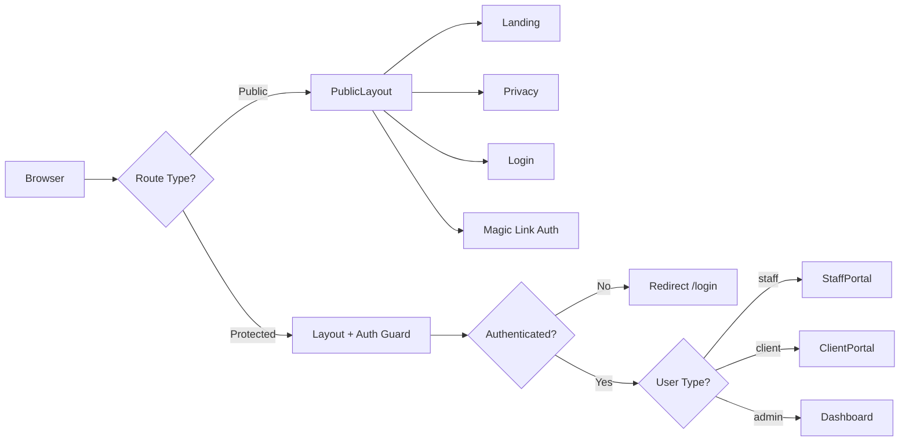

# MODULE 35: Authentication & Portal Routing Overhaul

## Mission
Fix critical authentication flows, implement magic link authentication for clients, resolve email portal links, and create public pages architecture.

## Status
- **Started:** 2025-12-28
- **Current Phase:** Phase 1 - Email Portal Links Fix
- **Priority:** P0 - Critical
- **Est. Duration:** 19-27 hours (~3-5 days)

## Context

### Problems Being Solved
1. **Email Portal Links Are Broken**
   - Staff emails link to `/shifts` (doesn't exist for staff users)
   - Client emails link to `/portal` (generic, should be `/ClientPortal`)
   - Marketplace digest uses wrong portal URL

2. **Client Onboarding Friction**
   - Existing care home managers won't create password accounts
   - Current flow: Admin invites → Client must sign up → Creates password
   - Need: Passwordless authentication via magic links

3. **Public Pages Show Logged-In UI**
   - Landing page shows "blank User" during auth check
   - Layout.jsx wraps ALL routes (even public ones)
   - Blocks OAuth application readiness

4. **Orphaned User Risk**
   - Magic links could create auth.users without proper profile linking
   - Need atomic flow: create user → link to client_contact → create session

## User Decisions

Based on discussions with user:

1. **Q1: Client Authentication**
   - ✅ Magic link only, password optional
   - Users can set password later from settings (not required)

2. **Q2: Staff Authentication**
   - ✅ Keep password-only (security for payroll/compliance)
   - ❌ Magic links for staff - PARKED (password flow works fine)

3. **Q3: Orphaned Users**
   - 🚧 Deferred to future module
   - Goal: Invite-only system with contact form for uninvited users

4. **Q4: Public Pages**
   - ✅ Minimal landing + legal pages
   - Reuse design/content from `marketing/website` Next.js app
   - Convert to React pages in main app

5. **Q5: Client RBAC**
   - ✅ MVP: All clients get OPERATIONS_MANAGER access
   - 🚧 Future: Support multiple contacts per client with role-based access

## Implementation Phases

### Phase 1: Email Portal Links Fix (1-2 hours) ✅ IN PROGRESS
- Update `getBranding.ts` with dynamic URLs
- Fix `notification-digest-engine` (staff assignments)
- Fix `smart-marketplace-digest` (staff marketplace)
- Fix `daily-client-digest` (client schedules)

### Phase 2: Magic Link Authentication for Clients (10-14 hours) 🔜 NEXT
**Client-only passwordless authentication**
- Extend `magic_link_tokens` table for auth use case
- Create `generate-client-magic-link` edge function
- Create `auth-magic-link` edge function
- Update database trigger to auto-link client_contacts
- Add `/auth/magic` React route
- Update `daily-client-digest` to include magic links
- Security review & testing
- **Note:** Staff continue using password authentication

### Phase 3: Public Pages Architecture (6-8 hours) 🔜 PENDING
- Create `PublicLayout.jsx` (no auth)
- Restructure route hierarchy
- Convert Next.js landing page to React
- Add Privacy, Terms, Contact pages
- Fix "blank User" issue

### Phase 4: Database Trigger Enhancements (2-3 hours) 🔜 PENDING
- Add client_contacts check to trigger
- Implement audit logging
- Prevent orphaned users

## Success Criteria

- ✅ All email portal links route to correct pages
- ✅ Clients can access ClientPortal via magic link (no password needed)
- ✅ Zero orphaned users created
- ✅ Public pages work without auth issues
- ✅ All existing functionality preserved
- ✅ Security review passed
- ✅ Staging tested before production deployment

## Files Being Modified

### Phase 1
- `supabase/functions/_shared/getBranding.ts`
- `supabase/functions/notification-digest-engine/index.ts`
- `supabase/functions/smart-marketplace-digest/index.ts`
- `supabase/functions/daily-client-digest/index.ts`

### Phase 2
- `supabase/migrations/[NEW]_extend_magic_link_tokens.sql`
- `supabase/functions/generate-client-magic-link/index.ts` (NEW)
- `supabase/functions/auth-magic-link/index.ts` (NEW)
- `supabase/migrations/[NEW]_enhance_auth_trigger.sql`
- `src/pages/AuthMagicLink.jsx` (NEW)

### Phase 3
- `src/pages/PublicLayout.jsx` (NEW)
- `src/pages/index.jsx` (route restructure)
- `src/pages/Landing.jsx` (NEW - converted from Next.js)
- `src/pages/Privacy.jsx` (NEW)
- `src/pages/Terms.jsx` (NEW)
- `src/pages/Contact.jsx` (NEW)

### Phase 4
- `supabase/migrations/[EXISTING]_fix_staff_signup_linking.sql` (update)
- `supabase/migrations/[NEW]_create_auth_audit_log.sql`

## Architecture Diagrams

### Magic Link Authentication Flow

### Two-Layout Architecture

## Security Considerations

### Magic Link Security
- ✅ 24-hour token expiry
- ✅ Single-use tokens (marked used)
- ✅ Crypto-secure UUIDs (128-bit entropy)
- ⚠️ Email forwarding risk (accepted for MVP)
- 🔜 Optional: IP binding for Phase 2

### Data Protection
- ✅ Client users cannot access `/Dashboard` (GDPR protection)
- ✅ RBAC filtering in ClientPortal
- ✅ Row Level Security (RLS) policies
- ✅ Audit logging for all magic link authentications

## Rollback Plan

### Phase 1 (Email Links)
- **Risk:** Very low (no DB changes)
- **Rollback:** Revert getBranding.ts + email template changes
- **Impact:** Links go back to old URLs (broken state)

### Phase 2 (Magic Links)
- **Risk:** Medium (new auth flow)
- **Rollback:** Disable edge functions, remove magic link buttons from emails
- **Impact:** Clients use traditional password signup
- **Safety:** Feature flag controlled (`enable_magic_link_auth`)

### Phase 3 (Public Pages)
- **Risk:** Low (new routes only)
- **Rollback:** Remove new routes, restore old route structure
- **Impact:** No public pages available

### Phase 4 (Triggers)
- **Risk:** Medium (core auth flow)
- **Rollback:** Restore previous trigger version
- **Impact:** Client contacts not auto-linked
- **Safety:** All migrations have DOWN scripts

## Testing Strategy

### Phase 1 Testing
- [ ] Staff receives shift assignment → link goes to /staffportal
- [ ] Client receives daily digest → link goes to /ClientPortal
- [ ] Marketplace digest → link goes to /staffportal
- [ ] Test across email clients (Gmail, Outlook, Apple Mail)

### Phase 2 Testing
- [ ] Generate magic link → token created
- [ ] Click magic link → auto-login successful
- [ ] Token expires after 24h (cannot reuse)
- [ ] Used tokens rejected
- [ ] RBAC maintained (OPERATIONS_MANAGER access)
- [ ] Optional password creation works
- [ ] No orphaned users created

### Phase 3 Testing
- [ ] Landing page loads without auth check
- [ ] No "blank User" during load
- [ ] Legal pages accessible without login
- [ ] Protected routes still require auth
- [ ] Mobile responsive

### Phase 4 Testing
- [ ] Staff invites auto-link correctly
- [ ] Client contacts auto-link correctly
- [ ] Agency admins auto-link correctly
- [ ] Audit log captures all events
- [ ] No orphaned users created

## Documentation

See detailed specifications:
- [PHASE_1_EMAIL_LINKS.md](./PHASE_1_EMAIL_LINKS.md) - Email portal URLs fix
- [PHASE_2_MAGIC_LINKS.md](./PHASE_2_MAGIC_LINKS.md) - Passwordless client auth
- [PHASE_3_PUBLIC_PAGES.md](./PHASE_3_PUBLIC_PAGES.md) - Two-layout architecture
- [PHASE_4_TRIGGER_ENHANCEMENTS.md](./PHASE_4_TRIGGER_ENHANCEMENTS.md) - Database improvements
- [MAGIC_LINK_ARCHITECTURE.md](./MAGIC_LINK_ARCHITECTURE.md) - Technical deep dive
- [SECURITY_REVIEW.md](./SECURITY_REVIEW.md) - Threat model & mitigations
- [TESTING_CHECKLIST.md](./TESTING_CHECKLIST.md) - Comprehensive test suite

## Progress Tracking

See [PROGRESS.md](./PROGRESS.md) for real-time status updates.

## Team

- **Planner:** Claude (AI Agent)
- **Implementer:** Multi-run agents following this spec
- **Quality Reviewer:** George Basera (Product Owner)

---

Last Updated: 2025-12-28
