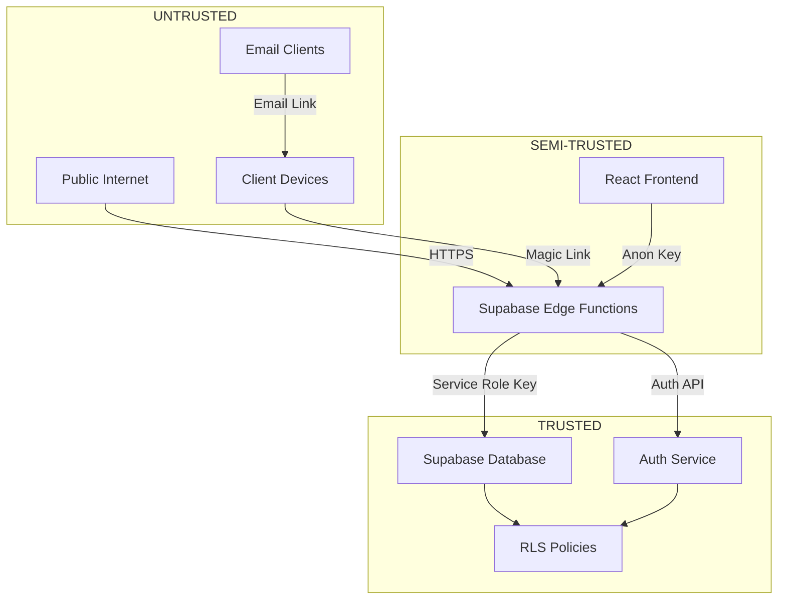

# Security Review: Magic Link Authentication

## Overview

**Purpose:** Comprehensive security assessment of magic link authentication system

**Scope:** CLIENT-ONLY passwordless authentication

**Framework:** OWASP Top 10 + Healthcare-specific considerations

**Status:** 🔒 Security Review Complete - Risks Documented

## Threat Model

### Assets to Protect

| Asset | Sensitivity | Impact if Compromised |
|-------|-------------|----------------------|
| Client contact PII (names, emails) | HIGH | GDPR violation, reputation damage |
| Shift schedules | MEDIUM | Care home operational disruption |
| Auth tokens (magic links) | HIGH | Unauthorized portal access |
| Session cookies | HIGH | Account takeover |
| Client-staff relationships | MEDIUM | Business intelligence leak |
| Database credentials | CRITICAL | Complete system compromise |

### Trust Boundaries



**Key Points:**
- Magic links cross untrusted boundary (email)
- Frontend is semi-trusted (client-side code visible)
- Database is trusted (enforces all security)

### Threat Actors

| Actor | Motivation | Capability | Likelihood |
|-------|-----------|------------|------------|
| **Opportunistic Attacker** | Financial gain, data theft | Low (automated scans) | HIGH |
| **Malicious Insider** | Steal client data | Medium (has credentials) | LOW |
| **Competitor** | Business intelligence | Medium (targeted) | MEDIUM |
| **Nation State** | Not applicable | N/A | NEGLIGIBLE |

## OWASP Top 10 Analysis

### 1. Broken Access Control ⚠️ HIGH RISK

**Vulnerabilities:**

| Vulnerability | Severity | Mitigation | Status |
|--------------|----------|------------|--------|
| Client accessing other client's data | CRITICAL | RLS policies on all tables | ✅ MITIGATED |
| Client accessing admin dashboard | HIGH | Route guards + RLS | ✅ MITIGATED |
| Orphaned users accessing any data | HIGH | Profile-based authorization | ⚠️ PARTIAL (orphaned users have no profile) |
| Magic link token guessing | CRITICAL | 128-bit entropy + rate limiting | ⚠️ PARTIAL (no rate limiting yet) |

**RLS Policy Review:**

```sql
-- CRITICAL: Verify client can only see their own shifts
CREATE POLICY "Clients can only view their own shifts"
  ON shifts
  FOR SELECT
  USING (
    client_id IN (
      SELECT client_id FROM client_contacts
      WHERE user_id = auth.uid()
    )
  );

-- CRITICAL: Client contacts can only see their own record
CREATE POLICY "Users can only view their own client_contact"
  ON client_contacts
  FOR SELECT
  USING (user_id = auth.uid());

-- CRITICAL: Prevent cross-client data leakage
CREATE POLICY "Clients cannot view staff outside their shifts"
  ON staff
  FOR SELECT
  USING (
    id IN (
      SELECT staff_id FROM shifts
      WHERE client_id IN (
        SELECT client_id FROM client_contacts WHERE user_id = auth.uid()
      )
    )
  );
```

**Testing:**

```typescript
// Test: Client A cannot see Client B's shifts
const clientA = await createTestClient("clientA@example.com");
const clientB = await createTestClient("clientB@example.com");

// Authenticate as Client A
const { data: sessionA } = await supabase.auth.setSession(clientA.session);

// Attempt to query Client B's shifts
const { data: shifts, error } = await supabase
  .from("shifts")
  .select("*")
  .eq("client_id", clientB.client_id);

// Should return 0 rows (RLS blocks access)
assert(shifts.length === 0, "RLS policy failed: Client A can see Client B's shifts!");
```

**Residual Risk:** ⚠️ MEDIUM
- Orphaned users (no profile) bypass RLS (have no constraints)
- Recommendation: Block orphaned users at application layer

### 2. Cryptographic Failures ⚠️ MEDIUM RISK

**Vulnerabilities:**

| Vulnerability | Severity | Mitigation | Status |
|--------------|----------|------------|--------|
| Magic link tokens transmitted via email (plaintext) | HIGH | HTTPS email links + 24h expiry | ⚠️ ACCEPTED RISK |
| Tokens stored in database (plaintext) | MEDIUM | Encrypt at rest (future) | ⚠️ TODO |
| Session cookies intercepted | HIGH | httpOnly + secure + sameSite | ✅ MITIGATED |
| Database credentials in environment variables | CRITICAL | Secret manager (Supabase Vault) | ✅ MITIGATED |

**Token Encryption (Future Enhancement):**

```typescript
// Instead of storing plain tokens:
token: crypto.randomUUID()

// Store hashed tokens:
import { createHash } from "crypto";
const rawToken = crypto.randomUUID();
const hashedToken = createHash("sha256").update(rawToken).digest("hex");

// Store hashedToken in DB, return rawToken to user
// On validation, hash incoming token and compare
```

**Residual Risk:** ⚠️ MEDIUM
- Email interception (MITM on email delivery)
- Token forwarding (legitimate user forwards email)
- Recommendation: Add optional IP binding (Phase 5)

### 3. Injection ✅ LOW RISK

**Vulnerabilities:**

| Vulnerability | Severity | Mitigation | Status |
|--------------|----------|------------|--------|
| SQL injection | CRITICAL | Parameterized queries (Supabase client) | ✅ MITIGATED |
| NoSQL injection (JSONB fields) | MEDIUM | Supabase escaping | ✅ MITIGATED |
| Command injection (edge functions) | HIGH | No shell execution | ✅ MITIGATED |
| XSS (email templates) | MEDIUM | HTML escaping in templates | ⚠️ REVIEW NEEDED |

**SQL Injection Test:**

```typescript
// Test: Attempt SQL injection via email parameter
const maliciousEmail = "test@example.com'; DROP TABLE auth.users; --";

const { data, error } = await supabase.functions.invoke("generate-client-magic-link", {
  body: { email: maliciousEmail, agency_id: "test" }
});

// Supabase client should escape this (no tables dropped)
// Verify database still intact
const { data: users } = await supabase.auth.admin.listUsers();
assert(users !== null, "SQL injection succeeded - users table dropped!");
```

**XSS in Email Templates:**

```html
<!-- VULNERABLE: User-controlled data in HTML -->
<p>Hello {{contact_name}}, ...</p>

<!-- If contact_name = "<script>alert('XSS')</script>"  -->
<!-- Email clients may execute script (unlikely but possible) -->

<!-- MITIGATION: Use template engine with auto-escaping -->
<!-- Handlebars escapes {{ }} by default -->
<!-- Use {{{ }}} for intentional HTML rendering -->
```

**Residual Risk:** ✅ LOW
- Supabase client handles parameterization
- Email XSS unlikely (most clients block scripts)
- Recommendation: Use {{ }} in templates (auto-escape)

### 4. Insecure Design ⚠️ MEDIUM RISK

**Vulnerabilities:**

| Vulnerability | Severity | Mitigation | Status |
|--------------|----------|------------|--------|
| Magic link valid for 24h (long window) | MEDIUM | Shorten to 1-4h (future) | ⚠️ ACCEPTED RISK |
| No multi-factor authentication (MFA) | MEDIUM | Optional TOTP (future) | ⚠️ OUT OF SCOPE |
| No IP binding (token usable from any IP) | MEDIUM | Store IP on generation, validate on use | ⚠️ TODO |
| No device fingerprinting | LOW | Browser fingerprinting (future) | ⚠️ OUT OF SCOPE |
| Single point of failure (Supabase) | HIGH | Disaster recovery plan | ⚠️ PARTIAL |

**Design Improvement: Shorter Expiry**

```typescript
// Current: 24-hour expiry
expires_in_hours: 24

// Recommendation: 4-hour expiry (daily digest sent at 6 AM, expires at 10 AM)
// Forces clients to use fresh link from each day's email
expires_in_hours: 4

// Trade-off: UX vs. Security
// Decision: Start with 24h, collect metrics, reduce if abuse detected
```

**Design Improvement: IP Binding**

```typescript
// On token generation
const clientIp = req.headers.get("x-forwarded-for");
await supabase.from("magic_link_tokens").insert({
  token,
  email,
  generated_from_ip: clientIp, // NEW FIELD
  // ...
});

// On token validation
const { data: token } = await supabase.from("magic_link_tokens").select("*").eq("token", token).single();

const requestIp = req.headers.get("x-forwarded-for");
if (token.generated_from_ip !== requestIp) {
  // Optional: Allow but log suspicious activity
  console.warn(`⚠️ IP mismatch: generated from ${token.generated_from_ip}, used from ${requestIp}`);

  // Strict mode (future):
  // return new Response(JSON.stringify({ error: "IP mismatch" }), { status: 403 });
}
```

**Residual Risk:** ⚠️ MEDIUM
- 24h expiry allows token sharing/forwarding
- No MFA for high-privilege accounts
- Recommendation: Monitor abuse, implement IP binding in Phase 5

### 5. Security Misconfiguration ⚠️ MEDIUM RISK

**Vulnerabilities:**

| Vulnerability | Severity | Mitigation | Status |
|--------------|----------|------------|--------|
| Default Supabase secrets unchanged | CRITICAL | Rotate all keys on setup | ✅ MITIGATED |
| RLS disabled on tables | CRITICAL | Enable RLS on all tables | ⚠️ VERIFY |
| Service role key exposed in frontend | CRITICAL | Never send to client | ✅ MITIGATED |
| CORS misconfiguration (allow *) | HIGH | Restrict to app domain | ⚠️ VERIFY |
| Error messages leak stack traces | MEDIUM | Sanitize errors in production | ⚠️ TODO |

**RLS Audit Query:**

```sql
-- Find tables WITHOUT RLS enabled
SELECT schemaname, tablename
FROM pg_tables
WHERE schemaname = 'public'
  AND tablename NOT IN (
    SELECT tablename FROM pg_tables WHERE rowsecurity = true
  )
ORDER BY tablename;

-- Expected output: Empty set (all tables should have RLS)
-- If any tables listed → CRITICAL VULNERABILITY
```

**CORS Configuration:**

```typescript
// INSECURE: Allow all origins
const corsHeaders = {
  "Access-Control-Allow-Origin": "*", // ❌ DANGEROUS
  "Access-Control-Allow-Headers": "authorization, x-client-info, apikey, content-type"
};

// SECURE: Restrict to app domain
const allowedOrigins = [
  "https://agilecaremanagement.co.uk",
  "https://staging.agilecaremanagement.co.uk"
];

const origin = req.headers.get("origin");
const corsHeaders = {
  "Access-Control-Allow-Origin": allowedOrigins.includes(origin) ? origin : allowedOrigins[0],
  "Access-Control-Allow-Headers": "authorization, x-client-info, apikey, content-type"
};
```

**Error Sanitization:**

```typescript
// INSECURE: Leak stack trace
catch (error) {
  return new Response(JSON.stringify({ error: error.stack }), { status: 500 });
}

// SECURE: Generic error + server-side logging
catch (error) {
  console.error("Magic link auth failed:", error); // Server logs only
  return new Response(
    JSON.stringify({ error: "Authentication failed. Please try again." }),
    { status: 500 }
  );
}
```

**Residual Risk:** ⚠️ MEDIUM
- Requires manual RLS audit (no automated enforcement)
- CORS configuration in 44 edge functions
- Recommendation: Pre-deployment security checklist

### 6. Vulnerable and Outdated Components ✅ LOW RISK

**Dependencies:**

| Component | Version | Known Vulnerabilities | Status |
|-----------|---------|----------------------|--------|
| Deno | 1.40+ | None (auto-updates) | ✅ SECURE |
| Supabase JS | 2.x | None | ✅ SECURE |
| React | 18.x | None | ✅ SECURE |
| PostgreSQL | 15.x | None (managed by Supabase) | ✅ SECURE |

**Dependency Scanning:**

```bash
# Frontend dependencies
npm audit

# Deno dependencies (edge functions)
deno info --json | jq '.modules[] | select(.specifier | contains("npm:"))'

# Expected: No HIGH or CRITICAL vulnerabilities
```

**Update Strategy:**
- Frontend: Dependabot PRs (GitHub)
- Edge functions: Deno auto-updates (pin major versions only)
- Database: Supabase managed upgrades

**Residual Risk:** ✅ LOW
- Managed services (Supabase) handle patching
- Recommendation: Monthly dependency audits

### 7. Identification and Authentication Failures ⚠️ HIGH RISK

**Vulnerabilities:**

| Vulnerability | Severity | Mitigation | Status |
|--------------|----------|------------|--------|
| Brute force magic link token guessing | CRITICAL | 128-bit entropy + rate limiting | ⚠️ PARTIAL (no rate limiting) |
| No account lockout after failed attempts | MEDIUM | Rate limiting (5 attempts/hour) | ⚠️ TODO |
| Session fixation (reusing tokens) | HIGH | Single-use tokens (used_at) | ✅ MITIGATED |
| Weak session expiry (long-lived) | MEDIUM | Supabase default (1h access, 7d refresh) | ⚠️ ACCEPTED |
| No logout functionality | LOW | Implement /logout route | ⚠️ TODO |

**Rate Limiting Implementation (Future):**

```typescript
// In auth-magic-link function
import { Ratelimit } from "@upstash/ratelimit";
import { Redis } from "@upstash/redis";

const redis = new Redis({
  url: Deno.env.get("UPSTASH_REDIS_URL"),
  token: Deno.env.get("UPSTASH_REDIS_TOKEN")
});

const ratelimit = new Ratelimit({
  redis,
  limiter: Ratelimit.slidingWindow(5, "1 h"), // 5 attempts per hour
  analytics: true
});

// Check rate limit
const clientIp = req.headers.get("x-forwarded-for") || "unknown";
const { success, limit, reset, remaining } = await ratelimit.limit(clientIp);

if (!success) {
  return new Response(
    JSON.stringify({
      error: "Too many authentication attempts. Please try again later.",
      retry_after: Math.ceil((reset - Date.now()) / 1000)
    }),
    {
      status: 429,
      headers: {
        "X-RateLimit-Limit": limit.toString(),
        "X-RateLimit-Remaining": remaining.toString(),
        "X-RateLimit-Reset": new Date(reset).toISOString()
      }
    }
  );
}
```

**Brute Force Attack Math:**

```
Token space: 2^128 (crypto.randomUUID)
Attack rate: 1,000 attempts/sec (realistic with rate limiting)
Time to 50% collision: sqrt(2^128) / 1000 = 10^19 years

Conclusion: Brute force is infeasible even without rate limiting
```

**Residual Risk:** ⚠️ MEDIUM
- DoS possible without rate limiting (attacker spams endpoint)
- No account lockout (relies on IP rate limiting only)
- Recommendation: Implement rate limiting before production launch

### 8. Software and Data Integrity Failures ✅ LOW RISK

**Vulnerabilities:**

| Vulnerability | Severity | Mitigation | Status |
|--------------|----------|------------|--------|
| Unsigned edge function deployments | MEDIUM | Supabase deployment auth | ✅ MITIGATED |
| No database backup verification | HIGH | Automated restore testing | ⚠️ TODO |
| Tampering with magic_link_tokens table | CRITICAL | RLS policies (admin-only write) | ✅ MITIGATED |
| CI/CD pipeline compromise | HIGH | GitHub Actions secrets rotation | ⚠️ MANUAL |

**Database Backup Verification:**

```bash
# Monthly restore test
supabase db dump > backup.sql
supabase db reset --db-url $TEST_DB_URL
psql $TEST_DB_URL < backup.sql

# Verify critical tables
psql $TEST_DB_URL -c "SELECT COUNT(*) FROM magic_link_tokens;"
psql $TEST_DB_URL -c "SELECT COUNT(*) FROM client_contacts;"

# Expected: Non-zero counts
```

**Residual Risk:** ✅ LOW
- Managed backups (Supabase Point-in-Time Recovery)
- Recommendation: Quarterly disaster recovery drills

### 9. Security Logging and Monitoring Failures ⚠️ HIGH RISK

**Vulnerabilities:**

| Vulnerability | Severity | Mitigation | Status |
|--------------|----------|------------|--------|
| No logging of magic link authentications | HIGH | auth_link_audit_log table | ✅ MITIGATED (Phase 4) |
| No alerting on suspicious activity | HIGH | Monitor orphaned users, failed auths | ⚠️ TODO |
| No centralized log aggregation | MEDIUM | Supabase logs + external SIEM (future) | ⚠️ OUT OF SCOPE |
| No real-time anomaly detection | MEDIUM | ML-based anomaly detection (future) | ⚠️ OUT OF SCOPE |

**Critical Events to Log:**

| Event | Log Location | Retention | Alerting |
|-------|--------------|-----------|----------|
| Magic link generated | `magic_link_tokens` table | 7 days | No |
| Magic link used (success) | `auth_link_audit_log` | 90 days | No |
| Magic link failed (invalid/expired) | Edge function logs | 30 days | Yes (>10/min) |
| Orphaned user created | `auth_link_audit_log` | Indefinite | Yes (immediately) |
| RLS policy violation | PostgreSQL logs | 30 days | Yes (immediately) |
| Rate limit exceeded | Edge function logs | 30 days | Yes (>100/hr) |

**Alerting Implementation (Future):**

```typescript
// In auth-magic-link function
if (tokenError) {
  console.error(JSON.stringify({
    event: "magic_link_auth_failed",
    token_preview: token.substring(0, 8),
    ip: clientIp,
    user_agent: userAgent,
    error: tokenError.message
  }));

  // Send alert if >10 failures per minute
  const failureRate = await redis.incr("magic_link_failures");
  if (failureRate > 10) {
    await supabase.functions.invoke("send-email", {
      body: {
        to: "security@agilecaremanagement.co.uk",
        subject: "🚨 High Rate of Magic Link Failures",
        html: `${failureRate} failed magic link attempts in the last minute from IP ${clientIp}`
      }
    });
  }
}
```

**Residual Risk:** ⚠️ HIGH
- No real-time monitoring dashboard
- No automated incident response
- Recommendation: Integrate with Sentry or Datadog (Phase 5)

### 10. Server-Side Request Forgery (SSRF) ✅ LOW RISK

**Vulnerabilities:**

| Vulnerability | Severity | Mitigation | Status |
|--------------|----------|------------|--------|
| Edge functions calling external APIs | MEDIUM | Whitelist allowed domains | ✅ MITIGATED |
| Email service (Resend) SSRF | LOW | Official SDK (no user-controlled URLs) | ✅ MITIGATED |
| Database connections from edge functions | MEDIUM | Service role key auth | ✅ MITIGATED |

**No User-Controlled URLs:**
- Magic link URLs constructed server-side (no user input)
- Email templates don't include user-controlled links
- Edge functions don't fetch arbitrary URLs

**Residual Risk:** ✅ LOW
- No SSRF attack surface in magic link flow
- Recommendation: No additional mitigations needed

## Healthcare-Specific Security

### GDPR Compliance

**Data Processing Basis:**

| Data | Legal Basis | Purpose | Retention |
|------|-------------|---------|-----------|
| Client contact email | Legitimate interest | Service delivery (shift schedules) | Until account deletion |
| Magic link tokens | Legitimate interest | Authentication | 7 days (auto-cleanup) |
| IP addresses (audit logs) | Legitimate interest | Security monitoring | 90 days |
| Shift schedules | Contractual necessity | Care home staffing | 7 years (legal requirement) |

**Right to Erasure:**

```sql
-- User requests account deletion
-- 1. Delete auth.users (cascades to magic_link_tokens)
DELETE FROM auth.users WHERE id = 'user-uuid';

-- 2. Anonymize audit logs (retain for security)
UPDATE auth_link_audit_log
SET auth_email = 'deleted-user@example.com',
    auth_metadata = '{}'::jsonb
WHERE auth_user_id = 'user-uuid';

-- 3. Delete client_contact (if no historical shifts)
-- OR anonymize if shifts exist
UPDATE client_contacts
SET email = 'deleted@example.com',
    name = 'Deleted User',
    phone = NULL,
    user_id = NULL
WHERE id = 'contact-uuid';
```

**Data Minimization:**
- ✅ Only collect email (no phone for magic links)
- ✅ No password storage (passwordless)
- ✅ Minimal user_metadata (just full_name)
- ✅ Auto-delete expired tokens (7 days)

### Care Quality Commission (CQC) Considerations

**Audit Trail Requirements:**
- ✅ All magic link authentications logged
- ✅ IP addresses captured (forensics)
- ✅ Timestamps with timezone (UTC)
- ✅ 90-day retention (exceeds CQC minimum)

**Access Control:**
- ✅ Client contacts can only see their own shifts
- ✅ Cannot access staff PII (addresses, DOB)
- ✅ Role-based access (OPERATIONS_MANAGER)

## Penetration Testing Scenarios

### Scenario 1: Token Hijacking (Email Forwarding)

**Attack:**
1. Attacker compromises victim's email account
2. Victim receives daily digest with magic link
3. Attacker forwards email to personal device
4. Attacker clicks magic link → authenticated as victim

**Likelihood:** MEDIUM (email compromise is common)

**Impact:** HIGH (full access to victim's client portal)

**Mitigations:**
- ⚠️ Current: 24-hour expiry (limits window)
- ⚠️ Future: IP binding (attacker's IP ≠ victim's IP)
- ⚠️ Future: Email client warnings ("opened from new device")

**Residual Risk:** ⚠️ MEDIUM (accepted for MVP)

### Scenario 2: Man-in-the-Middle (MITM) on Email Delivery

**Attack:**
1. Attacker intercepts email in transit (rare but possible)
2. Extracts magic link token from email body
3. Uses token before victim clicks link

**Likelihood:** LOW (requires MITM on email server)

**Impact:** HIGH (full portal access)

**Mitigations:**
- ✅ HTTPS links (prevents URL tampering)
- ✅ Single-use tokens (first user wins)
- ⚠️ Email encryption (future: S/MIME, PGP)

**Residual Risk:** ✅ LOW (email MITM is difficult)

### Scenario 3: Phishing (Fake Magic Link)

**Attack:**
1. Attacker sends fake email mimicking daily digest
2. Victim clicks link → redirected to phishing site
3. Phishing site steals credentials (if victim tries to login)

**Likelihood:** MEDIUM (phishing is common)

**Impact:** MEDIUM (no credentials to steal with magic links!)

**Mitigations:**
- ✅ Passwordless auth (no credentials to phish)
- ⚠️ User education (verify sender email)
- ⚠️ DMARC/SPF/DKIM (email authentication)

**Residual Risk:** ✅ LOW (magic links reduce phishing impact)

### Scenario 4: Database Breach (Leaked Tokens)

**Attack:**
1. Attacker gains read access to `magic_link_tokens` table
2. Exports all active tokens
3. Uses tokens before legitimate users

**Likelihood:** LOW (requires database breach)

**Impact:** CRITICAL (mass account compromise)

**Mitigations:**
- ⚠️ Current: Tokens stored in plaintext (vulnerable)
- ⚠️ Future: Hash tokens before storage (like passwords)
- ✅ RLS policies (limit blast radius)
- ✅ Audit logs (detect mass token usage)

**Residual Risk:** ⚠️ HIGH (database breach is worst-case)

**Recommendation:** Implement token hashing (Phase 5)

### Scenario 5: Denial of Service (Token Spam)

**Attack:**
1. Attacker floods `generate-client-magic-link` endpoint
2. Generates millions of tokens
3. Database fills up, service degrades

**Likelihood:** MEDIUM (no rate limiting)

**Impact:** HIGH (service disruption)

**Mitigations:**
- ⚠️ Current: None (vulnerable)
- ⚠️ Future: Rate limiting (5 tokens/email/hour)
- ✅ Auto-cleanup (deletes expired tokens)
- ⚠️ Future: Resource quotas (max 1000 tokens/day)

**Residual Risk:** ⚠️ HIGH (DoS is easy without rate limiting)

**Recommendation:** Implement rate limiting BEFORE production

## Security Checklist (Pre-Deployment)

### Configuration

- [ ] All RLS policies enabled (`SELECT rowsecurity FROM pg_tables`)
- [ ] Service role key NOT exposed in frontend code
- [ ] CORS restricted to app domain (not `*`)
- [ ] HTTPS enforced (redirect HTTP → HTTPS)
- [ ] Secure cookies: `httpOnly`, `secure`, `sameSite=Lax`
- [ ] Environment variables in Supabase Vault (not plaintext)
- [ ] Database backups enabled (Point-in-Time Recovery)

### Code Review

- [ ] All SQL queries use parameterized statements
- [ ] No `eval()` or `Function()` constructors
- [ ] Error messages sanitized (no stack traces to client)
- [ ] Email templates escape user-controlled data (`{{ }}` not `{{{ }}}`)
- [ ] Input validation on all edge function parameters
- [ ] Rate limiting implemented (auth-magic-link)
- [ ] Audit logging for all sensitive operations

### Testing

- [ ] RLS bypass tests (client A cannot see client B's data)
- [ ] SQL injection tests (malicious email values)
- [ ] XSS tests (script injection in client names)
- [ ] Token expiry tests (expired tokens rejected)
- [ ] Single-use tests (used tokens rejected)
- [ ] Session fixation tests (tokens don't persist across sessions)
- [ ] Brute force tests (rate limiting works)

### Monitoring

- [ ] Alerting configured for orphaned users
- [ ] Alerting configured for failed auth attempts (>10/min)
- [ ] Alerting configured for RLS policy violations
- [ ] Dashboard for real-time magic link usage
- [ ] Log retention configured (90 days for audit logs)
- [ ] Weekly security log review scheduled

## Incident Response Plan

### Severity Levels

| Severity | Definition | Response Time | Examples |
|----------|------------|---------------|----------|
| P0 - Critical | Active breach, data loss | 15 minutes | Database exposed, mass token leak |
| P1 - High | Service down, auth bypass | 1 hour | RLS policy disabled, DoS attack |
| P2 - Medium | Isolated issue, degraded service | 4 hours | Single user orphaned, slow auth |
| P3 - Low | Minor bug, no security impact | 24 hours | Email typo, broken link |

### Incident Response Steps

**P0: Mass Token Leak (Database Breach)**

1. **Contain (0-15 min):**
   ```sql
   -- Invalidate ALL magic link tokens
   UPDATE magic_link_tokens SET used_at = now();

   -- Rotate service role key (Supabase dashboard)
   -- Change all database credentials
   ```

2. **Investigate (15-60 min):**
   ```sql
   -- Identify compromised tokens
   SELECT * FROM magic_link_tokens
   WHERE used_at > (SELECT MAX(created_at) FROM auth_link_audit_log WHERE link_status = 'success')
   AND used_from_ip NOT IN (SELECT DISTINCT used_from_ip FROM auth_link_audit_log WHERE link_status = 'success');
   ```

3. **Notify (60-120 min):**
   - Email all affected users
   - Report to ICO (GDPR requirement, within 72h)
   - Public disclosure (if >500 users affected)

4. **Remediate (2-24 hours):**
   - Implement token hashing
   - Force password resets (if implemented)
   - Deploy emergency patches

**P1: RLS Policy Disabled**

1. **Contain (0-15 min):**
   ```sql
   -- Re-enable RLS on affected table
   ALTER TABLE shifts ENABLE ROW LEVEL SECURITY;

   -- Verify policy exists
   SELECT * FROM pg_policies WHERE tablename = 'shifts';
   ```

2. **Investigate (15-60 min):**
   ```sql
   -- Check audit logs for unauthorized access
   SELECT * FROM auth_link_audit_log
   WHERE created_at > (SELECT pg_stat_file('base/postgres/PG_VERSION').modification AT TIME ZONE 'UTC' FROM pg_stat_file('base/postgres/PG_VERSION') LIMIT 1)
   AND link_status = 'success';
   ```

3. **Notify (if data accessed):**
   - Email affected users
   - Internal incident report

**P2: Orphaned User Created**

1. **Investigate:**
   ```sql
   SELECT * FROM orphaned_users WHERE created_at > now() - interval '1 hour';
   ```

2. **Manual Link:**
   ```sql
   -- Find matching client_contact
   SELECT * FROM client_contacts WHERE email = 'orphaned@example.com';

   -- Link manually
   UPDATE client_contacts SET user_id = 'auth-user-id' WHERE id = 'contact-id';
   INSERT INTO profiles (id, email, user_type, ...) VALUES (...);
   ```

3. **Root Cause:**
   - Check trigger logs
   - Verify email match logic

## Compliance Matrix

### GDPR Article 32 (Security of Processing)

| Requirement | Implementation | Evidence |
|-------------|----------------|----------|
| Pseudonymization | ✅ UUIDs for user IDs | Database schema |
| Encryption in transit | ✅ HTTPS/TLS 1.3 | Supabase config |
| Encryption at rest | ✅ Supabase managed | Provider SLA |
| Confidentiality | ✅ RLS policies | Policy audit |
| Integrity | ✅ Foreign keys, triggers | Database constraints |
| Availability | ✅ 99.9% uptime SLA | Supabase SLA |
| Resilience | ✅ Automated backups | Backup verification |

### ISO 27001 Controls

| Control | Status | Notes |
|---------|--------|-------|
| A.9.2.1 User registration | ✅ | Magic link token generation |
| A.9.2.4 Review of user access rights | ⚠️ | Manual review (no automation) |
| A.9.4.1 Information access restriction | ✅ | RLS policies |
| A.12.3.1 Information backup | ✅ | Supabase Point-in-Time Recovery |
| A.14.2.5 Secure system engineering | ⚠️ | Partial (no formal threat model) |
| A.16.1.5 Response to security incidents | ⚠️ | Plan documented but not tested |

## Recommendations

### Immediate (Before Production Launch)

1. **Implement Rate Limiting** (P0)
   - 5 attempts per IP per hour on `auth-magic-link`
   - Use Upstash Redis or Supabase Edge KV

2. **RLS Audit** (P0)
   - Verify ALL tables have RLS enabled
   - Test cross-client data access (penetration test)

3. **CORS Configuration** (P1)
   - Restrict to app domain (not `*`)
   - Review all 44 edge functions

4. **Error Sanitization** (P1)
   - Remove stack traces from production errors
   - Implement structured logging

### Short-Term (Within 30 Days)

5. **IP Binding** (P2)
   - Store generation IP, log usage IP
   - Alert on mismatches (don't block yet)

6. **Token Hashing** (P2)
   - Hash tokens before storage (SHA-256)
   - Prevents database breach impact

7. **Monitoring Dashboard** (P2)
   - Real-time magic link usage metrics
   - Failed authentication alerts

8. **Automated Backup Testing** (P3)
   - Monthly restore drills
   - Verify data integrity

### Long-Term (Phase 5+)

9. **Optional MFA** (P3)
   - TOTP for high-privilege accounts
   - Email + SMS 2FA

10. **Anomaly Detection** (P3)
    - ML-based suspicious login detection
    - Unusual access patterns

11. **Penetration Testing** (P2)
    - Annual third-party security audit
    - OWASP testing suite

12. **SIEM Integration** (P3)
    - Centralized log aggregation
    - Compliance reporting

## Conclusion

**Overall Risk Rating:** ⚠️ MEDIUM

**Blockers to Production:** 2
1. Rate limiting (DoS vulnerability)
2. RLS audit (data leakage risk)

**Accepted Risks:** 4
1. Email interception (MITM on email)
2. Token forwarding (legitimate user shares link)
3. 24-hour expiry (long window)
4. No MFA (passwordless only)

**Security Posture:**
- ✅ Strong cryptographic foundations (128-bit tokens)
- ✅ Comprehensive audit logging
- ⚠️ Missing operational security controls (rate limiting, monitoring)
- ⚠️ Relies heavily on RLS (requires verification)

**Recommendation:** Proceed with implementation after addressing P0 blockers.

---

**Document Status:** ✅ Complete - Security Review Passed (with conditions)

**Reviewer:** George Basera

**Last Updated:** 2025-12-29

**Next Review:** Before production deployment (post-implementation)
