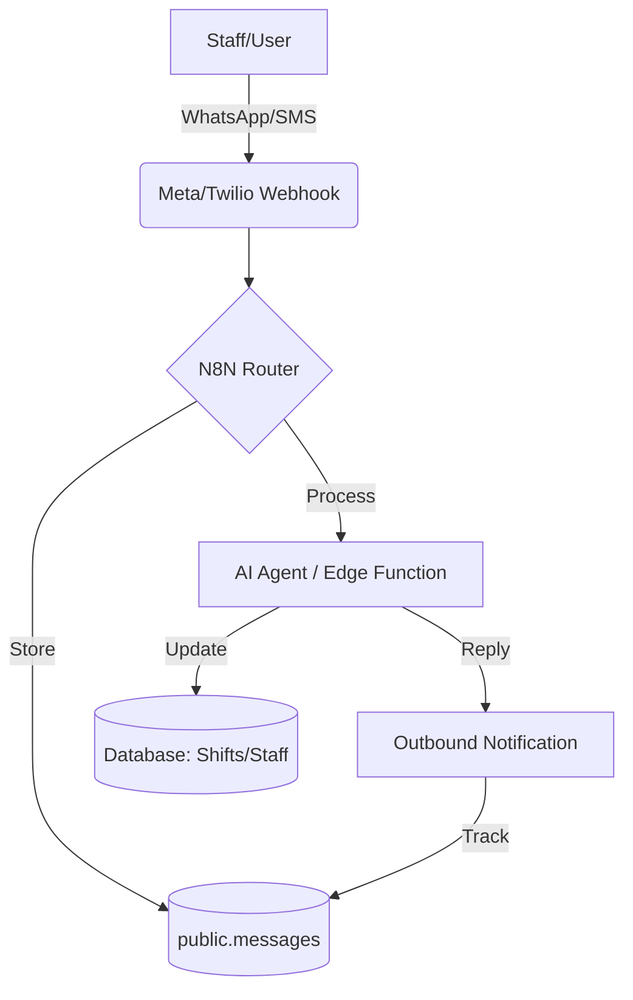

# MODULE 44: CONVERSATIONAL AI GATEWAY - Two-Way Messaging Hub

## 🎯 OBJECTIVE
Transform the current one-way notification system into a two-way **Conversational AI Gateway**. This module establishes the database infrastructure and logic to track inbound messages (WhatsApp/SMS) and route them to an AI agent for autonomous resolution or manager escalation.

## 🚀 BUSINESS VALUE
- **Autonomous Rota Verification**: Staff can reply "YES" to a shift reminder to automatically confirm it in the database.
- **Natural Language Requests**: Staff can text "I'm sick for my shift today" and have the AI handle the cancellation and re-booking flow.
- **Two-Way Context**: Managers can see the full history of a conversation, not just the outbound alerts.

## 🏗️ ARCHITECTURE
The system builds upon the existing `notification_log` and `ai_interaction_logs` patterns but introduces a unified `messages` table.

## 📋 KEY DELIVERABLES
1. **Database Schema**:
   - `public.messages` table for two-way text history.
   - `public.conversations` table for session management.
2. **N8N Inbound Gateway**:
   - Webhook handler for Meta (WhatsApp) and Twilio (SMS).
   - Logic to link incoming phone numbers to `staff` or `client` profiles.
3. **Conversational Logic**:
   - Edge Function for 'Intent Detection' (e.g., Confirm Shift, Cancel Shift, Help).
4. **Admin UI**:
   - Integration of message history into the `Staff` and `Client` profile pages.

## ✅ SUCCESS CRITERIA
- [ ] Incoming WhatsApp messages are logged in `public.messages` with correct `staff_id` mapping.
- [ ] Staff can confirm a shift via text message (Autonoma handles the DB update).
- [ ] 100% of interactions are traceable back to a specific `agency_id`.

---

**Status:** 🟠 **PLANNED** (Infrastructure Discovery Phase)
**Author:** Antigravity (Advanced AI Agent)
**Last Updated:** 2026-01-18
