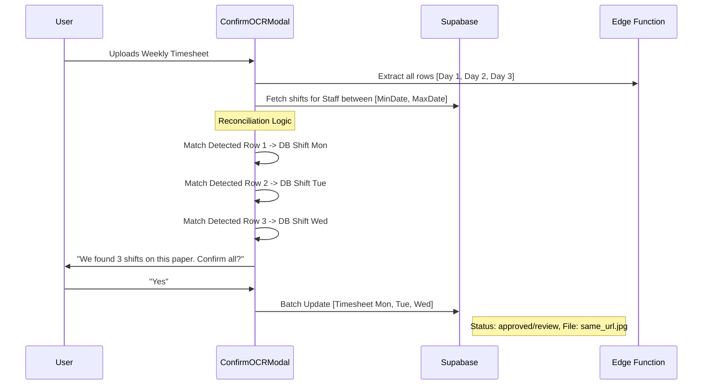

# MODULE 47: MULTI-SHIFT BATCH PROCESSING

**Status:** 📝 PLANNED / FUTURE WORK
**Priority:** ENHANCEMEMT (High UX Impact)
**Estimated Time:** 6-8 hours
**Risk Level:** Medium (Financial Integrity)
**Dependencies:**
- `extract-timesheet-data` (OCR Engine)
- `ConfirmOCRModal.jsx` (Frontend Selection UI)
- `timesheetService.js` (Saving Logic)

---

## MISSION OBJECTIVE

**Problem Statement:**
Staff often work multiple shifts in a single block (e.g., Mon, Tue, Wed) and record them on a single physical paper. Currently, the system detects these multiple rows but requires the user to repeat the upload/confirm process for each individual shift. This creates redundant friction.

**Solution Overview:**
Transition the "One-to-One" confirmation flow into a **"Smart Batch Update"** flow. When a user confirms a row on a multi-day document, the system should:
1. Detect all other rows on the document.
2. Cross-reference them with the database for the same staff member.
3. Automatically populate/update all matching shifts in a single transaction.
4. Leave an audit trail (reference to the same file) across all records.

**End State:**
A staff member uploads a weekly timesheet once, and all 3, 5, or 7 shifts for that week are approved or moved to review in a single confirmation step.

---

## ARCHITECTURE (PLANNED)

---

## DELIVERABLES

### 1. Enhanced Reconciliation Logic
- Implement `findMatchingShifts()` in the frontend to scan the database for records matching the dates found on the OCR document.
- Logic must ignore already-approved or "Locked" (Invoiced) shifts to prevent data corruption.

### 2. Batch Selection UI
- Update `ConfirmOCRModal.jsx` to show a summary: "3 Shifts Detected".
- Allow user to toggle which shifts should be included in the batch update.

### 3. Atomic Batch Save
- Create a `timesheetService.saveBatch()` method.
- Ensure all shifts are updated within a single promise block or transaction to ensure consistency.

---

## NEXT STEPS FOR AGENT

1. **Review `ConfirmOCRModal.jsx`**: Understand how `activeRow` is currently used.
2. **Extend `TimesheetUploader.jsx`**: Modify the save trigger to handle a list of updates instead of a single ID.
3. **Draft SQL Migration**: If needed, add a `cloned_from` or `source_document_id` to the `timesheets` table for better tracking of multi-shift uploads.

---

**Module Definition:** 100%
**Status:** 📝 Awaiting Implementation
**Requested By:** User (Project Visionary)
