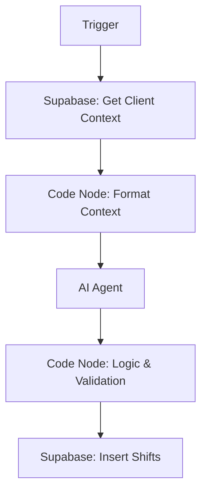

# AI Shift Booking Agent Instructions (n8n)

Use this guide to build the "Shift Booking Agent" workflow in n8n.

## 1. Workflow Overview (Linear Flow)

**CRITICAL**: Do **NOT** connect the Supabase node as a "Tool" to the AI Agent.
The AI Agent is not smart enough to calculate rates or handle UUIDs correctly.
You must use a **Linear Flow** where the Code Node handles the heavy lifting.



**Why this works**:
1.  **AI Agent**: Only outputs simple JSON (Role, Date, Time).
2.  **Code Node**: Calculates Rates (`£16`), converts Dates (`2025-12-08`), and maps UUIDs (`c8e8...`).
3.  **Supabase Node**: Inserts the *perfect* data prepared by the Code Node.

## 2. Step 1: Get Client Context (Supabase Node)
*   **Node Name**: `Get Client Data`
*   **Table**: `clients`
*   **Operation**: Get Rows
*   **Filter**: `name` ILIKE `Divine Care Center` (or dynamic input)
*   **Limit**: 1

## 3. Step 2: Format Context (Code Node)
Connect this **after** `Get Client Data`. This prepares a clean summary for the AI.

```javascript
// Get client data from previous node
const client = $('Get Client Data').first().json;

// 1. Filter Valid Roles (Must have charge_rate > 0)
const validRoles = [];
const rates = client.contract_terms?.rates_by_role || {};

for (const [roleKey, data] of Object.entries(rates)) {
  // STRICT VALIDATION: Both rates must be positive
  if (data.charge_rate > 0 && data.pay_rate > 0) {
    // Format: "Nurse (Charge: £20, Pay: £15)"
    validRoles.push(`${roleKey} (Charge: £${data.charge_rate}, Pay: £${data.pay_rate})`);
  }
}

// 2. Format Shift Times
const dayTimes = `${client.day_shift_start || '08:00'} - ${client.day_shift_end || '20:00'}`;
const nightTimes = `${client.night_shift_start || '20:00'} - ${client.night_shift_end || '08:00'}`;

// 3. Format Internal Locations
const locations = client.internal_locations || [];
const locationString = locations.length > 0 ? locations.join(', ') : 'None';

// 4. Construct Context String
// NOTE: Check if your node returns 'id' or 'client_id'
const clientId = client.client_id || client.id;

const contextString = `
CURRENT CLIENT CONTEXT:
- Name: ${client.name}
- ID: ${clientId}
- Agency ID: ${client.agency_id}
- Shift Times: Day (${dayTimes}), Night (${nightTimes})
- Valid Roles: ${validRoles.join(', ')}
- Available Locations: ${locationString}
`;

return { 
  contextString, 
  client_data: client // Pass full data through for later
};
```

## 4. Step 3: AI Agent Configuration

**System Prompt**:
Add the context variable to the top of your prompt.

```text
{{ $('Format Context').first().json.contextString }}

You are an expert Shift Booking Agent for a Staffing Agency.
Your goal is to extract shift details from natural language requests and return them in a structured JSON format.

### Rules
1.  **Client Context**: Use the "CURRENT CLIENT CONTEXT" above.
    *   **Roles**: ONLY book roles listed in "Valid Roles".
    *   **Times**: Use the "Shift Times" provided.
    *   **Locations**: If "Available Locations" are listed, you MUST ask the user to specify one.
2.  **Date**: Identify the date (e.g., "Tomorrow", "07/12/2025").
3.  **Quantity**: Default to 1.
4.  **Urgency**: 'normal', 'urgent', or 'critical'.

### Output Format (Structured Output Parser)

If you are using the **Structured Output Parser** node (Recommended), use this JSON Schema Example:

```json
{
  "client_name": "Divine Care Center",
  "role_raw": "healthcare_assistant",
  "date_expression": "tomorrow",
  "quantity": 1,
  "shift_type": "day",
  "urgency": "normal",
  "location_raw": "Room 101",
  "notes": "Use this field for special requirements"
}
```

### Interaction Style
1. Greet the user warmly.
2. Ask for missing information ONE QUESTION AT A TIME (e.g., Role, Date, Time, Location).
3. Once you have ALL required information, output the JSON object.
```

## 5. Step 3.5: Routing (If Node)
**CRITICAL**: Connect this **after** the AI Agent but **before** the Logic Node.
This prevents the workflow from trying to "book" a shift when the AI is just saying "Hello".

*   **Node Name**: `Check if Booking Ready`
*   **Type**: `If`
*   **Condition**:
    *   **String**: `{{ $json.role_raw }}`
    *   **Operator**: `Is Not Empty`

**Logic**:
*   **True (Booking Ready)**: Connect to **Step 4: Logic & Validation**.
*   **False (Chatting)**: Do nothing (or connect to a "Respond to User" node if needed, but usually n8n handles the chat response automatically).

## 6. Step 4: Logic & Validation (Code Node)
Connect this to the **TRUE** output of the `If` node.

**Auto-Filling & Defaults**:
*   **Location**: Validates that the requested location exists for this client.

```javascript
// --- INPUTS ---
// Get data from the AI Agent (passed through the If node)
const aiData = $('Check if Booking Ready').first().json;
const client = $('Format Context').first().json.client_data;

// ... (Helper Functions & Rate Lookup) ...

// --- LOCATION VALIDATION ---
let workLocation = null;
if (aiData.location_raw) {
    const validLocations = client.internal_locations || [];
    // Simple case-insensitive match
    const match = validLocations.find(loc => loc.toLowerCase() === aiData.location_raw.toLowerCase());
    if (match) {
        workLocation = match;
    } else if (validLocations.length > 0) {
        // Optional: Throw error if invalid location provided
        // throw new Error(`Invalid location '${aiData.location_raw}'. Valid locations: ${validLocations.join(', ')}`);
        workLocation = aiData.location_raw; // Fallback: just use what they said
    }
}

// ... (Rest of logic) ...

// Generate Output Items
const shifts = [];
for (let i = 0; i < (aiData.quantity || 1); i++) {
  shifts.push({
    // ... (other fields) ...
    work_location_within_site: workLocation,
    // ...
  });
}

return shifts;
```

## 4. Supabase Node (Insert)

*   **Operation**: Insert
*   **Table**: `shifts` (NOT `shift_bookings`)
*   **Mapping**:

| Demo JSON Field (Input) | Real DB Column (Output) | Notes |
| :--- | :--- | :--- |
| `client_name` | `client_id` | Use ID from Client Lookup step |
| `shift_date` | `date` | YYYY-MM-DD |
| `shift_start_time` | `start_time` | HH:MM |
| `shift_end_time` | `end_time` | HH:MM |
| `nurse_type` | `role_required` | Normalized key (e.g., `healthcare_assistant`) |
| `special_requirements` | `notes` | Map notes here |
| `status` | `status` | Set to 'open' |
| `created_at` | `created_date` | Current timestamp |
| `agency_id` | `agency_id` | From context |
| `pay_rate` | `pay_rate` | Calculated in Code Node |
| `charge_rate` | `charge_rate` | Calculated in Code Node |
| `urgency` | `urgency` | From AI |
| `location_raw` | `work_location_within_site` | Mapped in Code Node |

**Note**: The `shift_bookings` table in your demo JSON does not exist. You must use the `shifts` table.

## 5. Testing

**User Query**:
> "Book 2 urgent night shifts for HCA at Sunrise Care for tomorrow in Room 101"

**Expected AI Output**:
```json
{
  "client_name": "Sunrise Care",
  "role_raw": "HCA",
  "date_expression": "tomorrow",
  "quantity": 2,
  "shift_type": "night",
  "urgency": "urgent",
  "location_raw": "Room 101",
  "notes": ""
}
```

**Expected DB Result (Urgent Shift Example)**:
This is exactly what gets inserted into the `shifts` table:

```json
{
  "client_id": "f679e93f-97d8-4697-908a-e165f22e322a",
  "agency_id": "c8e84c94-8233-4084-b4c3-63ad9dc81c16",
  "date": "2025-12-08",
  "start_time": "20:00",
  "end_time": "08:00",
  "role_required": "healthcare_assistant",
  "shift_type": "night",
  "status": "open",
  "urgency": "urgent",
  "work_location_within_site": "Room 101",
  "notes": "Urgent cover needed",
  "pay_rate": 14,
  "charge_rate": 16,
  "created_by": "AI Agent",
  "created_date": "2025-12-07T08:46:00.000Z",
  "shift_journey_log": "[{\"state\":\"created\",\"method\":\"ai_agent\"}]"
}
```
