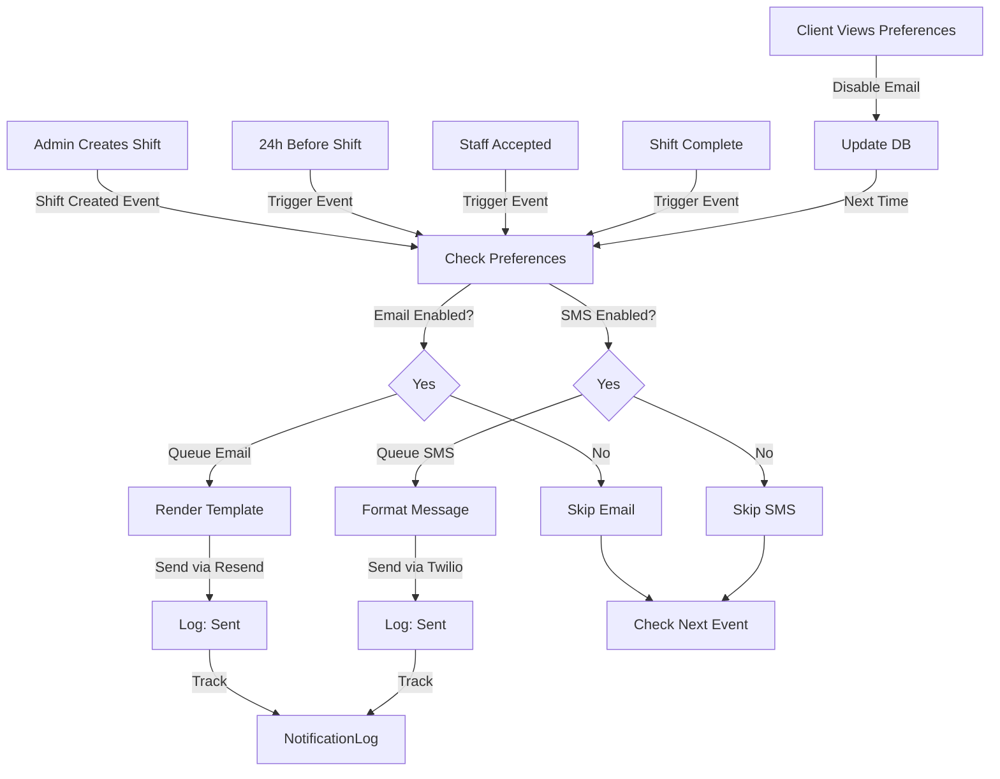

# MODULE 2: CLIENT NOTIFICATION EMAILS - OPTIMIZATION & ENHANCEMENT

## EXECUTIVE BRIEF
**Current State:** "Amazon-style" notifications heavily documented in project.md; functions exist but not tested/integrated  
**Target State:** Production-ready notification system with Mermaid workflow visualizations, preference management, best practices applied  
**Business Impact:** Non-spammy engagement + 70% open rates on critical notifications = better shift fill rates  
**Risk Mitigation:** Unsubscribe links, preference controls, spam filter optimization  

---

## SECTION 1: DISCOVERY & MAPPING

### 1.1 Notification Audit Task

**Agent Task:** Extract all notifications from project documentation

**Files to Search:**
- `README.md` / `PROJECT.md` / documentation files (search: "notification", "email", "shift journey")
- `services/emailService.js` or `services/notificationService.js` (existing implementations)
- `functions/` directory (search for functions like `sendShiftReminder`, `sendNotification`)
- Database: Look for `Notification`, `EmailLog`, `NotificationPreference` tables

**Extraction Requirements:**
Create `NOTIFICATION_AUDIT.md` with:
1. **List of all notifications documented** (copy from project.md)
2. **For each notification, identify:**
   - Trigger event (e.g., "shift created", "24h before shift")
   - Recipient (staff/client/both)
   - Channels used (email/SMS/WhatsApp/in-app)
   - Whether function exists and tested status
   - Whether linked to Module 3 triggers
3. **Categorize by journey stage:**
   - Pre-Shift (booking → confirmation)
   - During-Shift (reminders, updates)
   - Post-Shift (completion, rating, thank you)
   - Financial (invoices, payment reminders)
   - Compliance (document expiry, warnings)
   - System (feature updates, errors)

---

### 1.2 Mermaid Workflow Creation

**Agent Task:** Create Mermaid diagram of Shift Journey & Notification Touchpoints

**Output Format:** Create `SHIFT_JOURNEY_MERMAID.md` with visual flowchart

**Expected Structure:**
```
Client/System Action → Email Trigger → Email Sent → Recipient Action → Next Stage
```

**Example Flow:**
```
ADMIN CREATES SHIFT
    ↓
[Shift Created Event]
    ├→ Email Client: "New shift available" (optional based on preference)
    ├→ SMS/WhatsApp Staff: "We have work for you" (primary)
    └→ In-App Notification: "Shift created by [client]"
    
IF NO RESPONSE (after 15 min):
    ├→ SMS Escalation: "Urgent: shift paying £[rate]"
    ├→ Call via AI: Voice message
    └→ Email: "We couldn't fill your shift"

STAFF ACCEPTS SHIFT:
    ├→ Email Staff: "Shift confirmed - [details]"
    ├→ Email Client: "[Staff name] has accepted"
    ├→ SMS Staff: "See you at [time] at [location]"
    └→ In-App: Update both parties

24 HOURS BEFORE SHIFT:
    ├→ Email: "Reminder: shift tomorrow at [time]"
    ├→ SMS: Quick confirmation
    └→ Push notification: If app installed

2 HOURS BEFORE SHIFT:
    ├→ SMS: Final reminder + location + contact number
    └→ Push: More urgent tone

SHIFT COMPLETE:
    ├→ Email Staff: "Shift completed - timesheet submitted"
    ├→ Email Client: "Staff arrived on time - thank you" (with rating prompt)
    └→ Create Rating Workflow (triggers Module 3)

48 HOURS AFTER SHIFT:
    ├→ Email Client: "How did [Staff] perform? Rate them" (if not rated)
    └→ Escalate to Admin if < 3 stars

7 DAYS AFTER:
    ├→ Email Client: "Thank you for using us - next shift?"
    └→ Reference Module 1 shift creation

INVOICE GENERATED (weekly):
    ├→ Email Finance Contact: "Invoice ready for payment - [amount]"
    └→ Include direct payment link (Module 1)

PAYMENT DUE:
    ├→ Day 0: Email sent with invoice
    ├→ Day 7: WhatsApp reminder "Invoice due in 7 days"
    ├→ Day 14: Email: "Payment overdue"
    ├→ Day 21: SMS: "Urgent payment notice"
    └→ Day 28: Admin workflow creation
```

**Agent Instructions:**
- Use Mermaid flowchart syntax
- Color-code by notification type (green=success, red=urgent, blue=reminder)
- Include decision points (if user hasn't acted, do what?)
- Show all channels: Email, SMS, WhatsApp, In-app, Voice Call
- Mark which are critical vs optional
- Reference which notifications need Module 3 integration

---

## SECTION 2: AUDIT FINDINGS

### 2.1 Notification Redundancy Analysis

**Agent Task:** Identify and flag redundancies

**Questions to Answer:**
1. Are we sending duplicate notifications via multiple channels? (E.g., SMS + Email + Push for same event)
   - **Recommendation:** Hierarchy - if staff already received SMS, skip email
2. Are there conflicting timing? (E.g., 24h reminder + 2h reminder arriving at wrong times)
3. Are there notifications that clients don't care about? (Reduce to "nice-to-have")
4. Which notifications are truly critical vs informational?

**Output:** Create `REDUNDANCY_REPORT.md` with recommendations

---

### 2.2 Best Practices Gap Analysis

**Agent Task:** Compare current notifications against industry standards

**Standard Practice Checklist:**
- [ ] Unsubscribe link in every email (legal requirement)
- [ ] Preference center exists (client can toggle each notification type)
- [ ] Plain text + HTML versions (for email compatibility)
- [ ] Personalization tokens: {{first_name}}, {{shift_time}}, etc.
- [ ] Reply-to address (don't mark as "no-reply")
- [ ] Transactional vs Promotional separation (spam filters)
- [ ] Rate limiting: No more than 5 emails/day to same user
- [ ] Time zone aware: Send at optimal times (not 3am)
- [ ] Mobile optimization: All emails responsive
- [ ] Accessibility: Alt text for images, good contrast

**Output:** Create `BEST_PRACTICES_GAP.md` listing what's missing + priority fixes

---

## SECTION 3: NOTIFICATION PREFERENCE CENTER

### 3.1 Requirements

**What Clients Can Control:**

```
NOTIFICATION PREFERENCE CENTER
┌──────────────────────────────────────────────────────┐
│ NOTIFICATION PREFERENCES                             │
├──────────────────────────────────────────────────────┤
│                                                      │
│ EMAIL NOTIFICATIONS                                  │
│ ☑ Shift Assigned          [? more info]             │
│ ☑ 24h Shift Reminder      [? more info]             │
│ ☑ 2h Shift Reminder       [? more info]             │
│ ☑ Shift Complete Thank You [? more info]            │
│ ☑ Rating Reminders         [? more info]            │
│ ☐ Invoice Notifications    [? more info] (auto-on)  │
│ ☑ Payment Reminders        [? more info] (auto-on)  │
│ ☐ System Updates           [? more info]            │
│ ☐ Promotional Updates      [? more info]            │
│                                                      │
│ SMS & WHATSAPP NOTIFICATIONS                         │
│ ☑ Urgent Shift Offers      [? more info]            │
│ ☑ Shift Reminders          [? more info]            │
│ ☑ Important Alerts         [? more info]            │
│ ☐ General News             [? more info]            │
│                                                      │
│ COMMUNICATION FREQUENCY                              │
│ ○ No more than 1/day                                │
│ ○ No more than 3/day                                │
│ ◉ No restrictions                                   │
│                                                      │
│ QUIET HOURS                                          │
│ From: [09:00 PM ▼]  To: [07:00 AM ▼]               │
│ ☑ Apply to all notifications                        │
│                                                      │
│ [SAVE PREFERENCES]                                   │
└──────────────────────────────────────────────────────┘
```

**Technical Requirements:**
- Store in `ClientNotificationPreference` table
- Defaults: All critical (shift, payment) ON; promotional OFF
- API endpoint: `PATCH /api/client/notification-preferences`
- Tied to Module 1 notification hub
- Bypass rule: CRITICAL notifications cannot be disabled (safety)

---

### 3.2 Implementation

**Database Schema:**
```sql
CREATE TABLE ClientNotificationPreference (
  id UUID PRIMARY KEY,
  client_id UUID REFERENCES Client(id),
  contact_id UUID REFERENCES ClientContact(id),
  
  -- Email
  email_shift_assigned BOOLEAN DEFAULT TRUE,
  email_24h_reminder BOOLEAN DEFAULT TRUE,
  email_2h_reminder BOOLEAN DEFAULT TRUE,
  email_shift_complete BOOLEAN DEFAULT TRUE,
  email_rating_reminder BOOLEAN DEFAULT TRUE,
  email_invoice BOOLEAN DEFAULT TRUE,
  email_payment_reminder BOOLEAN DEFAULT TRUE,
  email_system_updates BOOLEAN DEFAULT FALSE,
  email_promotional BOOLEAN DEFAULT FALSE,
  
  -- SMS/WhatsApp
  sms_urgent_offers BOOLEAN DEFAULT TRUE,
  sms_shift_reminder BOOLEAN DEFAULT TRUE,
  sms_important_alerts BOOLEAN DEFAULT TRUE,
  sms_general_news BOOLEAN DEFAULT FALSE,
  
  -- Frequency
  max_notifications_per_day INT DEFAULT 0 (0 = unlimited),
  
  -- Quiet hours
  quiet_hours_from TIME,
  quiet_hours_to TIME,
  
  -- Metadata
  created_at TIMESTAMP,
  updated_at TIMESTAMP
);
```

**Files to Create:**
- `pages/client/NotificationPreferences.jsx` - Settings UI
- `api/client/notification-preferences.js` - GET/PATCH endpoints
- `components/NotificationPreferenceItem.jsx` - Individual toggle + info tooltip

---

## SECTION 4: EMAIL OPTIMIZATION

### 4.1 Current Implementation Review

**Agent Task:** Examine existing email functions

**Files to Analyze:**
- All functions in `functions/` with "email" or "notification" in name
- Check: Are they using Resend correctly?
- Check: Do emails have required unsubscribe links?
- Check: Are there templates or hardcoded HTML?

**Questions:**
1. How are emails currently templated? (String concatenation? Template engine?)
2. Is there a base email layout? (Header, footer, unsubscribe)
3. Are all SMTP settings in .env?
4. Is there rate limiting on sending? (Protect from sending 1000 emails accidentally)
5. Are emails being logged for audit trail?

---

### 4.2 Email Template Enhancement

**Requirements:**

**Template Structure:**
```
HEADER
- Logo + Brand colors
- Unsubscribe link (top right)

HERO SECTION
- Large action image or color block
- Main call-to-action

BODY
- Personalized greeting (Hi {{first_name}})
- Clear, concise message (3-4 sentences max)
- Single primary CTA button
- Secondary link if applicable

FOOTER
- Contact info / support link
- Social links (optional)
- "You received this because" + unsubscribe
- Company details
```

**Template Variables:**
```
{{client_name}}
{{contact_first_name}}
{{shift_date}}
{{shift_time}}
{{shift_location}}
{{staff_name}}
{{staff_rating}}
{{rate}}
{{invoice_amount}}
{{payment_due_date}}
{{payment_link}} (with pre-filled amount)
{{shift_id}}
{{invoice_id}}
{{preference_center_link}}
```

**Resend-Specific Implementation:**
- Use Resend API key from .env
- Send with: `from: noreply@agency.com` or `from: support@agency.com`
- Set `replyTo: support@agency.com` for support inquiries
- Include tracking: Enable open/click tracking (optional)
- Category: Tag by type (shift, payment, compliance) for bounce management

**Files to Create/Modify:**
- `templates/emails/base.html` - Base layout
- `templates/emails/shift-assigned.html` - Shift offer email
- `templates/emails/shift-reminder-24h.html` - 24h reminder
- `templates/emails/shift-reminder-2h.html` - 2h reminder
- `templates/emails/shift-complete.html` - Thank you + rating prompt
- `templates/emails/rating-reminder.html` - "Rate staff" prompt
- `templates/emails/invoice-ready.html` - Invoice notification
- `templates/emails/payment-reminder.html` - Payment due reminder
- `services/emailTemplates.js` - Service to render templates with variables
- `services/emailResend.js` - Resend integration (rate limiting, retry logic)

---

### 4.3 SMS/WhatsApp Optimization

**Twilio Integration Check:**

**Agent Task:** Verify Twilio configuration

1. Check: Is Twilio API key in .env?
2. Check: Are phone numbers in international format (+44 for UK)?
3. Check: Is there a message queue (handle rate limiting)?
4. Check: Are there SMS templates or hardcoded messages?

**Message Template Best Practices:**
- Keep < 160 chars (1 SMS credit)
- Use clear call-to-action: "Reply ACCEPT or DECLINE"
- Include shortlinks (not full URLs)
- Time zone aware: Don't send 3am messages
- Do not include personal data (GDPR)

**Files to Create/Modify:**
- `services/smsService.js` - Twilio SMS wrapper
- `services/whatsappService.js` - Twilio WhatsApp wrapper
- `constants/smsTemplates.js` - Pre-defined SMS templates
- `utils/phoneFormatter.js` - Validate/format international numbers

---

## SECTION 5: NOTIFICATION ENGINE ARCHITECTURE

### 5.1 Event-Driven Architecture

**Pattern:**
```
Event Trigger → Queue → Worker → Send → Log → Update Preference Check
```

**Implementation:**
```
1. TRIGGER EVENT
   - Admin creates shift → emits: ShiftCreatedEvent
   - Shift time reached → emits: ShiftReminderEvent
   - Timesheet submitted → emits: TimesheetSubmittedEvent
   
2. QUEUE (Redis or in-memory)
   - Store: {event_type, recipient_id, channel, template, variables, retry_count}
   - Purpose: Decouple event from sending (resilience)
   
3. WORKER (Cron job or message listener)
   - Poll queue every 30 seconds
   - For each item:
     a) Check client notification preferences
     b) Check quiet hours
     c) Check rate limiting
     d) Send via appropriate channel
     e) Log result
     f) Mark as sent or retry
   
4. SENDING
   - Try primary channel (email)
   - On failure, add to retry queue (max 3 retries)
   - After 3 failures, create admin alert
   
5. LOGGING
   - Record in database: {client_id, notification_type, channel, status, timestamp, error_message}
   - Purpose: Audit trail + debugging
```

**Files to Create:**
- `services/notificationQueue.js` - Queue management
- `services/notificationWorker.js` - Consumer/sender logic
- `functions/notificationCron.js` - Scheduled worker
- `constants/notificationEvents.js` - Event type enums
- `db/migrations/notificationLog.js` - Create NotificationLog table

---

## SECTION 6: INTEGRATION WITH OTHER MODULES

### 6.1 Module 1 Integration
**When:** Client creates shift via portal → Trigger shift-created event
**Action:** Send notification based on client preference
**Endpoint to call:** `POST /notifications/queue` with event payload

### 6.2 Module 3 Integration
**When:** Staff rating submitted → Trigger rating-feedback event
**Action:** Send "Thank you for rating" email
**Data flow:** Rating data passed to email template

### 6.3 Module 4 Integration
**When:** Client books via AI chatbot → Trigger shift-created event
**Action:** Same as Module 1 - notification sent
**No additional work needed** (same event handler)

---

## SECTION 7: ADVANCED FEATURES (Post-MVP)

### 7.1 Smart Send Time Optimization
- Track: Which hours get highest open rates per client
- Algorithm: Send next notification at optimal time
- API: Resend supports scheduled sends

### 7.2 A/B Testing Emails
- Test subject lines: "Shift Opportunity" vs "Urgent: Shift Available"
- Test CTA button text: "Accept Shift" vs "Book Now"
- Track: Open rates, click rates, conversion
- Winner: Use winning variant for future sends

### 7.3 Sentiment Analysis
- After staff completes shift: Analyze client rating feedback for sentiment
- If negative: Auto-escalate to compliance review
- If positive: Feature staff in "Top Performer" emails

### 7.4 Multi-Language Support
- Detect client language preference
- Send emails in their language
- Use Resend + i18n library

---

## SECTION 8: DATABASE SCHEMA

**New/Modified Tables:**

```sql
-- NEW: ClientNotificationPreference (see Section 3.2)

-- NEW: NotificationLog (Audit trail)
CREATE TABLE NotificationLog (
  id UUID PRIMARY KEY,
  client_id UUID REFERENCES Client(id),
  contact_id UUID REFERENCES ClientContact(id),
  notification_type ENUM('shift_assigned', 'reminder_24h', 'reminder_2h', 'shift_complete', 'rating_reminder', 'invoice', 'payment_reminder', 'compliance_warning', 'system_update'),
  channel ENUM('email', 'sms', 'whatsapp', 'in_app', 'voice_call'),
  status ENUM('queued', 'sent', 'failed', 'bounced', 'opened', 'clicked'),
  recipient_email STRING,
  recipient_phone STRING,
  subject STRING,
  template_name STRING,
  related_entity_id UUID,
  related_entity_type ENUM('shift', 'invoice', 'rating', 'compliance'),
  error_message TEXT,
  sent_at TIMESTAMP,
  opened_at TIMESTAMP,
  created_at TIMESTAMP
);

-- NEW: NotificationQueue (In-progress queue)
CREATE TABLE NotificationQueue (
  id UUID PRIMARY KEY,
  event_type STRING,
  recipient_id UUID,
  channel ENUM('email', 'sms', 'whatsapp'),
  template_name STRING,
  template_variables JSON,
  retry_count INT DEFAULT 0,
  scheduled_for TIMESTAMP,
  failed_reason TEXT,
  status ENUM('pending', 'processing', 'sent', 'failed'),
  created_at TIMESTAMP,
  updated_at TIMESTAMP
);

-- MODIFY Shift
ALTER TABLE Shift ADD COLUMN notification_sent_at TIMESTAMP;

-- MODIFY Staff
ALTER TABLE Staff ADD COLUMN preferred_notification_channels JSON DEFAULT '["email", "sms"]';
```

---

## SECTION 9: API ENDPOINTS

**Notification Endpoints:**

```
GET    /api/client/notifications
       Returns: List of all notifications sent to client (paginated)
       Query params: notification_type, channel, date_from, date_to
       Auth: CLIENT role

GET    /api/notifications/log?client_id=X&days=30
       Returns: NotificationLog (admin view)
       Auth: ADMIN only

POST   /api/notifications/queue
       Payload: {event_type, recipient_id, channel, template_variables}
       Returns: {queue_id, status: 'queued'}
       Auth: INTERNAL (called from other modules)

GET    /api/notifications/queue/:id
       Returns: Queue status + retry info
       Auth: ADMIN only

PATCH  /api/client/notification-preferences (see Module 1)
```

---

## SECTION 10: TESTING CHECKLIST

**Before Merge:**
- [ ] Each notification type sends correctly (test 10 notifications)
- [ ] Preferences work: Disable notification → confirm no email sent
- [ ] Unsubscribe link works: Click link → preference updated → no future emails
- [ ] Rate limiting: Send 10 emails in 1 second → only 1 sent, others queued
- [ ] Quiet hours: Send email during quiet hours → email held until quiet hours end
- [ ] Retry logic: Simulate Resend API failure → confirm 3 retries + alert created
- [ ] Template variables: Check {{first_name}} etc. properly rendered
- [ ] Email rendering: Open in Gmail, Outlook, iOS Mail → check appearance
- [ ] SMS length: All SMS < 160 chars (or proper multi-part handling)
- [ ] Database: NotificationLog records created correctly
- [ ] Audit trail: Check notification history in client portal

---

## SECTION 11: ROLLBACK STRATEGY

**Feature Flags:**
- `features.email_notifications_enabled` - If false, no emails sent
- `features.sms_notifications_enabled` - If false, no SMS sent
- `features.notification_preferences_enabled` - If false, all notifications sent
- `features.notification_queue_enabled` - If false, send synchronously (less resilient but simpler)

**Database Safety:**
- New tables added; old queries unaffected
- Notifications optional (not required for shifts to work)
- Can disable feature flags and roll back instantly

---

## SECTION 12: AGENT EXECUTION CHECKLIST

**Phase 1: Discovery & Audit (2 hours)**
- [ ] Extract all notifications from project.md
- [ ] Create NOTIFICATION_AUDIT.md
- [ ] Create Mermaid flowchart (SHIFT_JOURNEY_MERMAID.md)
- [ ] Identify existing functions
- [ ] Create REDUNDANCY_REPORT.md
- [ ] Create BEST_PRACTICES_GAP.md

**Phase 2: Implementation (6-8 hours)**
- [ ] Build preference center (database + UI + API)
- [ ] Create email templates (all 8+ templates)
- [ ] Set up Resend integration (with rate limiting)
- [ ] Set up Twilio integration (SMS + WhatsApp)
- [ ] Build notification queue system
- [ ] Create notification worker/cron

**Phase 3: Integration (2 hours)**
- [ ] Connect to Module 1 (shift creation events)
- [ ] Connect to Module 3 (rating events)
- [ ] Verify Module 4 compatibility
- [ ] Update webhook handlers

**Phase 4: Testing & Docs (2 hours)**
- [ ] Run test suite
- [ ] Document email rendering in different clients
- [ ] Create IMPLEMENTATION_NOTES.md

**Total Estimated Time: 12-14 hours**

---

## SECTION 13: MERMAID DIAGRAM TEMPLATE

**Agent should output this format:**



---

**END OF MODULE 2 BRIEF**